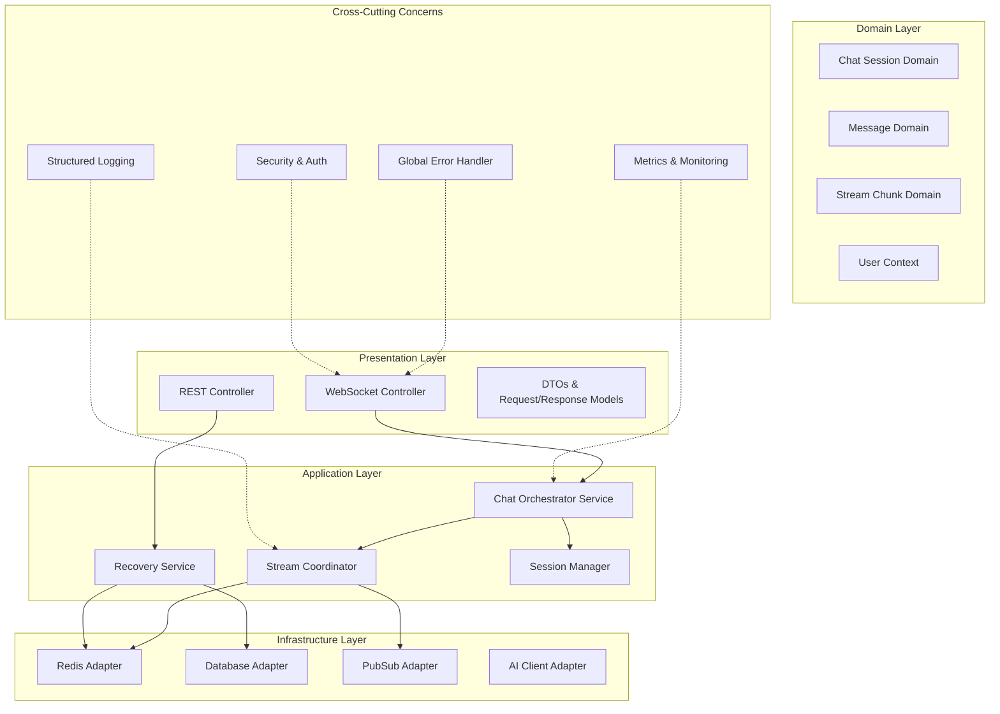
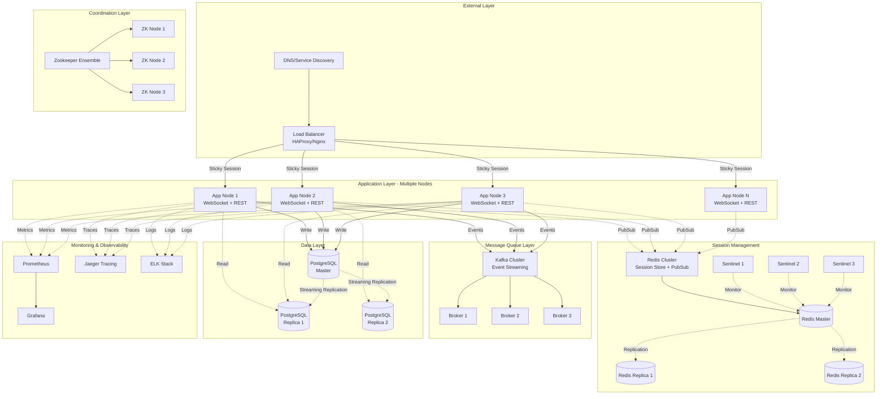
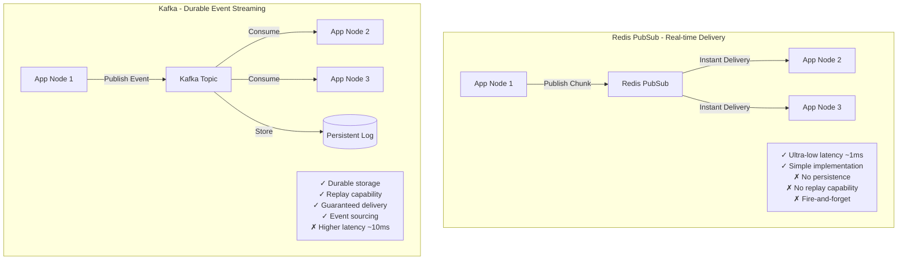
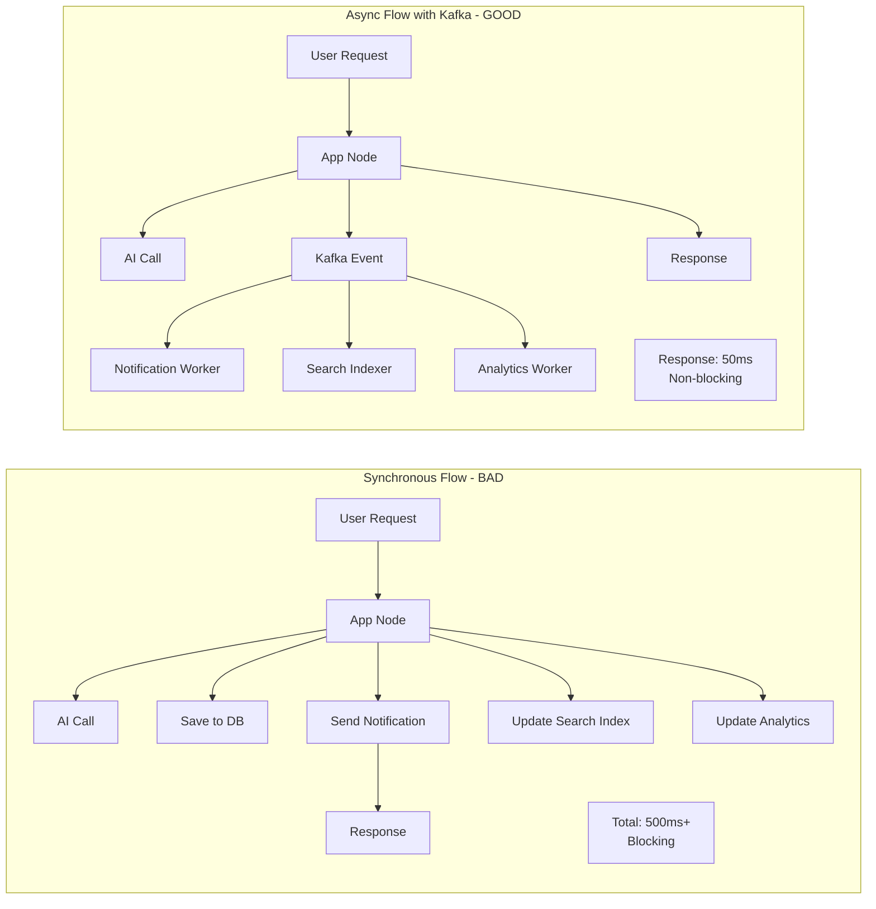

# Kiến Trúc Chi Tiết: AI Stream Chat với Recovery Mechanism

Tôi sẽ thiết kế một hệ thống enterprise-grade với các considerations về scalability, fault tolerance, và performance optimization.

## 1. Layered Architecture với Detailed Components



## 2. Detailed Domain Models

```java
// ============================================
// Domain Models
// ============================================

@Data
@Builder
public class ChatSession {
    private String sessionId;
    private String conversationId;
    private String userId;
    private String messageId;
    private SessionStatus status;
    private Instant startTime;
    private Instant lastActivityTime;
    private int totalChunks;
    private StreamMetadata metadata;
    
    public enum SessionStatus {
        INITIALIZING,
        STREAMING,
        COMPLETED,
        ERROR,
        TIMEOUT
    }
}

@Data
@Builder
public class StreamChunk {
    private String messageId;
    private int index;
    private String content;
    private ChunkType type;
    private Instant timestamp;
    private Map<String, Object> metadata;
    
    public enum ChunkType {
        TEXT,
        CODE,
        THINKING,
        TOOL_USE,
        CITATION
    }
}

@Data
@Builder
public class Message {
    private String id;
    private String conversationId;
    private String userId;
    private MessageRole role;
    private String content;
    private MessageStatus status;
    private Instant createdAt;
    private Instant updatedAt;
    private List<StreamChunk> chunks; // For recovery
    private MessageMetadata metadata;
    
    public enum MessageRole {
        USER, ASSISTANT, SYSTEM
    }
    
    public enum MessageStatus {
        PENDING, STREAMING, COMPLETED, FAILED
    }
}

@Data
@Builder
public class StreamMetadata {
    private String model;
    private int tokenCount;
    private Duration latency;
    private String aiRequestId;
    private Map<String, Object> customMetadata;
}

@Data
@Builder
public class RecoveryRequest {
    private String sessionId;
    private String messageId;
    private Integer lastChunkIndex;
    private Instant clientTimestamp;
}

@Data
@Builder
public class RecoveryResponse {
    private RecoveryStatus status;
    private List<StreamChunk> missingChunks;
    private Message completeMessage; // If already completed
    private ChatSession session;
    private boolean shouldReconnect;
    
    public enum RecoveryStatus {
        RECOVERED,
        COMPLETED,
        NOT_FOUND,
        EXPIRED,
        ERROR
    }
}
```

## 3. Core Service Implementation

### 3.1 WebSocket Handler

```java
@Component
@Slf4j
public class ChatWebSocketHandler extends TextWebSocketHandler {
    
    private final SessionManager sessionManager;
    private final ChatOrchestrator chatOrchestrator;
    private final RecoveryService recoveryService;
    private final SecurityValidator securityValidator;
    private final MetricsService metricsService;
    
    @Override
    public void afterConnectionEstablished(WebSocketSession wsSession) {
        try {
            String userId = extractUserId(wsSession);
            String sessionId = extractSessionId(wsSession);
            
            securityValidator.validateConnection(userId, wsSession);
            sessionManager.registerSession(sessionId, wsSession, userId);
            
            log.info("WebSocket connected: sessionId={}, userId={}", sessionId, userId);
            metricsService.incrementCounter("websocket.connections", 
                Tags.of("user", userId));
            
            sendWelcomeMessage(wsSession, sessionId);
            
        } catch (Exception e) {
            log.error("Error establishing connection", e);
            closeWithError(wsSession, "Connection failed");
        }
    }
    
    @Override
    protected void handleTextMessage(WebSocketSession wsSession, TextMessage message) {
        String sessionId = sessionManager.getSessionId(wsSession);
        
        try {
            WebSocketMessage wsMessage = parseMessage(message.getPayload());
            
            switch (wsMessage.getType()) {
                case CHAT_REQUEST:
                    handleChatRequest(wsSession, sessionId, wsMessage);
                    break;
                    
                case RECONNECT:
                    handleReconnect(wsSession, sessionId, wsMessage);
                    break;
                    
                case CANCEL_STREAM:
                    handleCancelStream(wsSession, sessionId, wsMessage);
                    break;
                    
                case HEARTBEAT:
                    handleHeartbeat(wsSession, sessionId);
                    break;
                    
                default:
                    log.warn("Unknown message type: {}", wsMessage.getType());
            }
            
        } catch (Exception e) {
            log.error("Error handling message: sessionId={}", sessionId, e);
            sendError(wsSession, "Message processing failed", e);
            metricsService.incrementCounter("websocket.errors", 
                Tags.of("type", "message_handling"));
        }
    }
    
    private void handleChatRequest(WebSocketSession wsSession, 
                                   String sessionId, 
                                   WebSocketMessage wsMessage) {
        
        ChatRequest request = wsMessage.toChatRequest();
        String userId = sessionManager.getUserId(sessionId);
        
        // Validate request
        if (!isValidRequest(request)) {
            sendError(wsSession, "Invalid request");
            return;
        }
        
        // Start streaming
        chatOrchestrator.processStreamingChat(
            userId, 
            sessionId, 
            request,
            new WebSocketStreamCallback(wsSession, metricsService)
        );
    }
    
    private void handleReconnect(WebSocketSession wsSession, 
                                String sessionId, 
                                WebSocketMessage wsMessage) {
        
        RecoveryRequest recoveryRequest = wsMessage.toRecoveryRequest();
        
        log.info("Recovery requested: sessionId={}, messageId={}, lastChunk={}", 
            sessionId, 
            recoveryRequest.getMessageId(), 
            recoveryRequest.getLastChunkIndex());
        
        RecoveryResponse recovery = recoveryService.recoverStream(recoveryRequest);
        
        switch (recovery.getStatus()) {
            case RECOVERED:
                // Send missing chunks
                recovery.getMissingChunks().forEach(chunk -> 
                    sendChunk(wsSession, chunk));
                
                // Resubscribe to ongoing stream
                if (recovery.getSession().getStatus() == SessionStatus.STREAMING) {
                    chatOrchestrator.resubscribeStream(
                        sessionId, 
                        recovery.getSession(),
                        new WebSocketStreamCallback(wsSession, metricsService)
                    );
                }
                break;
                
            case COMPLETED:
                // Send complete message
                sendCompleteMessage(wsSession, recovery.getCompleteMessage());
                break;
                
            case NOT_FOUND:
            case EXPIRED:
                sendRecoveryFailed(wsSession, recovery.getStatus());
                break;
        }
    }
    
    @Override
    public void afterConnectionClosed(WebSocketSession wsSession, 
                                     CloseStatus status) {
        String sessionId = sessionManager.getSessionId(wsSession);
        log.info("WebSocket closed: sessionId={}, status={}", sessionId, status);
        
        sessionManager.unregisterSession(sessionId);
        metricsService.incrementCounter("websocket.disconnections",
            Tags.of("reason", status.getReason()));
    }
    
    @Override
    public void handleTransportError(WebSocketSession wsSession, 
                                    Throwable exception) {
        String sessionId = sessionManager.getSessionId(wsSession);
        log.error("WebSocket transport error: sessionId={}", sessionId, exception);
        
        sessionManager.markSessionError(sessionId);
        metricsService.incrementCounter("websocket.transport_errors");
    }
    
    // Helper methods
    
    private void sendChunk(WebSocketSession wsSession, StreamChunk chunk) {
        try {
            String payload = toJson(WebSocketMessage.builder()
                .type(MessageType.CHUNK)
                .data(chunk)
                .build());
            
            wsSession.sendMessage(new TextMessage(payload));
            
        } catch (IOException e) {
            log.error("Failed to send chunk", e);
        }
    }
    
    private void sendError(WebSocketSession wsSession, String error) {
        try {
            String payload = toJson(WebSocketMessage.builder()
                .type(MessageType.ERROR)
                .error(error)
                .build());
            
            wsSession.sendMessage(new TextMessage(payload));
        } catch (IOException e) {
            log.error("Failed to send error message", e);
        }
    }
}
```

### 3.2 Chat Orchestrator Service

```java
@Service
@Slf4j
public class ChatOrchestrator {
    
    private final StreamCoordinator streamCoordinator;
    private final MessageRepository messageRepository;
    private final AIClientAdapter aiClient;
    private final RedisStreamCache streamCache;
    private final PubSubPublisher pubSubPublisher;
    private final ExecutorService executorService;
    
    public ChatOrchestrator(StreamCoordinator streamCoordinator,
                           MessageRepository messageRepository,
                           AIClientAdapter aiClient,
                           RedisStreamCache streamCache,
                           PubSubPublisher pubSubPublisher) {
        this.streamCoordinator = streamCoordinator;
        this.messageRepository = messageRepository;
        this.aiClient = aiClient;
        this.streamCache = streamCache;
        this.pubSubPublisher = pubSubPublisher;
        this.executorService = Executors.newVirtualThreadPerTaskExecutor();
    }
    
    public void processStreamingChat(String userId,
                                    String sessionId,
                                    ChatRequest request,
                                    StreamCallback callback) {
        
        // Create chat session
        ChatSession session = createChatSession(userId, sessionId, request);
        
        // Save user message
        Message userMessage = saveUserMessage(userId, request);
        
        // Create assistant message (pending)
        Message assistantMessage = createAssistantMessage(
            userId, 
            request.getConversationId(),
            session.getMessageId()
        );
        
        // Initialize stream in cache
        streamCache.initializeStream(session);
        
        // Process async
        CompletableFuture.runAsync(() -> {
            try {
                processAIStream(session, request, callback);
            } catch (Exception e) {
                handleStreamError(session, callback, e);
            }
        }, executorService);
    }
    
    private void processAIStream(ChatSession session,
                                ChatRequest request,
                                StreamCallback callback) {
        
        AtomicInteger chunkIndex = new AtomicInteger(0);
        StringBuilder fullContent = new StringBuilder();
        Instant streamStart = Instant.now();
        
        try {
            // Update session status
            session.setStatus(SessionStatus.STREAMING);
            streamCache.updateSession(session);
            
            // Call AI with streaming
            aiClient.streamChat(request, new AIStreamHandler() {
                
                @Override
                public void onChunk(String content, ChunkMetadata metadata) {
                    try {
                        int index = chunkIndex.getAndIncrement();
                        
                        StreamChunk chunk = StreamChunk.builder()
                            .messageId(session.getMessageId())
                            .index(index)
                            .content(content)
                            .type(determineChunkType(metadata))
                            .timestamp(Instant.now())
                            .metadata(metadata.toMap())
                            .build();
                        
                        fullContent.append(content);
                        
                        // Cache chunk in Redis
                        streamCache.appendChunk(session.getMessageId(), chunk);
                        
                        // Publish to PubSub for real-time delivery
                        pubSubPublisher.publishChunk(session.getSessionId(), chunk);
                        
                        // Callback to WebSocket
                        callback.onChunk(chunk);
                        
                        // Update last activity
                        session.setLastActivityTime(Instant.now());
                        session.setTotalChunks(index + 1);
                        streamCache.updateSession(session);
                        
                    } catch (Exception e) {
                        log.error("Error processing chunk: index={}", 
                            chunkIndex.get(), e);
                        throw new StreamProcessingException("Chunk processing failed", e);
                    }
                }
                
                @Override
                public void onComplete(AIResponse response) {
                    try {
                        Duration latency = Duration.between(streamStart, Instant.now());
                        
                        // Update session
                        session.setStatus(SessionStatus.COMPLETED);
                        session.setTotalChunks(chunkIndex.get());
                        session.getMetadata().setLatency(latency);
                        session.getMetadata().setTokenCount(response.getTokenCount());
                        
                        // Mark stream as complete in cache
                        streamCache.markComplete(session.getMessageId(), 
                            Duration.ofMinutes(5)); // TTL
                        
                        // Save complete message to DB
                        Message message = messageRepository.findById(session.getMessageId())
                            .orElseThrow();
                        message.setContent(fullContent.toString());
                        message.setStatus(MessageStatus.COMPLETED);
                        message.setUpdatedAt(Instant.now());
                        message.getMetadata().setTokenCount(response.getTokenCount());
                        messageRepository.save(message);
                        
                        // Publish complete event
                        pubSubPublisher.publishComplete(session.getSessionId(), message);
                        
                        // Callback
                        callback.onComplete(message);
                        
                        log.info("Stream completed: messageId={}, chunks={}, latency={}ms",
                            session.getMessageId(),
                            chunkIndex.get(),
                            latency.toMillis());
                        
                    } catch (Exception e) {
                        log.error("Error completing stream", e);
                        handleStreamError(session, callback, e);
                    }
                }
                
                @Override
                public void onError(Throwable error) {
                    handleStreamError(session, callback, error);
                }
            });
            
        } catch (Exception e) {
            handleStreamError(session, callback, e);
        }
    }
    
    public void resubscribeStream(String sessionId,
                                 ChatSession session,
                                 StreamCallback callback) {
        
        log.info("Resubscribing to stream: sessionId={}, messageId={}", 
            sessionId, session.getMessageId());
        
        // Subscribe to PubSub for remaining chunks
        pubSubPublisher.subscribe(sessionId, new PubSubListener() {
            @Override
            public void onChunk(StreamChunk chunk) {
                callback.onChunk(chunk);
            }
            
            @Override
            public void onComplete(Message message) {
                callback.onComplete(message);
            }
            
            @Override
            public void onError(String error) {
                callback.onError(new RuntimeException(error));
            }
        });
    }
    
    private void handleStreamError(ChatSession session,
                                  StreamCallback callback,
                                  Throwable error) {
        log.error("Stream error: sessionId={}, messageId={}", 
            session.getSessionId(), session.getMessageId(), error);
        
        session.setStatus(SessionStatus.ERROR);
        streamCache.updateSession(session);
        
        // Update message status
        messageRepository.findById(session.getMessageId())
            .ifPresent(msg -> {
                msg.setStatus(MessageStatus.FAILED);
                messageRepository.save(msg);
            });
        
        callback.onError(error);
    }
}
```

### 3.3 Recovery Service

```java
@Service
@Slf4j
public class RecoveryService {
    
    private final RedisStreamCache streamCache;
    private final MessageRepository messageRepository;
    private final MetricsService metricsService;
    
    @Transactional(readOnly = true)
    public RecoveryResponse recoverStream(RecoveryRequest request) {
        
        Instant recoveryStart = Instant.now();
        
        try {
            // Get session from cache
            Optional<ChatSession> sessionOpt = streamCache.getSession(request.getSessionId());
            
            if (sessionOpt.isEmpty()) {
                log.warn("Session not found in cache: sessionId={}", request.getSessionId());
                return handleSessionNotFound(request);
            }
            
            ChatSession session = sessionOpt.get();
            
            // Check session status
            switch (session.getStatus()) {
                case STREAMING:
                    return recoverStreamingSession(request, session);
                    
                case COMPLETED:
                    return recoverCompletedSession(request, session);
                    
                case ERROR:
                    return RecoveryResponse.builder()
                        .status(RecoveryStatus.ERROR)
                        .session(session)
                        .build();
                    
                default:
                    return RecoveryResponse.builder()
                        .status(RecoveryStatus.NOT_FOUND)
                        .build();
            }
            
        } finally {
            Duration latency = Duration.between(recoveryStart, Instant.now());
            metricsService.recordTimer("recovery.latency", latency);
        }
    }
    
    private RecoveryResponse recoverStreamingSession(RecoveryRequest request,
                                                    ChatSession session) {
        
        String messageId = session.getMessageId();
        Integer lastChunkIndex = request.getLastChunkIndex() != null 
            ? request.getLastChunkIndex() 
            : -1;
        
        log.info("Recovering streaming session: messageId={}, fromIndex={}, totalChunks={}",
            messageId, lastChunkIndex + 1, session.getTotalChunks());
        
        // Get missing chunks from cache
        List<StreamChunk> missingChunks = streamCache.getChunks(
            messageId,
            lastChunkIndex + 1,
            session.getTotalChunks()
        );
        
        log.info("Retrieved {} missing chunks for recovery", missingChunks.size());
        
        metricsService.incrementCounter("recovery.streaming",
            Tags.of("chunks", String.valueOf(missingChunks.size())));
        
        return RecoveryResponse.builder()
            .status(RecoveryStatus.RECOVERED)
            .missingChunks(missingChunks)
            .session(session)
            .shouldReconnect(true)
            .build();
    }
    
    private RecoveryResponse recoverCompletedSession(RecoveryRequest request,
                                                    ChatSession session) {
        
        log.info("Recovering completed session: messageId={}", session.getMessageId());
        
        // Try cache first
        List<StreamChunk> cachedChunks = streamCache.getAllChunks(session.getMessageId());
        
        if (!cachedChunks.isEmpty()) {
            // Reconstruct message from chunks
            String content = cachedChunks.stream()
                .sorted(Comparator.comparingInt(StreamChunk::getIndex))
                .map(StreamChunk::getContent)
                .collect(Collectors.joining());
            
            Message message = Message.builder()
                .id(session.getMessageId())
                .content(content)
                .status(MessageStatus.COMPLETED)
                .chunks(cachedChunks)
                .build();
            
            metricsService.incrementCounter("recovery.completed.cache");
            
            return RecoveryResponse.builder()
                .status(RecoveryStatus.COMPLETED)
                .completeMessage(message)
                .session(session)
                .shouldReconnect(false)
                .build();
        }
        
        // Fallback to database
        Message message = messageRepository.findById(session.getMessageId())
            .orElseThrow(() -> new MessageNotFoundException(session.getMessageId()));
        
        metricsService.incrementCounter("recovery.completed.database");
        
        return RecoveryResponse.builder()
            .status(RecoveryStatus.COMPLETED)
            .completeMessage(message)
            .session(session)
            .shouldReconnect(false)
            .build();
    }
    
    private RecoveryResponse handleSessionNotFound(RecoveryRequest request) {
        
        // Try to find message in database
        if (request.getMessageId() != null) {
            Optional<Message> messageOpt = messageRepository
                .findById(request.getMessageId());
            
            if (messageOpt.isPresent() && 
                messageOpt.get().getStatus() == MessageStatus.COMPLETED) {
                
                log.info("Found completed message in DB: messageId={}", 
                    request.getMessageId());
                
                metricsService.incrementCounter("recovery.database_fallback");
                
                return RecoveryResponse.builder()
                    .status(RecoveryStatus.COMPLETED)
                    .completeMessage(messageOpt.get())
                    .shouldReconnect(false)
                    .build();
            }
        }
        
        // Check if expired
        Instant requestTime = request.getClientTimestamp();
        if (requestTime != null && 
            Duration.between(requestTime, Instant.now()).toMinutes() > 5) {
            
            metricsService.incrementCounter("recovery.expired");
            return RecoveryResponse.builder()
                .status(RecoveryStatus.EXPIRED)
                .build();
        }
        
        metricsService.incrementCounter("recovery.not_found");
        return RecoveryResponse.builder()
            .status(RecoveryStatus.NOT_FOUND)
            .build();
    }
}
```

# Phần 4: Redis Infrastructure & Advanced Components

## 4.1 Redis Stream Cache Implementation

```java
@Component
@Slf4j
public class RedisStreamCache {
    
    private final StringRedisTemplate redisTemplate;
    private final RedissonClient redissonClient;
    private final ObjectMapper objectMapper;
    private final MetricsService metricsService;
    
    // Key patterns
    private static final String SESSION_KEY = "stream:session:{sessionId}";
    private static final String CHUNKS_KEY = "stream:chunks:{messageId}";
    private static final String METADATA_KEY = "stream:metadata:{messageId}";
    private static final String LOCK_KEY = "stream:lock:{messageId}";
    
    // TTL configurations
    private static final Duration SESSION_TTL = Duration.ofMinutes(10);
    private static final Duration CHUNKS_TTL = Duration.ofMinutes(5);
    private static final Duration LOCK_TTL = Duration.ofSeconds(30);
    
    /**
     * Initialize stream session in cache
     * Uses Redis Hash for session data
     */
    public void initializeStream(ChatSession session) {
        String key = SESSION_KEY.replace("{sessionId}", session.getSessionId());
        
        try {
            Map<String, String> sessionData = new HashMap<>();
            sessionData.put("sessionId", session.getSessionId());
            sessionData.put("messageId", session.getMessageId());
            sessionData.put("userId", session.getUserId());
            sessionData.put("conversationId", session.getConversationId());
            sessionData.put("status", session.getStatus().name());
            sessionData.put("startTime", session.getStartTime().toString());
            sessionData.put("totalChunks", "0");
            
            redisTemplate.opsForHash().putAll(key, sessionData);
            redisTemplate.expire(key, SESSION_TTL);
            
            log.debug("Initialized stream session in cache: sessionId={}", 
                session.getSessionId());
            
            metricsService.incrementCounter("redis.session.init");
            
        } catch (Exception e) {
            log.error("Failed to initialize stream in cache", e);
            throw new CacheException("Stream initialization failed", e);
        }
    }
    
    /**
     * Append chunk to stream using Redis List
     * Optimized for sequential writes and range reads
     */
    public void appendChunk(String messageId, StreamChunk chunk) {
        String key = CHUNKS_KEY.replace("{messageId}", messageId);
        
        try {
            // Use distributed lock to ensure chunk ordering
            RLock lock = redissonClient.getLock(LOCK_KEY.replace("{messageId}", messageId));
            
            try {
                if (lock.tryLock(100, 5000, TimeUnit.MILLISECONDS)) {
                    try {
                        // Serialize chunk
                        String chunkJson = objectMapper.writeValueAsString(chunk);
                        
                        // Append to list (right push for sequential order)
                        redisTemplate.opsForList().rightPush(key, chunkJson);
                        
                        // Set/update TTL
                        redisTemplate.expire(key, CHUNKS_TTL);
                        
                        // Update chunk index for verification
                        String metaKey = METADATA_KEY.replace("{messageId}", messageId);
                        redisTemplate.opsForValue().increment(metaKey + ":lastIndex");
                        
                        metricsService.incrementCounter("redis.chunk.append",
                            Tags.of("index", String.valueOf(chunk.getIndex())));
                        
                    } finally {
                        lock.unlock();
                    }
                } else {
                    throw new LockAcquisitionException("Failed to acquire lock for chunk append");
                }
            } catch (InterruptedException e) {
                Thread.currentThread().interrupt();
                throw new CacheException("Interrupted while acquiring lock", e);
            }
            
        } catch (Exception e) {
            log.error("Failed to append chunk: messageId={}, index={}", 
                messageId, chunk.getIndex(), e);
            metricsService.incrementCounter("redis.chunk.append.error");
            throw new CacheException("Chunk append failed", e);
        }
    }
    
    /**
     * Get chunks by range using Redis LRANGE
     * Optimized for recovery scenarios
     */
    public List<StreamChunk> getChunks(String messageId, int fromIndex, int toIndex) {
        String key = CHUNKS_KEY.replace("{messageId}", messageId);
        
        try {
            Instant start = Instant.now();
            
            // Redis LRANGE is 0-indexed, inclusive on both ends
            List<String> chunkJsons = redisTemplate.opsForList()
                .range(key, fromIndex, toIndex - 1);
            
            if (chunkJsons == null || chunkJsons.isEmpty()) {
                log.warn("No chunks found: messageId={}, range=[{},{})", 
                    messageId, fromIndex, toIndex);
                return Collections.emptyList();
            }
            
            List<StreamChunk> chunks = chunkJsons.stream()
                .map(json -> {
                    try {
                        return objectMapper.readValue(json, StreamChunk.class);
                    } catch (JsonProcessingException e) {
                        log.error("Failed to deserialize chunk", e);
                        return null;
                    }
                })
                .filter(Objects::nonNull)
                .collect(Collectors.toList());
            
            Duration latency = Duration.between(start, Instant.now());
            metricsService.recordTimer("redis.chunk.get_range", latency,
                Tags.of("count", String.valueOf(chunks.size())));
            
            log.debug("Retrieved {} chunks: messageId={}, range=[{},{}), latency={}ms",
                chunks.size(), messageId, fromIndex, toIndex, latency.toMillis());
            
            return chunks;
            
        } catch (Exception e) {
            log.error("Failed to get chunks: messageId={}", messageId, e);
            metricsService.incrementCounter("redis.chunk.get_range.error");
            return Collections.emptyList();
        }
    }
    
    /**
     * Get all chunks for a completed message
     */
    public List<StreamChunk> getAllChunks(String messageId) {
        String key = CHUNKS_KEY.replace("{messageId}", messageId);
        
        try {
            Long size = redisTemplate.opsForList().size(key);
            if (size == null || size == 0) {
                return Collections.emptyList();
            }
            
            return getChunks(messageId, 0, size.intValue());
            
        } catch (Exception e) {
            log.error("Failed to get all chunks: messageId={}", messageId, e);
            return Collections.emptyList();
        }
    }
    
    /**
     * Mark stream as complete and set TTL
     * Uses Redis MULTI/EXEC for atomicity
     */
    public void markComplete(String messageId, Duration ttl) {
        try {
            redisTemplate.execute(new SessionCallback<Void>() {
                @Override
                public Void execute(RedisOperations operations) throws DataAccessException {
                    operations.multi();
                    
                    // Update metadata
                    String metaKey = METADATA_KEY.replace("{messageId}", messageId);
                    operations.opsForValue().set(metaKey + ":status", "COMPLETED");
                    operations.opsForValue().set(metaKey + ":completedAt", 
                        Instant.now().toString());
                    operations.expire(metaKey, ttl);
                    
                    // Update chunks TTL
                    String chunksKey = CHUNKS_KEY.replace("{messageId}", messageId);
                    operations.expire(chunksKey, ttl);
                    
                    operations.exec();
                    return null;
                }
            });
            
            log.info("Marked stream as complete: messageId={}, ttl={}min", 
                messageId, ttl.toMinutes());
            
            metricsService.incrementCounter("redis.stream.complete");
            
        } catch (Exception e) {
            log.error("Failed to mark stream complete: messageId={}", messageId, e);
            throw new CacheException("Mark complete failed", e);
        }
    }
    
    /**
     * Update session in cache
     */
    public void updateSession(ChatSession session) {
        String key = SESSION_KEY.replace("{sessionId}", session.getSessionId());
        
        try {
            redisTemplate.opsForHash().put(key, "status", session.getStatus().name());
            redisTemplate.opsForHash().put(key, "totalChunks", 
                String.valueOf(session.getTotalChunks()));
            redisTemplate.opsForHash().put(key, "lastActivityTime", 
                session.getLastActivityTime().toString());
            
            metricsService.incrementCounter("redis.session.update");
            
        } catch (Exception e) {
            log.error("Failed to update session: sessionId={}", session.getSessionId(), e);
        }
    }
    
    /**
     * Get session from cache
     */
    public Optional<ChatSession> getSession(String sessionId) {
        String key = SESSION_KEY.replace("{sessionId}", sessionId);
        
        try {
            Map<Object, Object> sessionData = redisTemplate.opsForHash().entries(key);
            
            if (sessionData.isEmpty()) {
                return Optional.empty();
            }
            
            ChatSession session = ChatSession.builder()
                .sessionId((String) sessionData.get("sessionId"))
                .messageId((String) sessionData.get("messageId"))
                .userId((String) sessionData.get("userId"))
                .conversationId((String) sessionData.get("conversationId"))
                .status(SessionStatus.valueOf((String) sessionData.get("status")))
                .startTime(Instant.parse((String) sessionData.get("startTime")))
                .totalChunks(Integer.parseInt((String) sessionData.get("totalChunks")))
                .build();
            
            if (sessionData.containsKey("lastActivityTime")) {
                session.setLastActivityTime(
                    Instant.parse((String) sessionData.get("lastActivityTime")));
            }
            
            metricsService.incrementCounter("redis.session.get");
            return Optional.of(session);
            
        } catch (Exception e) {
            log.error("Failed to get session: sessionId={}", sessionId, e);
            metricsService.incrementCounter("redis.session.get.error");
            return Optional.empty();
        }
    }
    
    /**
     * Clean up expired streams (background job)
     */
    @Scheduled(fixedDelay = 60000) // Every minute
    public void cleanupExpiredStreams() {
        try {
            // Scan for expired sessions using Redis SCAN
            ScanOptions scanOptions = ScanOptions.scanOptions()
                .match("stream:session:*")
                .count(100)
                .build();
            
            Cursor<byte[]> cursor = redisTemplate.executeWithStickyConnection(
                redisConnection -> redisConnection.scan(scanOptions)
            );
            
            int cleaned = 0;
            while (cursor.hasNext()) {
                String key = new String(cursor.next());
                
                // Check if TTL expired or session is old
                Long ttl = redisTemplate.getExpire(key, TimeUnit.SECONDS);
                if (ttl != null && ttl <= 0) {
                    // Extract sessionId and clean related keys
                    String sessionId = key.substring(key.lastIndexOf(":") + 1);
                    cleanSessionData(sessionId);
                    cleaned++;
                }
            }
            
            if (cleaned > 0) {
                log.info("Cleaned up {} expired stream sessions", cleaned);
                metricsService.gauge("redis.cleanup.count", cleaned);
            }
            
        } catch (Exception e) {
            log.error("Error during cleanup", e);
        }
    }
    
    private void cleanSessionData(String sessionId) {
        try {
            Optional<ChatSession> sessionOpt = getSession(sessionId);
            if (sessionOpt.isEmpty()) {
                return;
            }
            
            ChatSession session = sessionOpt.get();
            String messageId = session.getMessageId();
            
            // Delete in pipeline for efficiency
            redisTemplate.executePipelined(new SessionCallback<Void>() {
                @Override
                public Void execute(RedisOperations operations) throws DataAccessException {
                    operations.delete(SESSION_KEY.replace("{sessionId}", sessionId));
                    operations.delete(CHUNKS_KEY.replace("{messageId}", messageId));
                    operations.delete(METADATA_KEY.replace("{messageId}", messageId));
                    return null;
                }
            });
            
        } catch (Exception e) {
            log.error("Failed to clean session data: sessionId={}", sessionId, e);
        }
    }
}
```

## 4.2 Redis PubSub Publisher & Listener

```java
@Component
@Slf4j
public class RedisPubSubPublisher {
    
    private final StringRedisTemplate redisTemplate;
    private final ObjectMapper objectMapper;
    private final MetricsService metricsService;
    
    private static final String CHUNK_CHANNEL = "stream:channel:{sessionId}:chunk";
    private static final String COMPLETE_CHANNEL = "stream:channel:{sessionId}:complete";
    private static final String ERROR_CHANNEL = "stream:channel:{sessionId}:error";
    
    /**
     * Publish chunk to session-specific channel
     * Uses Redis PubSub for real-time delivery
     */
    public void publishChunk(String sessionId, StreamChunk chunk) {
        String channel = CHUNK_CHANNEL.replace("{sessionId}", sessionId);
        
        try {
            PubSubMessage message = PubSubMessage.builder()
                .type(PubSubMessage.Type.CHUNK)
                .sessionId(sessionId)
                .messageId(chunk.getMessageId())
                .data(chunk)
                .timestamp(Instant.now())
                .build();
            
            String payload = objectMapper.writeValueAsString(message);
            
            Long subscribers = redisTemplate.convertAndSend(channel, payload);
            
            if (subscribers == 0) {
                log.debug("No active subscribers for session: {}", sessionId);
            }
            
            metricsService.incrementCounter("pubsub.chunk.publish",
                Tags.of("subscribers", String.valueOf(subscribers)));
            
        } catch (Exception e) {
            log.error("Failed to publish chunk: sessionId={}, index={}", 
                sessionId, chunk.getIndex(), e);
            metricsService.incrementCounter("pubsub.chunk.publish.error");
        }
    }
    
    /**
     * Publish completion event
     */
    public void publishComplete(String sessionId, Message message) {
        String channel = COMPLETE_CHANNEL.replace("{sessionId}", sessionId);
        
        try {
            PubSubMessage pubSubMessage = PubSubMessage.builder()
                .type(PubSubMessage.Type.COMPLETE)
                .sessionId(sessionId)
                .messageId(message.getId())
                .data(message)
                .timestamp(Instant.now())
                .build();
            
            String payload = objectMapper.writeValueAsString(pubSubMessage);
            Long subscribers = redisTemplate.convertAndSend(channel, payload);
            
            log.info("Published complete event: sessionId={}, subscribers={}", 
                sessionId, subscribers);
            
            metricsService.incrementCounter("pubsub.complete.publish");
            
        } catch (Exception e) {
            log.error("Failed to publish complete: sessionId={}", sessionId, e);
        }
    }
    
    /**
     * Publish error event
     */
    public void publishError(String sessionId, String error) {
        String channel = ERROR_CHANNEL.replace("{sessionId}", sessionId);
        
        try {
            PubSubMessage message = PubSubMessage.builder()
                .type(PubSubMessage.Type.ERROR)
                .sessionId(sessionId)
                .error(error)
                .timestamp(Instant.now())
                .build();
            
            String payload = objectMapper.writeValueAsString(message);
            redisTemplate.convertAndSend(channel, payload);
            
            metricsService.incrementCounter("pubsub.error.publish");
            
        } catch (Exception e) {
            log.error("Failed to publish error: sessionId={}", sessionId, e);
        }
    }
    
    /**
     * Subscribe to session channels
     * Used for reconnection scenarios
     */
    public void subscribe(String sessionId, PubSubListener listener) {
        String chunkChannel = CHUNK_CHANNEL.replace("{sessionId}", sessionId);
        String completeChannel = COMPLETE_CHANNEL.replace("{sessionId}", sessionId);
        String errorChannel = ERROR_CHANNEL.replace("{sessionId}", sessionId);
        
        MessageListener messageListener = (message, pattern) -> {
            try {
                String payload = new String(message.getBody());
                PubSubMessage pubSubMessage = objectMapper.readValue(payload, 
                    PubSubMessage.class);
                
                switch (pubSubMessage.getType()) {
                    case CHUNK:
                        StreamChunk chunk = objectMapper.convertValue(
                            pubSubMessage.getData(), StreamChunk.class);
                        listener.onChunk(chunk);
                        break;
                        
                    case COMPLETE:
                        Message msg = objectMapper.convertValue(
                            pubSubMessage.getData(), Message.class);
                        listener.onComplete(msg);
                        break;
                        
                    case ERROR:
                        listener.onError(pubSubMessage.getError());
                        break;
                }
                
                metricsService.incrementCounter("pubsub.message.received",
                    Tags.of("type", pubSubMessage.getType().name()));
                
            } catch (Exception e) {
                log.error("Error processing PubSub message", e);
                listener.onError("Message processing failed: " + e.getMessage());
            }
        };
        
        // Subscribe to all channels for this session
        redisTemplate.getConnectionFactory()
            .getConnection()
            .subscribe(messageListener, 
                chunkChannel.getBytes(), 
                completeChannel.getBytes(),
                errorChannel.getBytes());
        
        log.info("Subscribed to channels for session: {}", sessionId);
    }
}

/**
 * Listener interface for PubSub events
 */
public interface PubSubListener {
    void onChunk(StreamChunk chunk);
    void onComplete(Message message);
    void onError(String error);
}

/**
 * PubSub message wrapper
 */
@Data
@Builder
public class PubSubMessage {
    private Type type;
    private String sessionId;
    private String messageId;
    private Object data;
    private String error;
    private Instant timestamp;
    
    public enum Type {
        CHUNK,
        COMPLETE,
        ERROR
    }
}
```

## 4.3 Session Manager với Distributed Coordination

```java
@Component
@Slf4j
public class SessionManager {
    
    private final ConcurrentHashMap<String, WebSocketSessionWrapper> activeSessions;
    private final ConcurrentHashMap<String, String> sessionIdToUserId;
    private final RedissonClient redissonClient;
    private final MetricsService metricsService;
    private final ScheduledExecutorService cleanupExecutor;
    
    // Distributed session registry using Redis
    private static final String ACTIVE_SESSIONS_KEY = "sessions:active";
    private static final String USER_SESSIONS_KEY = "sessions:user:{userId}";
    
    public SessionManager(RedissonClient redissonClient, 
                         MetricsService metricsService) {
        this.activeSessions = new ConcurrentHashMap<>();
        this.sessionIdToUserId = new ConcurrentHashMap<>();
        this.redissonClient = redissonClient;
        this.metricsService = metricsService;
        this.cleanupExecutor = Executors.newSingleThreadScheduledExecutor();
        
        // Schedule heartbeat and cleanup
        cleanupExecutor.scheduleAtFixedRate(this::performHeartbeat, 30, 30, TimeUnit.SECONDS);
        cleanupExecutor.scheduleAtFixedRate(this::cleanupStale, 60, 60, TimeUnit.SECONDS);
    }
    
    /**
     * Register WebSocket session with distributed coordination
     */
    public void registerSession(String sessionId, 
                               WebSocketSession wsSession, 
                               String userId) {
        
        try {
            // Create wrapper with metadata
            WebSocketSessionWrapper wrapper = WebSocketSessionWrapper.builder()
                .sessionId(sessionId)
                .wsSession(wsSession)
                .userId(userId)
                .connectedAt(Instant.now())
                .lastHeartbeat(Instant.now())
                .build();
            
            // Local registration
            activeSessions.put(sessionId, wrapper);
            sessionIdToUserId.put(sessionId, userId);
            
            // Distributed registration in Redis
            RMap<String, String> activeSessionsMap = redissonClient.getMap(ACTIVE_SESSIONS_KEY);
            activeSessionsMap.put(sessionId, userId);
            
            // Track user's sessions
            RSet<String> userSessions = redissonClient.getSet(
                USER_SESSIONS_KEY.replace("{userId}", userId));
            userSessions.add(sessionId);
            
            // Set expiration for automatic cleanup
            userSessions.expire(Duration.ofMinutes(30));
            
            log.info("Session registered: sessionId={}, userId={}, total={}",
                sessionId, userId, activeSessions.size());
            
            metricsService.gauge("websocket.active_sessions", activeSessions.size());
            metricsService.incrementCounter("websocket.session.register");
            
        } catch (Exception e) {
            log.error("Failed to register session: sessionId={}", sessionId, e);
            throw new SessionRegistrationException("Session registration failed", e);
        }
    }
    
    /**
     * Unregister session with cleanup
     */
    public void unregisterSession(String sessionId) {
        try {
            WebSocketSessionWrapper wrapper = activeSessions.remove(sessionId);
            if (wrapper == null) {
                return;
            }
            
            String userId = sessionIdToUserId.remove(sessionId);
            
            // Distributed cleanup
            RMap<String, String> activeSessionsMap = redissonClient.getMap(ACTIVE_SESSIONS_KEY);
            activeSessionsMap.remove(sessionId);
            
            if (userId != null) {
                RSet<String> userSessions = redissonClient.getSet(
                    USER_SESSIONS_KEY.replace("{userId}", userId));
                userSessions.remove(sessionId);
            }
            
            log.info("Session unregistered: sessionId={}, userId={}, duration={}s",
                sessionId, userId,
                Duration.between(wrapper.getConnectedAt(), Instant.now()).getSeconds());
            
            metricsService.gauge("websocket.active_sessions", activeSessions.size());
            metricsService.incrementCounter("websocket.session.unregister");
            
        } catch (Exception e) {
            log.error("Failed to unregister session: sessionId={}", sessionId, e);
        }
    }
    
    /**
     * Get WebSocket session
     */
    public Optional<WebSocketSession> getSession(String sessionId) {
        WebSocketSessionWrapper wrapper = activeSessions.get(sessionId);
        return Optional.ofNullable(wrapper)
            .map(WebSocketSessionWrapper::getWsSession)
            .filter(WebSocketSession::isOpen);
    }
    
    /**
     * Get user ID for session
     */
    public String getUserId(String sessionId) {
        return sessionIdToUserId.get(sessionId);
    }
    
    /**
     * Get session ID from WebSocket session
     */
    public String getSessionId(WebSocketSession wsSession) {
        return activeSessions.entrySet().stream()
            .filter(entry -> entry.getValue().getWsSession().equals(wsSession))
            .map(Map.Entry::getKey)
            .findFirst()
            .orElse(null);
    }
    
    /**
     * Get all sessions for a user
     */
    public List<String> getUserSessions(String userId) {
        RSet<String> userSessions = redissonClient.getSet(
            USER_SESSIONS_KEY.replace("{userId}", userId));
        
        return userSessions.readAll().stream()
            .filter(activeSessions::containsKey)
            .collect(Collectors.toList());
    }
    
    /**
     * Check if session is active
     */
    public boolean isActive(String sessionId) {
        return activeSessions.containsKey(sessionId) &&
               getSession(sessionId).map(WebSocketSession::isOpen).orElse(false);
    }
    
    /**
     * Mark session as having error
     */
    public void markSessionError(String sessionId) {
        WebSocketSessionWrapper wrapper = activeSessions.get(sessionId);
        if (wrapper != null) {
            wrapper.setHasError(true);
            wrapper.setLastError(Instant.now());
            
            metricsService.incrementCounter("websocket.session.error");
        }
    }
    
    /**
     * Update heartbeat timestamp
     */
    public void updateHeartbeat(String sessionId) {
        WebSocketSessionWrapper wrapper = activeSessions.get(sessionId);
        if (wrapper != null) {
            wrapper.setLastHeartbeat(Instant.now());
        }
    }
    
    /**
     * Perform heartbeat check on all sessions
     */
    private void performHeartbeat() {
        try {
            Instant now = Instant.now();
            int checked = 0;
            int stale = 0;
            
            for (Map.Entry<String, WebSocketSessionWrapper> entry : activeSessions.entrySet()) {
                String sessionId = entry.getKey();
                WebSocketSessionWrapper wrapper = entry.getValue();
                
                checked++;
                
                // Check if session is stale (no heartbeat for 2 minutes)
                Duration sinceHeartbeat = Duration.between(wrapper.getLastHeartbeat(), now);
                if (sinceHeartbeat.toMinutes() >= 2) {
                    log.warn("Stale session detected: sessionId={}, lastHeartbeat={}s ago",
                        sessionId, sinceHeartbeat.getSeconds());
                    stale++;
                    
                    // Try to close gracefully
                    try {
                        WebSocketSession wsSession = wrapper.getWsSession();
                        if (wsSession.isOpen()) {
                            wsSession.close(CloseStatus.GOING_AWAY);
                        }
                    } catch (Exception e) {
                        log.error("Failed to close stale session", e);
                    }
                    
                    unregisterSession(sessionId);
                }
            }
            
            if (stale > 0) {
                log.info("Heartbeat check: checked={}, stale={}, active={}",
                    checked, stale, activeSessions.size());
            }
            
            metricsService.gauge("websocket.stale_sessions", stale);
            
        } catch (Exception e) {
            log.error("Error during heartbeat check", e);
        }
    }
    
    /**
     * Clean up stale entries from distributed registry
     */
    private void cleanupStale() {
        try {
            RMap<String, String> activeSessionsMap = redissonClient.getMap(ACTIVE_SESSIONS_KEY);
            
            Set<String> distributedSessions = new HashSet<>(activeSessionsMap.keySet());
            Set<String> localSessions = activeSessions.keySet();
            
            // Find sessions in Redis but not in local map
            distributedSessions.removeAll(localSessions);
            
            if (!distributedSessions.isEmpty()) {
                log.info("Cleaning up {} stale distributed sessions", 
                    distributedSessions.size());
                
                distributedSessions.forEach(activeSessionsMap::remove);
                
                metricsService.gauge("distributed.stale_sessions", 
                    distributedSessions.size());
            }
            
        } catch (Exception e) {
            log.error("Error during distributed cleanup", e);
        }
    }
    
    /**
     * Get session statistics
     */
    public SessionStats getStats() {
        return SessionStats.builder()
            .totalSessions(activeSessions.size())
            .activeSessions(activeSessions.values().stream()
                .filter(w -> w.getWsSession().isOpen())
                .count())
            .errorSessions(activeSessions.values().stream()
                .filter(WebSocketSessionWrapper::isHasError)
                .count())
            .uniqueUsers(new HashSet<>(sessionIdToUserId.values()).size())
            .build();
    }
}

/**
 * WebSocket session wrapper with metadata
 */
@Data
@Builder
class WebSocketSessionWrapper {
    private String sessionId;
    private WebSocketSession wsSession;
    private String userId;
    private Instant connectedAt;
    private Instant lastHeartbeat;
    private boolean hasError;
    private Instant lastError;
}

/**
 * Session statistics
 */
@Data
@Builder
class SessionStats {
    private long totalSessions;
    private long activeSessions;
    private long errorSessions;
    private long uniqueUsers;
}
```

## 4.4 Configuration Classes

```java
@Configuration
@EnableWebSocket
public class WebSocketConfiguration implements WebSocketConfigurer {
    
    private final ChatWebSocketHandler chatWebSocketHandler;
    
    @Override
    public void registerWebSocketHandlers(WebSocketHandlerRegistry registry) {
        registry.addHandler(chatWebSocketHandler, "/ws/chat")
            .setAllowedOrigins("*")
            .addInterceptors(new WebSocketHandshakeInterceptor())
            .withSockJS()
            .setHeartbeatTime(25000)
            .setDisconnectDelay(5000);
    }
    
    /**
     * Custom handshake interceptor for authentication and session setup
     */
    public static class WebSocketHandshakeInterceptor implements HandshakeInterceptor {
        
        @Override
        public boolean beforeHandshake(ServerHttpRequest request,
                                      ServerHttpResponse response,
                                      WebSocketHandler wsHandler,
                                      Map<String, Object> attributes) {
            
            // Extract session ID and user ID from query params or headers
            if (request instanceof ServletServerHttpRequest) {
                ServletServerHttpRequest servletRequest = 
                    (ServletServerHttpRequest) request;
                
                String sessionId = servletRequest.getServletRequest()
                    .getParameter("sessionId");
                String userId = servletRequest.getServletRequest()
                    .getParameter("userId");
                String token = servletRequest.getServletRequest()
                    .getParameter("token");
                
                // Validate token
                if (!isValidToken(token, userId)) {
                    return false;
                }
                
                // Generate session ID if not provided
                if (sessionId == null) {
                    sessionId = UUID.randomUUID().toString();
                }
                
                attributes.put("sessionId", sessionId);
                attributes.put("userId", userId);
            }
            
            return true;
        }
        
        @Override
        public void afterHandshake(ServerHttpRequest request,
                                  ServerHttpResponse response,
                                  WebSocketHandler wsHandler,
                                  Exception exception) {
            // Post-handshake logic if needed
        }
        
        private boolean isValidToken(String token, String userId) {
            // Implement JWT validation or other auth mechanism
            return token != null && !token.isEmpty();
        }
    }
}

@Configuration
public class RedisConfiguration {
    
    @Bean
    public RedissonClient redissonClient(
            @Value("${spring.redis.host}") String host,
            @Value("${spring.redis.port}") int port,
            @Value("${spring.redis.password:}") String password) {
        
        Config config = new Config();
        
        String address = "redis://" + host + ":" + port;
        
        config.useSingleServer()
            .setAddress(address)
            .setPassword(password.isEmpty() ? null : password)
            .setConnectionMinimumIdleSize(10)
            .setConnectionPoolSize(64)
            .setIdleConnectionTimeout(10000)
            .setConnectTimeout(10000)
            .setTimeout(3000)
            .setRetryAttempts(3)
            .setRetryInterval(1500)
            .setSubscriptionConnectionMinimumIdleSize(1)
            .setSubscriptionConnectionPoolSize(50)
            .setSubscriptionsPerConnection(5)
            .setClientName("chat-stream-service");
        
        return Redisson.create(config);
    }
    
    @Bean
    public StringRedisTemplate stringRedisTemplate(RedisConnectionFactory factory) {
        StringRedisTemplate template = new StringRedisTemplate();
        template.setConnectionFactory(factory);
        
        // Configure serialization
        template.setEnableTransactionSupport(true);
        template.setKeySerializer(new StringRedisSerializer());
        template.setValueSerializer(new StringRedisSerializer());
        template.setHashKeySerializer(new StringRedisSerializer());
        template.setHashValueSerializer(new StringRedisSerializer());
        
        return template;
    }
    
    @Bean
    public RedisMessageListenerContainer redisMessageListenerContainer(
            RedisConnectionFactory connectionFactory) {
        
        RedisMessageListenerContainer container = new RedisMessageListenerContainer();
        container.setConnectionFactory(connectionFactory);
        
        // Configure thread pool for message processing
        ThreadPoolTaskExecutor executor = new ThreadPoolTaskExecutor();
        executor.setCorePoolSize(10);
        executor.setMaxPoolSize(50);
        executor.setQueueCapacity(100);
        executor.setThreadNamePrefix("redis-pubsub-");
        executor.initialize();
        
        container.setTaskExecutor(executor);
        container.setSubscriptionExecutor(executor);
        
        return container;
    }
}
```

# Phần 6: Performance Optimization, Database Schema & Testing Strategy

## 6.1 Performance Optimization Strategies

### 6.1.1 Multi-Level Caching Architecture

```java
/**
 * Hierarchical Caching Strategy
 * 
 * Cache Levels:
 * L1: Caffeine (Local In-Memory) - Ultra-low latency (~1μs)
 * L2: Redis (Distributed) - Low latency (~1ms)
 * L3: Database (Source of Truth) - Higher latency (~10-50ms)
 * 
 * Cache-Aside Pattern với Write-Through optimization
 */
@Service
@Slf4j
public class HierarchicalCacheManager {
    
    private final Cache<String, ChatSession> localCache;
    private final RedisTemplate<String, ChatSession> redisTemplate;
    private final MetricsService metricsService;
    
    private static final Duration L1_TTL = Duration.ofMinutes(5);
    private static final Duration L2_TTL = Duration.ofMinutes(10);
    
    public HierarchicalCacheManager(RedisTemplate<String, ChatSession> redisTemplate,
                                   MetricsService metricsService) {
        this.redisTemplate = redisTemplate;
        this.metricsService = metricsService;
        
        // Configure Caffeine cache with optimized settings
        this.localCache = Caffeine.newBuilder()
            .maximumSize(10_000)
            .expireAfterWrite(L1_TTL)
            .expireAfterAccess(Duration.ofMinutes(3))
            .recordStats()
            .removalListener((String key, ChatSession value, RemovalCause cause) -> {
                log.debug("L1 cache eviction: key={}, cause={}", key, cause);
                metricsService.incrementCounter("cache.l1.eviction",
                    Tags.of("cause", cause.name()));
            })
            .build();
        
        // Schedule stats reporting
        scheduleStatsReporting();
    }
    
    /**
     * Get with automatic cache population
     */
    public Optional<ChatSession> getSession(String sessionId) {
        Instant start = Instant.now();
        
        try {
            // L1: Check local cache first
            ChatSession session = localCache.getIfPresent(sessionId);
            if (session != null) {
                recordCacheHit("l1", start);
                return Optional.of(session);
            }
            
            // L2: Check Redis
            session = redisTemplate.opsForValue().get("session:" + sessionId);
            if (session != null) {
                // Populate L1
                localCache.put(sessionId, session);
                recordCacheHit("l2", start);
                return Optional.of(session);
            }
            
            // Cache miss
            recordCacheMiss(start);
            return Optional.empty();
            
        } catch (Exception e) {
            log.error("Cache read error: sessionId={}", sessionId, e);
            metricsService.incrementCounter("cache.error");
            return Optional.empty();
        }
    }
    
    /**
     * Put with write-through strategy
     */
    public void putSession(ChatSession session) {
        try {
            String sessionId = session.getSessionId();
            
            // Write to both levels
            localCache.put(sessionId, session);
            redisTemplate.opsForValue().set(
                "session:" + sessionId,
                session,
                L2_TTL
            );
            
            metricsService.incrementCounter("cache.write");
            
        } catch (Exception e) {
            log.error("Cache write error: sessionId={}", 
                session.getSessionId(), e);
            metricsService.incrementCounter("cache.write.error");
        }
    }
    
    /**
     * Invalidate across all cache levels
     */
    public void invalidateSession(String sessionId) {
        try {
            localCache.invalidate(sessionId);
            redisTemplate.delete("session:" + sessionId);
            
            metricsService.incrementCounter("cache.invalidation");
            
        } catch (Exception e) {
            log.error("Cache invalidation error: sessionId={}", sessionId, e);
        }
    }
    
    private void recordCacheHit(String level, Instant start) {
        Duration latency = Duration.between(start, Instant.now());
        metricsService.incrementCounter("cache.hit", 
            Tags.of("level", level));
        metricsService.recordTimer("cache.latency", latency,
            Tags.of("level", level, "result", "hit"));
    }
    
    private void recordCacheMiss(Instant start) {
        Duration latency = Duration.between(start, Instant.now());
        metricsService.incrementCounter("cache.miss");
        metricsService.recordTimer("cache.latency", latency,
            Tags.of("result", "miss"));
    }
    
    private void scheduleStatsReporting() {
        ScheduledExecutorService executor = Executors.newSingleThreadScheduledExecutor();
        executor.scheduleAtFixedRate(() -> {
            CacheStats stats = localCache.stats();
            
            metricsService.gauge("cache.l1.hit_rate", stats.hitRate());
            metricsService.gauge("cache.l1.miss_rate", stats.missRate());
            metricsService.gauge("cache.l1.eviction_count", stats.evictionCount());
            metricsService.gauge("cache.l1.size", localCache.estimatedSize());
            
            log.info("L1 Cache Stats: hitRate={}, missRate={}, size={}, evictions={}",
                String.format("%.2f%%", stats.hitRate() * 100),
                String.format("%.2f%%", stats.missRate() * 100),
                localCache.estimatedSize(),
                stats.evictionCount());
                
        }, 1, 1, TimeUnit.MINUTES);
    }
}
```

### 6.1.2 Connection Pool Optimization

```java
/**
 * Advanced Connection Pool Configuration
 * 
 * Optimization Strategies:
 * - Dynamic sizing based on load
 * - Connection validation and health checks
 * - Statement caching
 * - Prepared statement pooling
 */
@Configuration
public class DataSourceConfiguration {
    
    @Bean
    @ConfigurationProperties("spring.datasource.hikari")
    public HikariConfig hikariConfig() {
        HikariConfig config = new HikariConfig();
        
        // Pool sizing - Critical for performance
        config.setMinimumIdle(10);
        config.setMaximumPoolSize(50);
        config.setConnectionTimeout(30000); // 30s
        config.setIdleTimeout(600000); // 10 min
        config.setMaxLifetime(1800000); // 30 min
        config.setLeakDetectionThreshold(60000); // 1 min
        
        // Connection validation
        config.setConnectionTestQuery("SELECT 1");
        config.setValidationTimeout(5000);
        
        // Performance optimizations
        config.addDataSourceProperty("cachePrepStmts", "true");
        config.addDataSourceProperty("prepStmtCacheSize", "250");
        config.addDataSourceProperty("prepStmtCacheSqlLimit", "2048");
        config.addDataSourceProperty("useServerPrepStmts", "true");
        config.addDataSourceProperty("useLocalSessionState", "true");
        config.addDataSourceProperty("rewriteBatchedStatements", "true");
        config.addDataSourceProperty("cacheResultSetMetadata", "true");
        config.addDataSourceProperty("cacheServerConfiguration", "true");
        config.addDataSourceProperty("elideSetAutoCommits", "true");
        config.addDataSourceProperty("maintainTimeStats", "false");
        
        // Monitoring
        config.setMetricRegistry(new MetricRegistry());
        config.setHealthCheckRegistry(new HealthCheckRegistry());
        
        return config;
    }
    
    @Bean
    public DataSource dataSource(HikariConfig hikariConfig) {
        return new HikariDataSource(hikariConfig);
    }
}

/**
 * Redis Connection Pool Configuration
 */
@Configuration
public class RedisConnectionPoolConfiguration {
    
    @Bean
    public LettuceConnectionFactory lettuceConnectionFactory(
            @Value("${spring.redis.host}") String host,
            @Value("${spring.redis.port}") int port,
            @Value("${spring.redis.password}") String password) {
        
        // Pool configuration
        GenericObjectPoolConfig<Object> poolConfig = new GenericObjectPoolConfig<>();
        poolConfig.setMaxTotal(100);
        poolConfig.setMaxIdle(50);
        poolConfig.setMinIdle(20);
        poolConfig.setMaxWait(Duration.ofMillis(200));
        poolConfig.setTestOnBorrow(true);
        poolConfig.setTestOnReturn(false);
        poolConfig.setTestWhileIdle(true);
        poolConfig.setTimeBetweenEvictionRuns(Duration.ofSeconds(30));
        poolConfig.setBlockWhenExhausted(true);
        
        // Client configuration
        LettucePoolingClientConfiguration clientConfig = 
            LettucePoolingClientConfiguration.builder()
                .poolConfig(poolConfig)
                .commandTimeout(Duration.ofSeconds(5))
                .shutdownTimeout(Duration.ofMillis(100))
                .build();
        
        // Standalone configuration
        RedisStandaloneConfiguration serverConfig = 
            new RedisStandaloneConfiguration(host, port);
        
        if (!password.isEmpty()) {
            serverConfig.setPassword(password);
        }
        
        return new LettuceConnectionFactory(serverConfig, clientConfig);
    }
}
```

### 6.1.3 Async Processing Architecture

```java
/**
 * Advanced Async Processing với Virtual Threads (Java 21+)
 * 
 * Benefits:
 * - Massive scalability (millions of virtual threads)
 * - Reduced memory footprint
 * - Better resource utilization
 * - Simplified async programming model
 */
@Configuration
@EnableAsync
public class AsyncConfiguration implements AsyncConfigurer {
    
    @Override
    public Executor getAsyncExecutor() {
        return virtualThreadExecutor();
    }
    
    @Bean(name = "virtualThreadExecutor")
    public Executor virtualThreadExecutor() {
        return Executors.newVirtualThreadPerTaskExecutor();
    }
    
    @Bean(name = "streamProcessingExecutor")
    public ThreadPoolTaskExecutor streamProcessingExecutor() {
        ThreadPoolTaskExecutor executor = new ThreadPoolTaskExecutor();
        
        // For CPU-bound tasks, still use platform threads
        int processors = Runtime.getRuntime().availableProcessors();
        executor.setCorePoolSize(processors);
        executor.setMaxPoolSize(processors * 2);
        executor.setQueueCapacity(1000);
        executor.setThreadNamePrefix("stream-proc-");
        executor.setRejectedExecutionHandler(new ThreadPoolExecutor.CallerRunsPolicy());
        executor.setWaitForTasksToCompleteOnShutdown(true);
        executor.setAwaitTerminationSeconds(60);
        
        // Custom task decorator for tracing
        executor.setTaskDecorator(new TracingTaskDecorator());
        
        executor.initialize();
        return executor;
    }
    
    @Bean(name = "notificationExecutor")
    public Executor notificationExecutor() {
        // Use virtual threads for I/O-bound notification tasks
        return Executors.newVirtualThreadPerTaskExecutor();
    }
    
    @Override
    public AsyncUncaughtExceptionHandler getAsyncUncaughtExceptionHandler() {
        return new CustomAsyncExceptionHandler();
    }
    
    private static class CustomAsyncExceptionHandler 
            implements AsyncUncaughtExceptionHandler {
        
        private static final Logger log = 
            LoggerFactory.getLogger(CustomAsyncExceptionHandler.class);
        
        @Override
        public void handleUncaughtException(Throwable throwable,
                                          Method method,
                                          Object... params) {
            log.error("Async method execution failed: method={}, params={}",
                method.getName(), Arrays.toString(params), throwable);
        }
    }
    
    private static class TracingTaskDecorator implements TaskDecorator {
        @Override
        public Runnable decorate(Runnable runnable) {
            // Preserve MDC context across threads
            Map<String, String> contextMap = MDC.getCopyOfContextMap();
            
            return () -> {
                try {
                    if (contextMap != null) {
                        MDC.setContextMap(contextMap);
                    }
                    runnable.run();
                } finally {
                    MDC.clear();
                }
            };
        }
    }
}

/**
 * Async Service với Virtual Threads
 */
@Service
@Slf4j
public class AsyncStreamProcessor {
    
    @Async("virtualThreadExecutor")
    public CompletableFuture<Void> processStreamAsync(
            ChatSession session,
            ChatRequest request,
            StreamCallback callback) {
        
        log.info("Processing stream async: sessionId={}, thread={}",
            session.getSessionId(),
            Thread.currentThread());
        
        return CompletableFuture.runAsync(() -> {
            try {
                // Long-running I/O operation
                // Virtual threads make this extremely efficient
                processStream(session, request, callback);
                
            } catch (Exception e) {
                log.error("Async stream processing failed", e);
                throw new CompletionException(e);
            }
        });
    }
    
    private void processStream(ChatSession session,
                              ChatRequest request,
                              StreamCallback callback) {
        // Implementation
    }
}
```

## 6.2 Database Schema Design

### 6.2.1 PostgreSQL Schema với Advanced Indexing

```sql
-- ============================================
-- PostgreSQL Schema for Chat Stream System
-- ============================================

-- Enable extensions
CREATE EXTENSION IF NOT EXISTS "uuid-ossp";
CREATE EXTENSION IF NOT EXISTS "pg_trgm"; -- For text search
CREATE EXTENSION IF NOT EXISTS "btree_gin"; -- For composite indexes

-- ============================================
-- Core Tables
-- ============================================

-- Users table (simplified - assume OAuth integration)
CREATE TABLE users (
    id UUID PRIMARY KEY DEFAULT uuid_generate_v4(),
    username VARCHAR(255) NOT NULL UNIQUE,
    email VARCHAR(255) NOT NULL UNIQUE,
    created_at TIMESTAMP WITH TIME ZONE DEFAULT CURRENT_TIMESTAMP,
    updated_at TIMESTAMP WITH TIME ZONE DEFAULT CURRENT_TIMESTAMP,
    is_active BOOLEAN DEFAULT true
);

CREATE INDEX idx_users_email ON users(email);
CREATE INDEX idx_users_username ON users(username);

-- Conversations table
CREATE TABLE conversations (
    id UUID PRIMARY KEY DEFAULT uuid_generate_v4(),
    user_id UUID NOT NULL REFERENCES users(id) ON DELETE CASCADE,
    title VARCHAR(500),
    created_at TIMESTAMP WITH TIME ZONE DEFAULT CURRENT_TIMESTAMP,
    updated_at TIMESTAMP WITH TIME ZONE DEFAULT CURRENT_TIMESTAMP,
    last_message_at TIMESTAMP WITH TIME ZONE,
    message_count INTEGER DEFAULT 0,
    is_archived BOOLEAN DEFAULT false,
    metadata JSONB
);

-- Critical indexes for performance
CREATE INDEX idx_conversations_user_id ON conversations(user_id);
CREATE INDEX idx_conversations_updated_at ON conversations(updated_at DESC);
CREATE INDEX idx_conversations_user_updated 
    ON conversations(user_id, updated_at DESC) 
    WHERE is_archived = false;
CREATE INDEX idx_conversations_metadata ON conversations USING GIN(metadata);

-- Messages table - Core entity for chat history
CREATE TABLE messages (
    id UUID PRIMARY KEY DEFAULT uuid_generate_v4(),
    conversation_id UUID NOT NULL REFERENCES conversations(id) ON DELETE CASCADE,
    user_id UUID NOT NULL REFERENCES users(id),
    role VARCHAR(20) NOT NULL CHECK (role IN ('user', 'assistant', 'system')),
    content TEXT NOT NULL,
    status VARCHAR(20) NOT NULL 
        CHECK (status IN ('pending', 'streaming', 'completed', 'failed')),
    created_at TIMESTAMP WITH TIME ZONE DEFAULT CURRENT_TIMESTAMP,
    updated_at TIMESTAMP WITH TIME ZONE DEFAULT CURRENT_TIMESTAMP,
    completed_at TIMESTAMP WITH TIME ZONE,
    token_count INTEGER,
    model VARCHAR(100),
    metadata JSONB,
    
    -- For full-text search
    content_tsv TSVECTOR GENERATED ALWAYS AS 
        (to_tsvector('english', content)) STORED
);

-- Performance-critical indexes
CREATE INDEX idx_messages_conversation_id 
    ON messages(conversation_id, created_at DESC);
CREATE INDEX idx_messages_user_id ON messages(user_id);
CREATE INDEX idx_messages_created_at ON messages(created_at DESC);
CREATE INDEX idx_messages_status ON messages(status) 
    WHERE status IN ('streaming', 'pending');

-- Full-text search index
CREATE INDEX idx_messages_content_tsv ON messages USING GIN(content_tsv);

-- Composite index for conversation history queries
CREATE INDEX idx_messages_conversation_role_created 
    ON messages(conversation_id, role, created_at DESC);

-- Stream chunks table - For recovery mechanism
CREATE TABLE stream_chunks (
    id BIGSERIAL PRIMARY KEY,
    message_id UUID NOT NULL REFERENCES messages(id) ON DELETE CASCADE,
    chunk_index INTEGER NOT NULL,
    content TEXT NOT NULL,
    chunk_type VARCHAR(50) DEFAULT 'text',
    created_at TIMESTAMP WITH TIME ZONE DEFAULT CURRENT_TIMESTAMP,
    metadata JSONB,
    
    CONSTRAINT unique_message_chunk UNIQUE(message_id, chunk_index)
);

-- Critical index for recovery queries
CREATE INDEX idx_stream_chunks_message_id_index 
    ON stream_chunks(message_id, chunk_index);

-- Partitioning strategy for large-scale systems
-- Partition by created_at (monthly partitions)
CREATE TABLE stream_chunks_template (
    LIKE stream_chunks INCLUDING ALL
) PARTITION BY RANGE (created_at);

-- Create partitions (automated via pg_partman recommended)
CREATE TABLE stream_chunks_2025_01 PARTITION OF stream_chunks_template
    FOR VALUES FROM ('2025-01-01') TO ('2025-02-01');

CREATE TABLE stream_chunks_2025_02 PARTITION OF stream_chunks_template
    FOR VALUES FROM ('2025-02-01') TO ('2025-03-01');

-- Stream sessions table - For active session tracking
CREATE TABLE stream_sessions (
    id UUID PRIMARY KEY DEFAULT uuid_generate_v4(),
    session_id VARCHAR(255) NOT NULL UNIQUE,
    message_id UUID REFERENCES messages(id) ON DELETE CASCADE,
    user_id UUID NOT NULL REFERENCES users(id),
    conversation_id UUID REFERENCES conversations(id),
    status VARCHAR(20) NOT NULL,
    start_time TIMESTAMP WITH TIME ZONE DEFAULT CURRENT_TIMESTAMP,
    end_time TIMESTAMP WITH TIME ZONE,
    last_activity_time TIMESTAMP WITH TIME ZONE DEFAULT CURRENT_TIMESTAMP,
    total_chunks INTEGER DEFAULT 0,
    metadata JSONB
);

CREATE INDEX idx_stream_sessions_session_id ON stream_sessions(session_id);
CREATE INDEX idx_stream_sessions_message_id ON stream_sessions(message_id);
CREATE INDEX idx_stream_sessions_status ON stream_sessions(status)
    WHERE status = 'streaming';
CREATE INDEX idx_stream_sessions_activity 
    ON stream_sessions(last_activity_time DESC)
    WHERE status IN ('streaming', 'pending');

-- ============================================
-- Analytics & Audit Tables
-- ============================================

-- Message analytics for monitoring
CREATE TABLE message_analytics (
    id BIGSERIAL PRIMARY KEY,
    message_id UUID NOT NULL REFERENCES messages(id) ON DELETE CASCADE,
    user_id UUID NOT NULL REFERENCES users(id),
    latency_ms INTEGER,
    token_count INTEGER,
    model VARCHAR(100),
    created_at TIMESTAMP WITH TIME ZONE DEFAULT CURRENT_TIMESTAMP,
    metadata JSONB
);

-- Time-series index for analytics queries
CREATE INDEX idx_message_analytics_created_at 
    ON message_analytics(created_at DESC);
CREATE INDEX idx_message_analytics_user_created 
    ON message_analytics(user_id, created_at DESC);

-- Audit log for compliance
CREATE TABLE audit_logs (
    id BIGSERIAL PRIMARY KEY,
    entity_type VARCHAR(50) NOT NULL,
    entity_id UUID NOT NULL,
    action VARCHAR(50) NOT NULL,
    user_id UUID REFERENCES users(id),
    ip_address INET,
    user_agent TEXT,
    created_at TIMESTAMP WITH TIME ZONE DEFAULT CURRENT_TIMESTAMP,
    payload JSONB
);

CREATE INDEX idx_audit_logs_entity ON audit_logs(entity_type, entity_id);
CREATE INDEX idx_audit_logs_created_at ON audit_logs(created_at DESC);
CREATE INDEX idx_audit_logs_user_id ON audit_logs(user_id, created_at DESC);

-- ============================================
-- Functions & Triggers
-- ============================================

-- Update updated_at timestamp
CREATE OR REPLACE FUNCTION update_updated_at_column()
RETURNS TRIGGER AS $$
BEGIN
    NEW.updated_at = CURRENT_TIMESTAMP;
    RETURN NEW;
END;
$$ LANGUAGE plpgsql;

-- Apply to tables
CREATE TRIGGER update_users_updated_at 
    BEFORE UPDATE ON users
    FOR EACH ROW EXECUTE FUNCTION update_updated_at_column();

CREATE TRIGGER update_conversations_updated_at 
    BEFORE UPDATE ON conversations
    FOR EACH ROW EXECUTE FUNCTION update_updated_at_column();

CREATE TRIGGER update_messages_updated_at 
    BEFORE UPDATE ON messages
    FOR EACH ROW EXECUTE FUNCTION update_updated_at_column();

-- Update conversation stats on message insert
CREATE OR REPLACE FUNCTION update_conversation_stats()
RETURNS TRIGGER AS $$
BEGIN
    UPDATE conversations
    SET message_count = message_count + 1,
        last_message_at = NEW.created_at,
        updated_at = CURRENT_TIMESTAMP
    WHERE id = NEW.conversation_id;
    RETURN NEW;
END;
$$ LANGUAGE plpgsql;

CREATE TRIGGER update_conversation_on_message
    AFTER INSERT ON messages
    FOR EACH ROW EXECUTE FUNCTION update_conversation_stats();

-- Auto-archive old conversations (maintenance job)
CREATE OR REPLACE FUNCTION archive_old_conversations()
RETURNS INTEGER AS $$
DECLARE
    archived_count INTEGER;
BEGIN
    WITH archived AS (
        UPDATE conversations
        SET is_archived = true
        WHERE last_message_at < CURRENT_TIMESTAMP - INTERVAL '90 days'
          AND is_archived = false
        RETURNING id
    )
    SELECT COUNT(*) INTO archived_count FROM archived;
    
    RETURN archived_count;
END;
$$ LANGUAGE plpgsql;

-- ============================================
-- Views for Common Queries
-- ============================================

-- Active conversations with recent messages
CREATE OR REPLACE VIEW v_active_conversations AS
SELECT 
    c.id,
    c.user_id,
    c.title,
    c.created_at,
    c.updated_at,
    c.last_message_at,
    c.message_count,
    u.username,
    u.email,
    (
        SELECT json_agg(
            json_build_object(
                'id', m.id,
                'role', m.role,
                'content', LEFT(m.content, 100),
                'created_at', m.created_at
            )
            ORDER BY m.created_at DESC
        )
        FROM (
            SELECT * FROM messages 
            WHERE conversation_id = c.id 
            ORDER BY created_at DESC 
            LIMIT 5
        ) m
    ) AS recent_messages
FROM conversations c
JOIN users u ON c.user_id = u.id
WHERE c.is_archived = false;

-- Stream session status
CREATE OR REPLACE VIEW v_active_stream_sessions AS
SELECT 
    ss.session_id,
    ss.message_id,
    ss.user_id,
    ss.status,
    ss.total_chunks,
    ss.start_time,
    ss.last_activity_time,
    EXTRACT(EPOCH FROM (CURRENT_TIMESTAMP - ss.start_time)) AS duration_seconds,
    u.username,
    m.content AS message_preview
FROM stream_sessions ss
JOIN users u ON ss.user_id = u.id
LEFT JOIN messages m ON ss.message_id = m.id
WHERE ss.status IN ('streaming', 'pending');

-- ============================================
-- Performance Monitoring Queries
-- ============================================

-- Materialized view for analytics dashboard
CREATE MATERIALIZED VIEW mv_message_statistics AS
SELECT 
    DATE_TRUNC('hour', created_at) AS hour,
    COUNT(*) AS message_count,
    COUNT(DISTINCT user_id) AS unique_users,
    AVG(token_count) AS avg_tokens,
    PERCENTILE_CONT(0.95) WITHIN GROUP (ORDER BY token_count) AS p95_tokens,
    COUNT(*) FILTER (WHERE status = 'completed') AS completed_count,
    COUNT(*) FILTER (WHERE status = 'failed') AS failed_count
FROM messages
WHERE created_at >= CURRENT_TIMESTAMP - INTERVAL '7 days'
GROUP BY DATE_TRUNC('hour', created_at);

CREATE UNIQUE INDEX idx_mv_message_statistics_hour 
    ON mv_message_statistics(hour);

-- Refresh materialized view (scheduled job)
-- REFRESH MATERIALIZED VIEW CONCURRENTLY mv_message_statistics;

-- ============================================
-- Data Retention & Cleanup
-- ============================================

-- Delete old stream chunks (keep only 7 days)
CREATE OR REPLACE FUNCTION cleanup_old_stream_chunks()
RETURNS INTEGER AS $$
DECLARE
    deleted_count INTEGER;
BEGIN
    WITH deleted AS (
        DELETE FROM stream_chunks
        WHERE created_at < CURRENT_TIMESTAMP - INTERVAL '7 days'
        RETURNING id
    )
    SELECT COUNT(*) INTO deleted_count FROM deleted;
    
    RETURN deleted_count;
END;
$$ LANGUAGE plpgsql;

-- Schedule with pg_cron (if available)
-- SELECT cron.schedule('cleanup-chunks', '0 2 * * *', 
--     'SELECT cleanup_old_stream_chunks()');
```

### 6.2.2 Repository Implementation với JPA

```java
/**
 * Message Repository với advanced querying capabilities
 */
@Repository
public interface MessageRepository extends JpaRepository<Message, UUID>, 
                                          JpaSpecificationExecutor<Message> {
    
    // Basic queries
    @Query("SELECT m FROM Message m WHERE m.conversationId = :conversationId " +
           "ORDER BY m.createdAt DESC")
    List<Message> findByConversationIdOrderByCreatedAtDesc(
        @Param("conversationId") UUID conversationId);
    
    // Pagination support
    @Query("SELECT m FROM Message m WHERE m.conversationId = :conversationId " +
           "ORDER BY m.createdAt DESC")
    Page<Message> findByConversationId(
        @Param("conversationId") UUID conversationId,
        Pageable pageable);
    
    // Find messages with specific status
    @Query("SELECT m FROM Message m WHERE m.status = :status " +
           "AND m.updatedAt < :threshold")
    List<Message> findStaleMessages(
        @Param("status") MessageStatus status,
        @Param("threshold") Instant threshold);
    
    // Full-text search using PostgreSQL
    @Query(value = "SELECT * FROM messages " +
                   "WHERE content_tsv @@ to_tsquery('english', :query) " +
                   "AND user_id = :userId " +
                   "ORDER BY ts_rank(content_tsv, to_tsquery('english', :query)) DESC " +
                   "LIMIT :limit",
           nativeQuery = true)
    List<Message> fullTextSearch(
        @Param("userId") UUID userId,
        @Param("query") String query,
        @Param("limit") int limit);
    
    // Count messages by status
    @Query("SELECT COUNT(m) FROM Message m WHERE m.status = :status")
    long countByStatus(@Param("status") MessageStatus status);
    
    // Analytics query
    @Query("SELECT new com.example.dto.MessageStats(" +
           "   COUNT(m), " +
           "   AVG(m.tokenCount), " +
           "   MAX(m.tokenCount)" +
           ") FROM Message m " +
           "WHERE m.userId = :userId " +
           "AND m.createdAt >= :since")
    MessageStats getMessageStats(
        @Param("userId") UUID userId,
        @Param("since") Instant since);
    
    // Custom delete for cleanup
    @Modifying
    @Query("DELETE FROM Message m WHERE m.createdAt < :threshold " +
           "AND m.status = 'completed'")
    int deleteOldCompletedMessages(@Param("threshold") Instant threshold);
}

/**
 * Stream Chunks Repository
 */
@Repository
public interface StreamChunkRepository extends JpaRepository<StreamChunk, Long> {
    
    @Query("SELECT sc FROM StreamChunk sc WHERE sc.messageId = :messageId " +
           "AND sc.chunkIndex >= :fromIndex " +
           "ORDER BY sc.chunkIndex")
    List<StreamChunk> findChunksForRecovery(
        @Param("messageId") UUID messageId,
        @Param("fromIndex") int fromIndex);
    
    @Query("SELECT sc FROM StreamChunk sc WHERE sc.messageId = :messageId " +
           "ORDER BY sc.chunkIndex")
    List<StreamChunk> findAllChunksByMessageId(@Param("messageId") UUID messageId);
    
    @Query("SELECT MAX(sc.chunkIndex) FROM StreamChunk sc " +
           "WHERE sc.messageId = :messageId")
    Optional<Integer> findMaxChunkIndex(@Param("messageId") UUID messageId);
    
    @Modifying
    @Query("DELETE FROM StreamChunk sc WHERE sc.createdAt < :threshold")
    int deleteOldChunks(@Param("threshold") Instant threshold);
}

/**
 * Custom specification for complex queries
 */
public class MessageSpecification {
    
    public static Specification<Message> hasUserId(UUID userId) {
        return (root, query, cb) -> cb.equal(root.get("userId"), userId);
    }
    
    public static Specification<Message> hasConversationId(UUID conversationId) {
        return (root, query, cb) -> 
            cb.equal(root.get("conversationId"), conversationId);
    }
    
    public static Specification<Message> hasStatus(MessageStatus status) {
        return (root, query, cb) -> cb.equal(root.get("status"), status);
    }
    
    public static Specification<Message> createdAfter(Instant timestamp) {
        return (root, query, cb) -> 
            cb.greaterThanOrEqualTo(root.get("createdAt"), timestamp);
    }
    
    public static Specification<Message> createdBefore(Instant timestamp) {
        return (root, query, cb) -> 
            cb.lessThanOrEqualTo(root.get("createdAt"), timestamp);
    }
    
    public static Specification<Message> contentContains(String keyword) {
        return (root, query, cb) -> 
            cb.like(cb.lower(root.get("content")), 
                "%" + keyword.toLowerCase() + "%");
    }
}

// Usage example
public class MessageService {
    
    public Page<Message> searchMessages(MessageSearchCriteria criteria, 
                                       Pageable pageable) {
        Specification<Message> spec = Specification.where(null);
        
        if (criteria.getUserId() != null) {
            spec = spec.and(MessageSpecification.hasUserId(criteria.getUserId()));
        }
        
        if (criteria.getConversationId() != null) {
            spec = spec.and(MessageSpecification
                .hasConversationId(criteria.getConversationId()));
        }
        
        if (criteria.getStatus() != null) {
            spec = spec.and(MessageSpecification.hasStatus(criteria.getStatus()));
        }
        
        if (criteria.getFromDate() != null) {
            spec = spec.and(MessageSpecification
                .createdAfter(criteria.getFromDate()));
        }
        
        if (criteria.getKeyword() != null) {
            spec = spec.and(MessageSpecification
                .contentContains(criteria.getKeyword()));
        }
        
        return messageRepository.findAll(spec, pageable);
    }
}
```

# Phần 7: Testing Strategy & Multi-Node Deployment Architecture

## 7.1 Comprehensive Testing Strategy

### 7.1.1 Unit Testing với Mockito

```java
/**
 * Unit Tests for Core Components
 */
@ExtendWith(MockitoExtension.class)
class ChatOrchestratorTest {
    
    @Mock
    private StreamCoordinator streamCoordinator;
    
    @Mock
    private MessageRepository messageRepository;
    
    @Mock
    private AIClientAdapter aiClient;
    
    @Mock
    private RedisStreamCache streamCache;
    
    @Mock
    private PubSubPublisher pubSubPublisher;
    
    @InjectMocks
    private ChatOrchestrator chatOrchestrator;
    
    @Captor
    private ArgumentCaptor<AIStreamHandler> handlerCaptor;
    
    @Test
    void testProcessStreamingChat_Success() {
        // Arrange
        String userId = "user-123";
        String sessionId = "session-456";
        ChatRequest request = ChatRequest.builder()
            .conversationId(UUID.randomUUID())
            .content("Test message")
            .build();
        
        StreamCallback callback = mock(StreamCallback.class);
        
        Message savedMessage = Message.builder()
            .id(UUID.randomUUID())
            .content("")
            .status(MessageStatus.PENDING)
            .build();
        
        when(messageRepository.save(any(Message.class)))
            .thenReturn(savedMessage);
        
        // Act
        chatOrchestrator.processStreamingChat(userId, sessionId, request, callback);
        
        // Assert
        verify(streamCache).initializeStream(any(ChatSession.class));
        verify(messageRepository, times(2)).save(any(Message.class));
        
        // Verify async execution
        await().atMost(Duration.ofSeconds(5))
            .untilAsserted(() -> 
                verify(aiClient).streamChat(eq(request), any(AIStreamHandler.class)));
    }
    
    @Test
    void testProcessStreamingChat_AIClientFailure() {
        // Arrange
        String userId = "user-123";
        String sessionId = "session-456";
        ChatRequest request = ChatRequest.builder()
            .conversationId(UUID.randomUUID())
            .content("Test message")
            .build();
        
        StreamCallback callback = mock(StreamCallback.class);
        
        doThrow(new AIClientException("AI service unavailable"))
            .when(aiClient).streamChat(any(), any());
        
        // Act & Assert
        await().atMost(Duration.ofSeconds(5))
            .untilAsserted(() -> 
                verify(callback).onError(any(AIClientException.class)));
    }
}

/**
 * Redis Cache Tests
 */
@SpringBootTest
@Testcontainers
class RedisStreamCacheIntegrationTest {
    
    @Container
    static GenericContainer<?> redis = new GenericContainer<>("redis:7-alpine")
        .withExposedPorts(6379);
    
    @Autowired
    private RedisStreamCache streamCache;
    
    @DynamicPropertySource
    static void redisProperties(DynamicPropertyRegistry registry) {
        registry.add("spring.redis.host", redis::getHost);
        registry.add("spring.redis.port", redis::getFirstMappedPort);
    }
    
    @Test
    void testAppendAndRetrieveChunks() {
        // Arrange
        String messageId = UUID.randomUUID().toString();
        List<StreamChunk> chunks = IntStream.range(0, 10)
            .mapToObj(i -> StreamChunk.builder()
                .messageId(messageId)
                .index(i)
                .content("Chunk " + i)
                .type(ChunkType.TEXT)
                .timestamp(Instant.now())
                .build())
            .collect(Collectors.toList());
        
        // Act
        chunks.forEach(chunk -> streamCache.appendChunk(messageId, chunk));
        
        // Assert
        List<StreamChunk> retrieved = streamCache.getChunks(messageId, 0, 10);
        
        assertThat(retrieved).hasSize(10);
        assertThat(retrieved).extracting(StreamChunk::getIndex)
            .containsExactly(0, 1, 2, 3, 4, 5, 6, 7, 8, 9);
    }
    
    @Test
    void testConcurrentChunkAppend() throws InterruptedException {
        // Test concurrent writes to ensure ordering
        String messageId = UUID.randomUUID().toString();
        int threadCount = 10;
        CountDownLatch latch = new CountDownLatch(threadCount);
        
        ExecutorService executor = Executors.newFixedThreadPool(threadCount);
        
        for (int i = 0; i < threadCount; i++) {
            final int index = i;
            executor.submit(() -> {
                try {
                    streamCache.appendChunk(messageId, StreamChunk.builder()
                        .messageId(messageId)
                        .index(index)
                        .content("Chunk " + index)
                        .build());
                } finally {
                    latch.countDown();
                }
            });
        }
        
        latch.await(10, TimeUnit.SECONDS);
        executor.shutdown();
        
        // Verify all chunks are present and ordered
        List<StreamChunk> chunks = streamCache.getAllChunks(messageId);
        assertThat(chunks).hasSize(threadCount);
        assertThat(chunks).extracting(StreamChunk::getIndex).isSorted();
    }
}
```

### 7.1.2 WebSocket Integration Tests

```java
/**
 * WebSocket Integration Tests
 */
@SpringBootTest(webEnvironment = SpringBootTest.WebEnvironment.RANDOM_PORT)
class WebSocketIntegrationTest {
    
    @LocalServerPort
    private int port;
    
    @Autowired
    private SessionManager sessionManager;
    
    private WebSocketStompClient stompClient;
    private BlockingQueue<String> receivedMessages;
    
    @BeforeEach
    void setup() {
        receivedMessages = new LinkedBlockingQueue<>();
        
        WebSocketClient webSocketClient = 
            new StandardWebSocketClient();
        
        stompClient = new WebSocketStompClient(webSocketClient);
        stompClient.setMessageConverter(new MappingJackson2MessageConverter());
    }
    
    @Test
    void testWebSocketConnection() throws Exception {
        String wsUrl = "ws://localhost:" + port + "/ws/chat";
        String sessionId = UUID.randomUUID().toString();
        
        StompSession session = stompClient.connect(
            wsUrl + "?sessionId=" + sessionId + "&token=test-token",
            new StompSessionHandlerAdapter() {}
        ).get(5, TimeUnit.SECONDS);
        
        assertThat(session.isConnected()).isTrue();
        assertThat(sessionManager.isActive(sessionId)).isTrue();
        
        session.disconnect();
        
        await().atMost(Duration.ofSeconds(2))
            .untilAsserted(() -> 
                assertThat(sessionManager.isActive(sessionId)).isFalse());
    }
    
    @Test
    void testStreamingMessage() throws Exception {
        String wsUrl = "ws://localhost:" + port + "/ws/chat";
        String sessionId = UUID.randomUUID().toString();
        
        StompSession session = stompClient.connect(
            wsUrl + "?sessionId=" + sessionId + "&token=test-token",
            new StompSessionHandlerAdapter() {}
        ).get(5, TimeUnit.SECONDS);
        
        // Subscribe to receive messages
        session.subscribe("/user/queue/messages", new StompFrameHandler() {
            @Override
            public Type getPayloadType(StompHeaders headers) {
                return String.class;
            }
            
            @Override
            public void handleFrame(StompHeaders headers, Object payload) {
                receivedMessages.offer((String) payload);
            }
        });
        
        // Send chat request
        ChatRequest request = ChatRequest.builder()
            .content("Test message")
            .build();
        
        session.send("/app/chat", request);
        
        // Verify we receive streaming chunks
        String firstMessage = receivedMessages.poll(10, TimeUnit.SECONDS);
        assertThat(firstMessage).isNotNull();
        
        // Should receive multiple chunks
        await().atMost(Duration.ofSeconds(10))
            .untilAsserted(() -> 
                assertThat(receivedMessages).hasSizeGreaterThan(1));
    }
}
```

### 7.1.3 Load Testing với Gatling

```scala
/**
 * Gatling Load Test for WebSocket Streaming
 */
import io.gatling.core.Predef._
import io.gatling.http.Predef._
import scala.concurrent.duration._

class WebSocketStreamLoadTest extends Simulation {
  
  val httpProtocol = http
    .baseUrl("ws://localhost:8080")
    .wsBaseUrl("ws://localhost:8080")
    .acceptHeader("application/json")
    .userAgentHeader("Gatling Load Test")
  
  // Scenario: Concurrent users streaming messages
  val streamScenario = scenario("WebSocket Stream Load Test")
    .exec(
      ws("Connect")
        .connect("/ws/chat?sessionId=${sessionId}&token=test-token")
        .await(5.seconds)(
          ws.checkTextMessage("welcome")
        )
    )
    .pause(1.second)
    .exec(
      ws("Send Message")
        .sendText("""{"type":"CHAT_REQUEST","content":"Hello AI"}""")
    )
    .exec(
      ws("Receive Chunks")
        .await(30.seconds)(
          ws.checkTextMessage("chunk")
            .matching(jsonPath("$.type").is("CHUNK"))
            .repeat(10, "chunks")
        )
    )
    .exec(
      ws("Receive Complete")
        .await(5.seconds)(
          ws.checkTextMessage("complete")
            .matching(jsonPath("$.type").is("COMPLETE"))
        )
    )
    .exec(ws("Close").close)
  
  // Load profile: Ramp up to 1000 concurrent users
  setUp(
    streamScenario.inject(
      rampUsersPerSec(10).to(100).during(2.minutes),
      constantUsersPerSec(100).during(5.minutes),
      rampUsersPerSec(100).to(10).during(1.minute)
    ).protocols(httpProtocol)
  ).assertions(
    global.responseTime.max.lt(5000),
    global.successfulRequests.percent.gt(95)
  )
}
```

## 7.2 Multi-Node Deployment Architecture

### 7.2.1 Distributed System Architecture



### 7.2.2 Session Affinity & Load Balancing Strategy

```yaml
# HAProxy Configuration for WebSocket Load Balancing
# File: haproxy.cfg

global
    log /dev/log local0
    log /dev/log local1 notice
    maxconn 50000
    tune.ssl.default-dh-param 2048
    
defaults
    log global
    mode http
    option httplog
    option dontlognull
    timeout connect 5000ms
    timeout client 300000ms  # 5 minutes for WebSocket
    timeout server 300000ms  # 5 minutes for WebSocket
    timeout tunnel 3600000ms # 1 hour for long-lived connections
    
# Frontend for HTTP/WebSocket
frontend http-in
    bind *:80
    bind *:443 ssl crt /etc/ssl/certs/server.pem
    
    # ACL for WebSocket upgrade
    acl is_websocket hdr(Upgrade) -i WebSocket
    acl is_websocket_path path_beg /ws/
    
    # Use sticky session based on sessionId parameter
    acl has_session_id url_param(sessionId) -m found
    
    # Route to appropriate backend
    use_backend websocket-backend if is_websocket or is_websocket_path
    default_backend http-backend

# Backend for WebSocket with sticky sessions
backend websocket-backend
    balance roundrobin
    
    # Sticky session configuration
    # Based on sessionId query parameter
    stick-table type string len 64 size 1m expire 30m
    stick on url_param(sessionId)
    
    # Health check for WebSocket
    option httpchk GET /actuator/health
    http-check expect status 200
    
    # Server definitions
    server node1 app-node-1:8080 check inter 5s fall 3 rise 2 maxconn 10000
    server node2 app-node-2:8080 check inter 5s fall 3 rise 2 maxconn 10000
    server node3 app-node-3:8080 check inter 5s fall 3 rise 2 maxconn 10000
    
    # WebSocket specific options
    option http-server-close
    option forwardfor

# Backend for HTTP/REST
backend http-backend
    balance roundrobin
    
    # HTTP health check
    option httpchk GET /actuator/health
    http-check expect status 200
    
    # Server definitions
    server node1 app-node-1:8080 check inter 5s fall 3 rise 2 maxconn 5000
    server node2 app-node-2:8080 check inter 5s fall 3 rise 2 maxconn 5000
    server node3 app-node-3:8080 check inter 5s fall 3 rise 2 maxconn 5000

# Statistics interface
listen stats
    bind *:8404
    stats enable
    stats uri /stats
    stats refresh 30s
    stats admin if TRUE
```

### 7.2.3 Distributed Session Manager với Redis

```java
/**
 * Distributed Session Manager for Multi-Node Deployment
 * 
 * Key Features:
 * - Session replication across nodes
 * - Failover support
 * - Cross-node PubSub routing
 * - Distributed lock for session operations
 */
@Component
@Slf4j
public class DistributedSessionManager {
    
    private final ConcurrentHashMap<String, WebSocketSessionWrapper> localSessions;
    private final RedissonClient redissonClient;
    private final RedisPubSubPublisher pubSubPublisher;
    private final MetricsService metricsService;
    private final String nodeId;
    
    // Distributed data structures
    private RMap<String, SessionMetadata> globalSessionRegistry;
    private RMapCache<String, String> sessionToNodeMapping;
    private RTopic sessionEventsTopic;
    
    private static final String SESSION_REGISTRY_KEY = "global:sessions";
    private static final String SESSION_NODE_MAPPING_KEY = "session:node:mapping";
    private static final String SESSION_EVENTS_TOPIC = "session:events";
    
    public DistributedSessionManager(RedissonClient redissonClient,
                                    RedisPubSubPublisher pubSubPublisher,
                                    MetricsService metricsService,
                                    @Value("${app.node.id}") String nodeId) {
        this.localSessions = new ConcurrentHashMap<>();
        this.redissonClient = redissonClient;
        this.pubSubPublisher = pubSubPublisher;
        this.metricsService = metricsService;
        this.nodeId = nodeId;
        
        initializeDistributedStructures();
        subscribeToSessionEvents();
        startHealthCheck();
    }
    
    private void initializeDistributedStructures() {
        // Global session registry (shared across all nodes)
        globalSessionRegistry = redissonClient.getMap(SESSION_REGISTRY_KEY);
        
        // Session to node mapping with TTL
        sessionToNodeMapping = redissonClient.getMapCache(SESSION_NODE_MAPPING_KEY);
        
        // PubSub topic for session events
        sessionEventsTopic = redissonClient.getTopic(SESSION_EVENTS_TOPIC);
        
        log.info("Initialized distributed session structures for node: {}", nodeId);
    }
    
    /**
     * Register session in distributed environment
     */
    public void registerSession(String sessionId,
                               WebSocketSession wsSession,
                               String userId) {
        
        try {
            // Local registration
            WebSocketSessionWrapper wrapper = WebSocketSessionWrapper.builder()
                .sessionId(sessionId)
                .wsSession(wsSession)
                .userId(userId)
                .nodeId(nodeId)
                .connectedAt(Instant.now())
                .lastHeartbeat(Instant.now())
                .build();
            
            localSessions.put(sessionId, wrapper);
            
            // Global registration with distributed lock
            RLock lock = redissonClient.getLock("session:lock:" + sessionId);
            
            try {
                if (lock.tryLock(5, 30, TimeUnit.SECONDS)) {
                    try {
                        // Register in global registry
                        SessionMetadata metadata = SessionMetadata.builder()
                            .sessionId(sessionId)
                            .userId(userId)
                            .nodeId(nodeId)
                            .connectedAt(Instant.now())
                            .build();
                        
                        globalSessionRegistry.put(sessionId, metadata);
                        
                        // Map session to this node
                        sessionToNodeMapping.put(sessionId, nodeId, 30, TimeUnit.MINUTES);
                        
                        // Publish registration event
                        publishSessionEvent(SessionEvent.builder()
                            .type(SessionEventType.REGISTERED)
                            .sessionId(sessionId)
                            .nodeId(nodeId)
                            .timestamp(Instant.now())
                            .build());
                        
                        log.info("Session registered globally: sessionId={}, node={}, userId={}",
                            sessionId, nodeId, userId);
                        
                        metricsService.incrementCounter("session.registered",
                            Tags.of("node", nodeId));
                        
                    } finally {
                        lock.unlock();
                    }
                }
            } catch (InterruptedException e) {
                Thread.currentThread().interrupt();
                throw new SessionRegistrationException("Interrupted during registration", e);
            }
            
        } catch (Exception e) {
            log.error("Failed to register session: sessionId={}", sessionId, e);
            throw new SessionRegistrationException("Session registration failed", e);
        }
    }
    
    /**
     * Unregister session with cleanup
     */
    public void unregisterSession(String sessionId) {
        try {
            // Local cleanup
            WebSocketSessionWrapper wrapper = localSessions.remove(sessionId);
            
            if (wrapper == null) {
                return;
            }
            
            // Global cleanup
            RLock lock = redissonClient.getLock("session:lock:" + sessionId);
            
            try {
                if (lock.tryLock(5, 10, TimeUnit.SECONDS)) {
                    try {
                        globalSessionRegistry.remove(sessionId);
                        sessionToNodeMapping.remove(sessionId);
                        
                        // Publish unregistration event
                        publishSessionEvent(SessionEvent.builder()
                            .type(SessionEventType.UNREGISTERED)
                            .sessionId(sessionId)
                            .nodeId(nodeId)
                            .timestamp(Instant.now())
                            .build());
                        
                        log.info("Session unregistered: sessionId={}, node={}, duration={}s",
                            sessionId, nodeId,
                            Duration.between(wrapper.getConnectedAt(), Instant.now()).getSeconds());
                        
                        metricsService.incrementCounter("session.unregistered",
                            Tags.of("node", nodeId));
                        
                    } finally {
                        lock.unlock();
                    }
                }
            } catch (InterruptedException e) {
                Thread.currentThread().interrupt();
            }
            
        } catch (Exception e) {
            log.error("Failed to unregister session: sessionId={}", sessionId, e);
        }
    }
    
    /**
     * Route message to session (potentially on different node)
     */
    public void routeMessage(String sessionId, Object message) {
        // Check if session is local
        if (localSessions.containsKey(sessionId)) {
            sendToLocalSession(sessionId, message);
            return;
        }
        
        // Find which node has the session
        String targetNode = sessionToNodeMapping.get(sessionId);
        
        if (targetNode == null) {
            log.warn("Session not found in any node: sessionId={}", sessionId);
            metricsService.incrementCounter("session.routing.not_found");
            return;
        }
        
        if (targetNode.equals(nodeId)) {
            // Should be local but isn't - possibly stale data
            log.warn("Session should be local but not found: sessionId={}", sessionId);
            sessionToNodeMapping.remove(sessionId);
            return;
        }
        
        // Route to remote node via PubSub
        routeToRemoteNode(targetNode, sessionId, message);
    }
    
    private void sendToLocalSession(String sessionId, Object message) {
        WebSocketSessionWrapper wrapper = localSessions.get(sessionId);
        
        if (wrapper == null || !wrapper.getWsSession().isOpen()) {
            log.warn("Cannot send to closed or missing session: {}", sessionId);
            return;
        }
        
        try {
            String payload = new ObjectMapper().writeValueAsString(message);
            wrapper.getWsSession().sendMessage(new TextMessage(payload));
            
            metricsService.incrementCounter("session.message.sent.local");
            
        } catch (Exception e) {
            log.error("Failed to send message to local session: {}", sessionId, e);
            metricsService.incrementCounter("session.message.error");
        }
    }
    
    private void routeToRemoteNode(String targetNode, String sessionId, Object message) {
        try {
            // Publish to node-specific channel
            String channel = "node:" + targetNode + ":messages";
            
            NodeMessage nodeMessage = NodeMessage.builder()
                .targetSessionId(sessionId)
                .payload(message)
                .sourceNode(nodeId)
                .timestamp(Instant.now())
                .build();
            
            RTopic topic = redissonClient.getTopic(channel);
            topic.publish(nodeMessage);
            
            log.debug("Routed message to node: target={}, session={}",
                targetNode, sessionId);
            
            metricsService.incrementCounter("session.message.sent.remote",
                Tags.of("target_node", targetNode));
            
        } catch (Exception e) {
            log.error("Failed to route message to node: target={}, session={}",
                targetNode, sessionId, e);
            metricsService.incrementCounter("session.routing.error");
        }
    }
    
    /**
     * Subscribe to session events from other nodes
     */
    private void subscribeToSessionEvents() {
        // Subscribe to global session events
        sessionEventsTopic.addListener(SessionEvent.class, (channel, event) -> {
            if (event.getNodeId().equals(nodeId)) {
                return; // Ignore own events
            }
            
            handleSessionEvent(event);
        });
        
        // Subscribe to node-specific messages
        String nodeChannel = "node:" + nodeId + ":messages";
        RTopic nodeTopic = redissonClient.getTopic(nodeChannel);
        
        nodeTopic.addListener(NodeMessage.class, (channel, message) -> {
            handleNodeMessage(message);
        });
        
        log.info("Subscribed to distributed session events on node: {}", nodeId);
    }
    
    private void handleSessionEvent(SessionEvent event) {
        log.debug("Received session event: type={}, session={}, node={}",
            event.getType(), event.getSessionId(), event.getNodeId());
        
        metricsService.incrementCounter("session.event.received",
            Tags.of("type", event.getType().name(), "source_node", event.getNodeId()));
    }
    
    private void handleNodeMessage(NodeMessage message) {
        String sessionId = message.getTargetSessionId();
        
        if (!localSessions.containsKey(sessionId)) {
            log.warn("Received message for non-existent local session: {}",sessionId);
            return;
        }
        
        sendToLocalSession(sessionId, message.getPayload());
        
        log.debug("Delivered routed message: session={}, from={}",
            sessionId, message.getSourceNode());
    }
    
    private void publishSessionEvent(SessionEvent event) {
        try {
            sessionEventsTopic.publish(event);
        } catch (Exception e) {
            log.error("Failed to publish session event", e);
        }
    }
    
    /**
     * Health check and failover detection
     */
    private void startHealthCheck() {
        ScheduledExecutorService executor = Executors.newSingleThreadScheduledExecutor();
        
        executor.scheduleAtFixedRate(() -> {
            try {
                performHealthCheck();
            } catch (Exception e) {
                log.error("Health check failed", e);
            }
        }, 30, 30, TimeUnit.SECONDS);
    }
    
    private void performHealthCheck() {
        Instant now = Instant.now();
        int staleCount = 0;
        
        // Check local sessions
        for (Map.Entry<String, WebSocketSessionWrapper> entry : localSessions.entrySet()) {
            String sessionId = entry.getKey();
            WebSocketSessionWrapper wrapper = entry.getValue();
            
            Duration sinceHeartbeat = Duration.between(wrapper.getLastHeartbeat(), now);
            
            if (sinceHeartbeat.toMinutes() >= 2) {
                log.warn("Stale session detected: sessionId={}, lastHeartbeat={}s ago",
                    sessionId, sinceHeartbeat.getSeconds());
                staleCount++;
                
                // Cleanup stale session
                unregisterSession(sessionId);
                
                try {
                    if (wrapper.getWsSession().isOpen()) {
                        wrapper.getWsSession().close(CloseStatus.GOING_AWAY);
                    }
                } catch (Exception e) {
                    log.error("Failed to close stale session", e);
                }
            }
        }
        
        // Update node metrics
        metricsService.gauge("session.local.count", localSessions.size(),
            Tags.of("node", nodeId));
        metricsService.gauge("session.stale.count", staleCount,
            Tags.of("node", nodeId));
        
        // Check for orphaned sessions in global registry
        detectOrphanedSessions();
    }
    
    private void detectOrphanedSessions() {
        // Find sessions that claim to be on this node but aren't in local map
        sessionToNodeMapping.entrySet().stream()
            .filter(entry -> entry.getValue().equals(nodeId))
            .filter(entry -> !localSessions.containsKey(entry.getKey()))
            .forEach(entry -> {
                String sessionId = entry.getKey();
                log.warn("Orphaned session detected: sessionId={}, claiming node={}",
                    sessionId, nodeId);
                
                // Cleanup
                sessionToNodeMapping.remove(sessionId);
                globalSessionRegistry.remove(sessionId);
                
                metricsService.incrementCounter("session.orphaned.cleaned");
            });
    }
    
    /**
     * Get distributed session statistics
     */
    public DistributedSessionStats getDistributedStats() {
        int localCount = localSessions.size();
        int globalCount = globalSessionRegistry.size();
        
        Map<String, Integer> sessionsByNode = globalSessionRegistry.values().stream()
            .collect(Collectors.groupingBy(
                SessionMetadata::getNodeId,
                Collectors.collectingAndThen(Collectors.counting(), Long::intValue)
            ));
        
        return DistributedSessionStats.builder()
            .nodeId(nodeId)
            .localSessionCount(localCount)
            .globalSessionCount(globalCount)
            .sessionsByNode(sessionsByNode)
            .build();
    }
}

/**
 * Supporting DTOs for distributed session management
 */
@Data
@Builder
class SessionMetadata implements Serializable {
    private String sessionId;
    private String userId;
    private String nodeId;
    private Instant connectedAt;
}

@Data
@Builder
class SessionEvent implements Serializable {
    private SessionEventType type;
    private String sessionId;
    private String nodeId;
    private Instant timestamp;
}

enum SessionEventType {
    REGISTERED,
    UNREGISTERED,
    HEARTBEAT,
    ERROR
}

@Data
@Builder
class NodeMessage implements Serializable {
    private String targetSessionId;
    private Object payload;
    private String sourceNode;
    private Instant timestamp;
}

@Data
@Builder
class DistributedSessionStats {
    private String nodeId;
    private int localSessionCount;
    private int globalSessionCount;
    private Map<String, Integer> sessionsByNode;
}
```


# Kafka trong Multi-Node Chat Stream Architecture

## Vai Trò và Use Cases Chi Tiết

Trong kiến trúc multi-node chat streaming, Kafka đóng **vai trò quan trọng** để giải quyết các vấn đề mà Redis PubSub không thể xử lý hiệu quả. Để hiểu rõ, tôi sẽ phân tích chi tiết:

### Kiến Trúc So Sánh: Redis PubSub vs Kafka



## Use Case 1: Event Sourcing & Audit Trail

### Tại Sao Cần Event Sourcing?

Trong hệ thống chat, bạn cần:
1. **Audit trail hoàn chỉnh**: Ai nói gì, khi nào, từ node nào
2. **Replay capability**: Khôi phục state sau disaster
3. **Compliance**: Lưu trữ lâu dài cho regulatory requirements
4. **Analytics**: Phân tích hành vi người dùng

### Implementation với Kafka

```java
/**
 * Kafka Event Sourcing Architecture
 * 
 * Event Flow:
 * User Action → Domain Event → Kafka Topic → Multiple Consumers
 *                                          → Event Store (PostgreSQL)
 *                                          → Analytics Pipeline
 *                                          → Audit Service
 */

// ============================================
// Domain Events
// ============================================

@Data
@Builder
public class ChatEvent {
    private String eventId;
    private String eventType;
    private String aggregateId; // conversationId or messageId
    private String userId;
    private Instant timestamp;
    private String nodeId;
    private Object payload;
    private Map<String, String> metadata;
}

/**
 * Specific Event Types
 */
@Data
@EqualsAndHashCode(callSuper = true)
public class MessageCreatedEvent extends ChatEvent {
    private UUID messageId;
    private UUID conversationId;
    private String content;
    private MessageRole role;
}

@Data
@EqualsAndHashCode(callSuper = true)
public class StreamStartedEvent extends ChatEvent {
    private UUID messageId;
    private String sessionId;
    private String model;
}

@Data
@EqualsAndHashCode(callSuper = true)
public class ChunkReceivedEvent extends ChatEvent {
    private UUID messageId;
    private int chunkIndex;
    private String content;
    private long latencyMs;
}

@Data
@EqualsAndHashCode(callSuper = true)
public class StreamCompletedEvent extends ChatEvent {
    private UUID messageId;
    private int totalChunks;
    private int totalTokens;
    private long durationMs;
}

// ============================================
// Kafka Event Publisher
// ============================================

@Service
@Slf4j
public class KafkaEventPublisher {
    
    private final KafkaTemplate<String, ChatEvent> kafkaTemplate;
    private final ObjectMapper objectMapper;
    private final MetricsService metricsService;
    
    // Topic names by event type
    private static final String TOPIC_MESSAGE_EVENTS = "chat.message.events";
    private static final String TOPIC_STREAM_EVENTS = "chat.stream.events";
    private static final String TOPIC_USER_EVENTS = "chat.user.events";
    
    /**
     * Publish event với guaranteed delivery
     * 
     * Key Design Decisions:
     * - Partition key = userId để maintain ordering per user
     * - Synchronous send cho critical events
     * - Async send với callback cho non-critical events
     */
    public CompletableFuture<SendResult<String, ChatEvent>> publishEvent(
            ChatEvent event) {
        
        String topic = determineTopicByEventType(event.getEventType());
        String key = event.getUserId(); // Partition by userId
        
        try {
            // Add metadata
            event.getMetadata().put("publishedAt", Instant.now().toString());
            event.getMetadata().put("publishedBy", getNodeId());
            
            // Send to Kafka
            CompletableFuture<SendResult<String, ChatEvent>> future = 
                kafkaTemplate.send(topic, key, event);
            
            // Add callback for monitoring
            future.whenComplete((result, ex) -> {
                if (ex != null) {
                    handlePublishFailure(event, ex);
                } else {
                    handlePublishSuccess(event, result);
                }
            });
            
            return future;
            
        } catch (Exception e) {
            log.error("Failed to publish event: type={}, aggregateId={}", 
                event.getEventType(), event.getAggregateId(), e);
            
            metricsService.incrementCounter("kafka.publish.error",
                Tags.of("event_type", event.getEventType()));
            
            return CompletableFuture.failedFuture(e);
        }
    }
    
    /**
     * Publish event synchronously - cho critical operations
     */
    public void publishEventSync(ChatEvent event) throws Exception {
        String topic = determineTopicByEventType(event.getEventType());
        String key = event.getUserId();
        
        try {
            SendResult<String, ChatEvent> result = 
                kafkaTemplate.send(topic, key, event).get(5, TimeUnit.SECONDS);
            
            log.debug("Event published synchronously: type={}, partition={}, offset={}",
                event.getEventType(),
                result.getRecordMetadata().partition(),
                result.getRecordMetadata().offset());
            
            metricsService.incrementCounter("kafka.publish.sync.success");
            
        } catch (TimeoutException e) {
            log.error("Timeout publishing event synchronously", e);
            metricsService.incrementCounter("kafka.publish.sync.timeout");
            throw e;
        }
    }
    
    private void handlePublishSuccess(ChatEvent event, 
                                     SendResult<String, ChatEvent> result) {
        RecordMetadata metadata = result.getRecordMetadata();
        
        log.debug("Event published successfully: type={}, topic={}, partition={}, offset={}",
            event.getEventType(),
            metadata.topic(),
            metadata.partition(),
            metadata.offset());
        
        metricsService.incrementCounter("kafka.publish.success",
            Tags.of("event_type", event.getEventType(),
                    "topic", metadata.topic()));
        
        metricsService.recordTimer("kafka.publish.latency",
            Duration.ofMillis(System.currentTimeMillis() - event.getTimestamp().toEpochMilli()));
    }
    
    private void handlePublishFailure(ChatEvent event, Throwable ex) {
        log.error("Failed to publish event: type={}, aggregateId={}", 
            event.getEventType(), event.getAggregateId(), ex);
        
        metricsService.incrementCounter("kafka.publish.failure",
            Tags.of("event_type", event.getEventType()));
        
        // Store in dead letter queue for retry
        storeInDeadLetterQueue(event, ex);
    }
    
    private String determineTopicByEventType(String eventType) {
        if (eventType.startsWith("STREAM_")) {
            return TOPIC_STREAM_EVENTS;
        } else if (eventType.startsWith("USER_")) {
            return TOPIC_USER_EVENTS;
        } else {
            return TOPIC_MESSAGE_EVENTS;
        }
    }
}

// ============================================
// Kafka Event Consumer - Event Store
// ============================================

/**
 * Consumer 1: Store events in PostgreSQL for long-term audit
 */
@Service
@Slf4j
public class EventStoreConsumer {
    
    private final EventStoreRepository eventStoreRepository;
    private final MetricsService metricsService;
    
    @KafkaListener(
        topics = {
            "chat.message.events",
            "chat.stream.events",
            "chat.user.events"
        },
        groupId = "event-store-consumer",
        concurrency = "3",
        containerFactory = "kafkaListenerContainerFactory"
    )
    public void consumeEvent(
            ConsumerRecord<String, ChatEvent> record,
            @Header(KafkaHeaders.RECEIVED_TOPIC) String topic,
            @Header(KafkaHeaders.RECEIVED_PARTITION) int partition,
            @Header(KafkaHeaders.OFFSET) long offset) {
        
        ChatEvent event = record.value();
        
        try {
            log.debug("Consuming event for storage: type={}, topic={}, partition={}, offset={}",
                event.getEventType(), topic, partition, offset);
            
            // Store in PostgreSQL event_store table
            EventStoreEntry entry = EventStoreEntry.builder()
                .eventId(event.getEventId())
                .eventType(event.getEventType())
                .aggregateId(event.getAggregateId())
                .userId(event.getUserId())
                .timestamp(event.getTimestamp())
                .payload(serializePayload(event.getPayload()))
                .metadata(event.getMetadata())
                .topic(topic)
                .partition(partition)
                .offset(offset)
                .build();
            
            eventStoreRepository.save(entry);
            
            metricsService.incrementCounter("kafka.event.stored",
                Tags.of("event_type", event.getEventType()));
            
        } catch (Exception e) {
            log.error("Failed to store event: eventId={}", event.getEventId(), e);
            metricsService.incrementCounter("kafka.event.store.error");
            // Throw exception to trigger retry
            throw new EventProcessingException("Failed to store event", e);
        }
    }
    
    private String serializePayload(Object payload) throws JsonProcessingException {
        return new ObjectMapper().writeValueAsString(payload);
    }
}

// ============================================
// Kafka Event Consumer - Analytics
// ============================================

/**
 * Consumer 2: Real-time analytics processing
 */
@Service
@Slf4j
public class AnalyticsConsumer {
    
    private final AnalyticsAggregator analyticsAggregator;
    private final MetricsService metricsService;
    
    @KafkaListener(
        topics = "chat.stream.events",
        groupId = "analytics-consumer",
        concurrency = "5"
    )
    public void consumeStreamEvent(StreamCompletedEvent event) {
        try {
            // Aggregate metrics
            analyticsAggregator.recordStreamCompletion(
                event.getUserId(),
                event.getDurationMs(),
                event.getTotalTokens(),
                event.getTotalChunks()
            );
            
            log.debug("Processed stream completion for analytics: messageId={}, duration={}ms",
                event.getMessageId(), event.getDurationMs());
            
        } catch (Exception e) {
            log.error("Analytics processing failed", e);
        }
    }
}

// ============================================
// Kafka Event Consumer - Cross-Node Sync
// ============================================

/**
 * Consumer 3: Synchronize state across nodes
 * 
 * Use Case: Khi node 1 complete stream, các nodes khác cần biết
 * để update cache và cleanup resources
 */
@Service
@Slf4j
public class CrossNodeSyncConsumer {
    
    private final RedisStreamCache streamCache;
    private final HierarchicalCacheManager cacheManager;
    private final String currentNodeId;
    
    @KafkaListener(
        topics = "chat.stream.events",
        groupId = "cross-node-sync-#{T(java.util.UUID).randomUUID().toString()}",
        concurrency = "3"
    )
    public void consumeStreamEvent(ChatEvent event) {
        // Skip events from current node (already processed locally)
        if (event.getMetadata().get("publishedBy").equals(currentNodeId)) {
            return;
        }
        
        try {
            if (event instanceof StreamCompletedEvent) {
                handleStreamCompleted((StreamCompletedEvent) event);
            }
            
        } catch (Exception e) {
            log.error("Cross-node sync failed", e);
        }
    }
    
    private void handleStreamCompleted(StreamCompletedEvent event) {
        // Update Redis cache với complete status
        streamCache.markComplete(
            event.getMessageId().toString(),
            Duration.ofMinutes(5)
        );
        
        // Invalidate local cache nếu có
        cacheManager.invalidateSession(event.getAggregateId());
        
        log.info("Synchronized stream completion from node: messageId={}, sourceNode={}",
            event.getMessageId(), 
            event.getMetadata().get("publishedBy"));
    }
}
```

## Use Case 2: Async Background Processing

### Tại Sao Cần Async Processing với Kafka?



### Implementation

```java
/**
 * Async Job Processing với Kafka
 */

// ============================================
// Background Job Events
// ============================================

@Data
@Builder
class NotificationJobEvent {
    private UUID messageId;
    private String userId;
    private String notificationType;
    private Map<String, Object> payload;
}

@Data
@Builder
class SearchIndexJobEvent {
    private UUID messageId;
    private String content;
    private UUID conversationId;
    private Instant timestamp;
}

@Data
@Builder
class AnalyticsJobEvent {
    private UUID messageId;
    private String userId;
    private long latencyMs;
    private int tokenCount;
    private String model;
}

// ============================================
// Job Publisher
// ============================================

@Service
@Slf4j
public class BackgroundJobPublisher {
    
    private final KafkaTemplate<String, Object> kafkaTemplate;
    
    private static final String TOPIC_NOTIFICATIONS = "jobs.notifications";
    private static final String TOPIC_SEARCH_INDEX = "jobs.search-index";
    private static final String TOPIC_ANALYTICS = "jobs.analytics";
    
    /**
     * Publish notification job sau khi message complete
     */
    public void publishNotificationJob(UUID messageId, String userId) {
        NotificationJobEvent event = NotificationJobEvent.builder()
            .messageId(messageId)
            .userId(userId)
            .notificationType("MESSAGE_COMPLETE")
            .payload(Map.of("timestamp", Instant.now().toString()))
            .build();
        
        kafkaTemplate.send(TOPIC_NOTIFICATIONS, userId, event);
        
        log.debug("Published notification job: messageId={}, userId={}", 
            messageId, userId);
    }
    
    /**
     * Publish search indexing job
     */
    public void publishSearchIndexJob(UUID messageId, 
                                     String content, 
                                     UUID conversationId) {
        SearchIndexJobEvent event = SearchIndexJobEvent.builder()
            .messageId(messageId)
            .content(content)
            .conversationId(conversationId)
            .timestamp(Instant.now())
            .build();
        
        kafkaTemplate.send(TOPIC_SEARCH_INDEX, messageId.toString(), event);
        
        log.debug("Published search index job: messageId={}", messageId);
    }
}

// ============================================
// Job Consumers
// ============================================

/**
 * Notification Worker
 */
@Service
@Slf4j
public class NotificationWorker {
    
    private final NotificationService notificationService;
    private final MetricsService metricsService;
    
    @KafkaListener(
        topics = "jobs.notifications",
        groupId = "notification-worker",
        concurrency = "10" // High concurrency for I/O bound tasks
    )
    @RetryableTopic(
        attempts = "3",
        backoff = @Backoff(delay = 1000, multiplier = 2),
        include = {NotificationException.class}
    )
    public void processNotification(NotificationJobEvent event) {
        Instant start = Instant.now();
        
        try {
            log.info("Processing notification job: messageId={}, userId={}", 
                event.getMessageId(), event.getUserId());
            
            // Send push notification, email, etc.
            notificationService.sendNotification(
                event.getUserId(),
                event.getNotificationType(),
                event.getPayload()
            );
            
            Duration latency = Duration.between(start, Instant.now());
            metricsService.recordTimer("job.notification.latency", latency);
            metricsService.incrementCounter("job.notification.success");
            
        } catch (Exception e) {
            log.error("Notification job failed: messageId={}", 
                event.getMessageId(), e);
            metricsService.incrementCounter("job.notification.error");
            throw new NotificationException("Failed to send notification", e);
        }
    }
}

/**
 * Search Indexer Worker
 */
@Service
@Slf4j
public class SearchIndexWorker {
    
    private final ElasticsearchClient elasticsearchClient;
    private final MetricsService metricsService;
    
    @KafkaListener(
        topics = "jobs.search-index",
        groupId = "search-indexer",
        concurrency = "5"
    )
    public void indexMessage(SearchIndexJobEvent event) {
        try {
            log.info("Indexing message: messageId={}", event.getMessageId());
            
            // Index in Elasticsearch
            MessageDocument document = MessageDocument.builder()
                .id(event.getMessageId().toString())
                .content(event.getContent())
                .conversationId(event.getConversationId().toString())
                .timestamp(event.getTimestamp())
                .build();
            
            elasticsearchClient.index(document);
            
            metricsService.incrementCounter("job.search_index.success");
            
        } catch (Exception e) {
            log.error("Search indexing failed: messageId={}", 
                event.getMessageId(), e);
            metricsService.incrementCounter("job.search_index.error");
        }
    }
}
```

## Use Case 3: Guaranteed Message Delivery Across Nodes

### Problem với Redis PubSub

```java
// ❌ PROBLEM: Redis PubSub - Fire and Forget
// Nếu không có subscriber lúc publish → Message bị mất

Node1: publish("stream:channel", chunk)
// Nếu Node2 chưa subscribe hoặc bị disconnect → chunk bị mất
// Không có cách nào replay lại
```

### Solution với Kafka

```java
/**
 * Kafka-based Cross-Node Message Delivery
 * 
 * Benefits:
 * 1. Messages are persisted
 * 2. Can replay from any offset
 * 3. Consumer can catch up after downtime
 * 4. Guaranteed delivery semantics
 */

// ============================================
// Kafka Cross-Node Publisher
// ============================================

@Service
@Slf4j
public class KafkaCrossNodePublisher {
    
    private final KafkaTemplate<String, StreamChunk> kafkaTemplate;
    
    private static final String TOPIC_STREAM_CHUNKS = "stream.chunks";
    
    /**
     * Publish chunk với guarantee delivery
     * 
     * Key Strategy:
     * - Partition key = sessionId (maintain ordering)
     * - Idempotent producer (exactly-once semantics)
     * - Transactional writes
     */
    @Transactional
    public void publishChunkForAllNodes(String sessionId, StreamChunk chunk) {
        try {
            // Send với exactly-once semantics
            SendResult<String, StreamChunk> result = kafkaTemplate
                .send(TOPIC_STREAM_CHUNKS, sessionId, chunk)
                .get(5, TimeUnit.SECONDS);
            
            log.debug("Published chunk for all nodes: sessionId={}, chunkIndex={}, offset={}",
                sessionId,
                chunk.getIndex(),
                result.getRecordMetadata().offset());
            
        } catch (Exception e) {
            log.error("Failed to publish chunk: sessionId={}, chunkIndex={}",
                sessionId, chunk.getIndex(), e);
            throw new ChunkPublishException("Chunk publish failed", e);
        }
    }
}

// ============================================
// Kafka Cross-Node Consumer
// ============================================

@Service
@Slf4j
public class KafkaCrossNodeConsumer {
    
    private final DistributedSessionManager sessionManager;
    private final MetricsService metricsService;
    
    /**
     * Consume chunks from all nodes
     * 
     * Key Features:
     * - Each node có riêng consumer group để receive TẤT CẢ messages
     * - Consumer offset tracking để không miss messages
     * - Automatic retry on failure
     */
    @KafkaListener(
        topics = "stream.chunks",
        groupId = "cross-node-consumer-#{nodeId}", // Unique per node
        concurrency = "5",
        properties = {
            "enable.auto.commit=false", // Manual commit for reliability
            "max.poll.records=100"
        }
    )
    public void consumeChunk(
            ConsumerRecord<String, StreamChunk> record,
            Acknowledgment acknowledgment) {
        
        String sessionId = record.key();
        StreamChunk chunk = record.value();
        
        try {
            // Route to appropriate WebSocket session
            sessionManager.routeMessage(sessionId, chunk);
            
            // Manual commit after successful processing
            acknowledgment.acknowledge();
            
            metricsService.incrementCounter("kafka.chunk.consumed");
            
        } catch (Exception e) {
            log.error("Failed to consume chunk: sessionId={}, chunkIndex={}",
                sessionId, chunk.getIndex(), e);
            
            metricsService.incrementCounter("kafka.chunk.consume.error");
            
            // Don't acknowledge - will be redelivered
            throw new ChunkConsumeException("Chunk consume failed", e);
        }
    }
}
```

## Use Case 4: Stream Replay & Recovery

### Kafka's Killer Feature: Time-Travel

```java
/**
 * Stream Replay Service
 * 
 * Use Cases:
 * 1. User reconnects và muốn replay từ chunk cụ thể
 * 2. Debug issues bằng cách replay events
 * 3. Rebuild state sau data corruption
 * 4. Analytics trên historical data
 */

@Service
@Slf4j
public class StreamReplayService {
    
    private final KafkaConsumer<String, StreamChunk> kafkaConsumer;
    private final MetricsService metricsService;
    
    /**
     * Replay stream từ specific offset
     */
    public List<StreamChunk> replayStreamFromOffset(
            String sessionId,
            long fromOffset) {
        
        List<StreamChunk> chunks = new ArrayList<>();
        
        try {
            // Find partition for sessionId
            TopicPartition partition = findPartitionForKey(
                "stream.chunks", sessionId);
            
            // Seek to specific offset
            kafkaConsumer.assign(Collections.singletonList(partition));
            kafkaConsumer.seek(partition, fromOffset);
            
            // Poll messages
            ConsumerRecords<String, StreamChunk> records = 
                kafkaConsumer.poll(Duration.ofSeconds(10));
            
            for (ConsumerRecord<String, StreamChunk> record : records) {
                if (record.key().equals(sessionId)) {
                    chunks.add(record.value());
                }
            }
            
            log.info("Replayed {} chunks: sessionId={}, fromOffset={}",
                chunks.size(), sessionId, fromOffset);
            
            metricsService.incrementCounter("kafka.replay.success");
            
            return chunks;
            
        } catch (Exception e) {
            log.error("Failed to replay stream: sessionId={}, fromOffset={}",
                sessionId, fromOffset, e);
            metricsService.incrementCounter("kafka.replay.error");
            throw new StreamReplayException("Replay failed", e);
        }
    }
    
    /**
     * Replay stream by timestamp
     */
    public List<StreamChunk> replayStreamFromTimestamp(
            String sessionId,
            Instant fromTimestamp) {
        
        try {
            TopicPartition partition = findPartitionForKey(
                "stream.chunks", sessionId);
            
            // Seek to timestamp
            kafkaConsumer.assign(Collections.singletonList(partition));
            
            Map<TopicPartition, Long> timestampsToSearch = Map.of(
                partition, fromTimestamp.toEpochMilli()
            );
            
            Map<TopicPartition, OffsetAndTimestamp> offsetsForTimes = 
                kafkaConsumer.offsetsForTimes(timestampsToSearch);
            
            OffsetAndTimestamp offsetAndTimestamp = 
                offsetsForTimes.get(partition);
            
            if (offsetAndTimestamp != null) {
                return replayStreamFromOffset(sessionId, offsetAndTimestamp.offset());
            }
            
            return Collections.emptyList();
            
        } catch (Exception e) {
            log.error("Failed to replay by timestamp: sessionId={}, timestamp={}",
                sessionId, fromTimestamp, e);
            throw new StreamReplayException("Replay by timestamp failed", e);
        }
    }
}
```

## Kafka Configuration cho Production

```java
/**
 * Production-Grade Kafka Configuration
 */

@Configuration
public class KafkaConfiguration {
    
    @Value("${kafka.bootstrap-servers}")
    private String bootstrapServers;
    
    // ============================================
    // Producer Configuration
    // ============================================
    
    @Bean
    public ProducerFactory<String, Object> producerFactory() {
        Map<String, Object> config = new HashMap<>();
        
        // Basic config
        config.put(ProducerConfig.BOOTSTRAP_SERVERS_CONFIG, bootstrapServers);
        config.put(ProducerConfig.KEY_SERIALIZER_CLASS_CONFIG, 
            StringSerializer.class);
        config.put(ProducerConfig.VALUE_SERIALIZER_CLASS_CONFIG, 
            JsonSerializer.class);
        
        // Performance tuning
        config.put(ProducerConfig.BATCH_SIZE_CONFIG, 16384); // 16KB
        config.put(ProducerConfig.LINGER_MS_CONFIG, 10); // Wait 10ms for batching
        config.put(ProducerConfig.COMPRESSION_TYPE_CONFIG, "snappy");
        config.put(ProducerConfig.BUFFER_MEMORY_CONFIG, 33554432); // 32MB
        
        // Reliability config
        config.put(ProducerConfig.ACKS_CONFIG, "all"); // Wait for all replicas
        config.put(ProducerConfig.RETRIES_CONFIG, Integer.MAX_VALUE);
        config.put(ProducerConfig.MAX_IN_FLIGHT_REQUESTS_PER_CONNECTION, 5);
        config.put(ProducerConfig.ENABLE_IDEMPOTENCE_CONFIG, true); // Exactly-once
        
        // Timeout config
        config.put(ProducerConfig.REQUEST_TIMEOUT_MS_CONFIG, 30000);
        config.put(ProducerConfig.DELIVERY_TIMEOUT_MS_CONFIG, 120000);
        
        return new DefaultKafkaProducerFactory<>(config);
    }
    
    @Bean
    public KafkaTemplate<String, Object> kafkaTemplate() {
        return new KafkaTemplate<>(producerFactory());
    }
    
    // ============================================
    // Consumer Configuration
    // ============================================
    
    @Bean
    public ConsumerFactory<String, Object> consumerFactory() {
        Map<String, Object> config = new HashMap<>();
        
        // Basic config
        config.put(ConsumerConfig.BOOTSTRAP_SERVERS_CONFIG, bootstrapServers);
        config.put(ConsumerConfig.KEY_DESERIALIZER_CLASS_CONFIG, 
            StringDeserializer.class);
        config.put(ConsumerConfig.VALUE_DESERIALIZER_CLASS_CONFIG, 
            JsonDeserializer.class);
        
        // JSON deserializer config
        config.put(JsonDeserializer.TRUSTED_PACKAGES, "com.example.events");
        config.put(JsonDeserializer.VALUE_DEFAULT_TYPE, ChatEvent.class);
        
        // Consumer config
        config.put(ConsumerConfig.AUTO_OFFSET_RESET_CONFIG, "earliest");
        config.put(ConsumerConfig.ENABLE_AUTO_COMMIT_CONFIG, false); // Manual commit
        config.put(ConsumerConfig.MAX_POLL_RECORDS_CONFIG, 500);
        config.put(ConsumerConfig.MAX_POLL_INTERVAL_MS_CONFIG, 300000); // 5 min
        config.put(ConsumerConfig.SESSION_TIMEOUT_MS_CONFIG, 30000); // 30s
        config.put(ConsumerConfig.HEARTBEAT_INTERVAL_MS_CONFIG, 10000); // 10s
        
        // Performance config
        config.put(ConsumerConfig.FETCH_MIN_BYTES_CONFIG, 1024); // 1KB
        config.put(ConsumerConfig.FETCH_MAX_WAIT_MS_CONFIG, 500);
        
        return new DefaultKafkaConsumerFactory<>(config);
    }
    
    @Bean
    public ConcurrentKafkaListenerContainerFactory<String, Object> 
            kafkaListenerContainerFactory() {
        
        ConcurrentKafkaListenerContainerFactory<String, Object> factory = 
            new ConcurrentKafkaListenerContainerFactory<>();
        
        factory.setConsumerFactory(consumerFactory());
        factory.setConcurrency(3); // 3 consumer threads per listener
        factory.getContainerProperties().setAckMode(
            ContainerProperties.AckMode.MANUAL); // Manual ack
        
        // Error handling
        factory.setCommonErrorHandler(new DefaultErrorHandler(
            new FixedBackOff(1000L, 3L))); // Retry 3 times with 1s delay
        
        // Batch listener for higher throughput
        factory.setBatchListener(false);
        
        return factory;
    }
}
```

## So Sánh Tổng Quan: Redis PubSub vs Kafka

```java
/**
 * Decision Matrix: Khi nào dùng cái nào?
 */

┌─────────────────────┬──────────────────────┬──────────────────────┐
│   Characteristic    │    Redis PubSub      │       Kafka          │
├─────────────────────┼──────────────────────┼──────────────────────┤
│ Latency             │ ~1ms (Ultra-low)     │ ~10ms (Low)          │
│ Persistence         │ ✗ None               │ ✓ Disk-based         │
│ Replay              │ ✗ Not supported      │ ✓ Full replay        │
│ Guaranteed Delivery │ ✗ Fire-and-forget    │ ✓ At-least-once      │
│ Ordering            │ ✓ Per channel        │ ✓ Per partition      │
│ Scalability         │ Moderate             │ Excellent            │
│ Complexity          │ Simple               │ Complex              │
│ Use Case            │ Real-time broadcast  │ Event sourcing       │
└─────────────────────┴──────────────────────┴──────────────────────┘

/**
 * HYBRID APPROACH - BEST OF BOTH WORLDS
 */

Real-time streaming chunks → Redis PubSub
    ✓ Ultra-low latency
    ✓ Instant delivery
    ✗ OK to lose some chunks (will recover from cache)

Important events → Kafka
    ✓ Guaranteed delivery
    ✓ Audit trail
    ✓ Can replay
    ✓ Analytics
```
