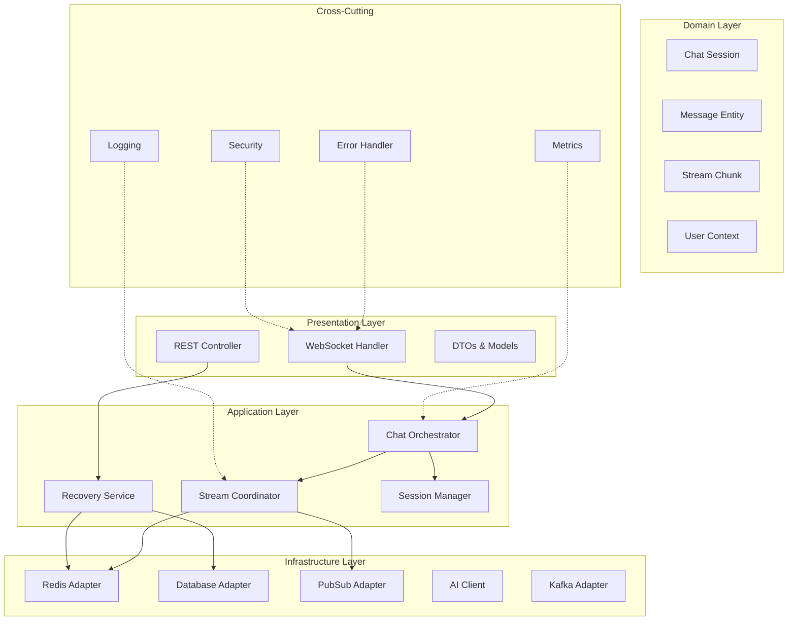
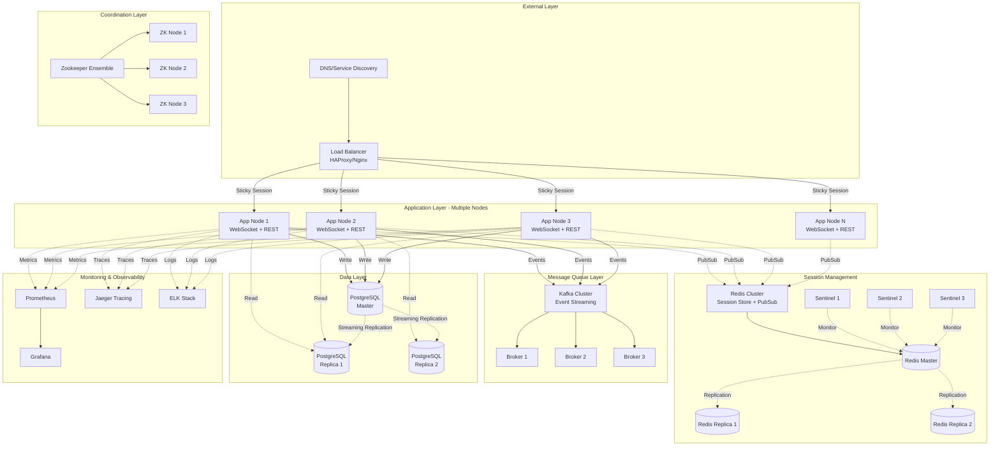

# Kiến Trúc Tối Ưu: Enterprise AI Stream Chat với Recovery Mechanism

## Tổng Quan Kiến Trúc
Tài liệu này trình bày kiến trúc chi tiết cho hệ thống AI streaming chat quy mô enterprise, tập trung vào **khả năng mở rộng, chịu lỗi, và phục hồi**. Hệ thống được thiết kế để xử lý hàng triệu kết nối đồng thời với độ trễ thấp và độ tin cậy cao.

### Các Tính Năng Chính
- ✅ **WebSocket Streaming** với real-time delivery
- ✅ **Automatic Recovery** khi client reconnect
- ✅ **Multi-node Deployment** với session affinity
- ✅ **Event Sourcing** với Kafka
- ✅ **Multi-layer Caching** (L1: Caffeine, L2: Redis)
- ✅ **Guaranteed Message Delivery**
- ✅ **Comprehensive Monitoring & Tracing**

## 1. Kiến Trúc Phân Tầng (Layered Architecture)
### 1.1 Sơ Đồ Tổng Quan


### 1.2 Trách Nhiệm Từng Layer
**Presentation Layer**
- Xử lý WebSocket connections và REST requests
- Validation và transformation của input/output
- Authentication và authorization tại entry point

**Application Layer**
- Orchestration của business workflows
- Coordination giữa các services
- Recovery mechanism và session management

**Domain Layer**
- Business logic và domain rules
- Entity relationships và invariants
- Domain events

**Infrastructure Layer**
- Integration với external systems
- Data persistence và caching
- Message queue và pub/sub

## 2. Domain Models Chi Tiết
### 2.1 Core Entities
```java
import jakarta.persistence.*;
import lombok.Data;
import lombok.Builder;
import lombok.AllArgsConstructor;
import lombok.NoArgsConstructor;
import java.time.Instant;
import java.util.List;
import java.util.Map;
import com.fasterxml.jackson.annotation.JsonInclude;
import io.hypersistence.utils.hibernate.type.json.JsonBinaryType;
import org.hibernate.annotations.Type;

/**
 * Chat Session - Represents an active streaming session
 *
 * Lifecycle: INITIALIZING → STREAMING → COMPLETED/ERROR/TIMEOUT
 */
@Data
@Builder
@AllArgsConstructor
@NoArgsConstructor
@Entity
@Table(name = "chat_sessions")
public class ChatSession {
    @Id
    @GeneratedValue(strategy = GenerationType.UUID)
    private UUID id;
   
    @Column(nullable = false, unique = true)
    private String sessionId;
   
    @Column(nullable = false)
    private UUID conversationId;
   
    @Column(nullable = false)
    private UUID userId;
   
    @Column(nullable = false)
    private UUID messageId;
   
    @Enumerated(EnumType.STRING)
    @Column(nullable = false)
    private SessionStatus status;
   
    @Column(nullable = false)
    private Instant startTime;
   
    private Instant lastActivityTime;
   
    private Integer totalChunks;
   
    @Embedded
    private StreamMetadata metadata;
   
    public enum SessionStatus {
        INITIALIZING("Session đang khởi tạo"),
        STREAMING("Đang stream data từ AI"),
        COMPLETED("Stream hoàn thành"),
        ERROR("Có lỗi xảy ra"),
        TIMEOUT("Session timeout");
       
        private final String description;
       
        SessionStatus(String description) {
            this.description = description;
        }
    }
   
    /**
     * Check if session is active (can receive chunks)
     */
    public boolean isActive() {
        return status == SessionStatus.STREAMING;
    }
   
    /**
     * Check if session is terminal (no more updates)
     */
    public boolean isTerminal() {
        return status == SessionStatus.COMPLETED
            || status == SessionStatus.ERROR
            || status == SessionStatus.TIMEOUT;
    }
}

/**
 * Stream Chunk - Individual piece of streamed content
 */
@Data
@Builder
@AllArgsConstructor
@NoArgsConstructor
@Entity
@Table(name = "stream_chunks", indexes = {
    @Index(name = "idx_message_chunk", columnList = "messageId,chunkIndex")
})
public class StreamChunk {
    @Id
    @GeneratedValue(strategy = GenerationType.IDENTITY)
    private Long id;
   
    @Column(nullable = false)
    private UUID messageId;
   
    @Column(nullable = false)
    private Integer chunkIndex;
   
    @Column(nullable = false, columnDefinition = "TEXT")
    private String content;
   
    @Enumerated(EnumType.STRING)
    private ChunkType type;
   
    @Column(nullable = false)
    private Instant timestamp;
   
    @Type(JsonBinaryType.class)
    @Column(columnDefinition = "jsonb")
    private Map<String, Object> metadata;
   
    public enum ChunkType {
        TEXT("Văn bản thông thường"),
        CODE("Code block"),
        THINKING("AI thinking process"),
        TOOL_USE("Tool execution"),
        CITATION("Trích dẫn nguồn");
       
        private final String description;
       
        ChunkType(String description) {
            this.description = description;
        }
    }
}

/**
 * Message - Complete message entity
 */
@Data
@Builder
@AllArgsConstructor
@NoArgsConstructor
@Entity
@Table(name = "messages", indexes = {
    @Index(name = "idx_conversation_created",
           columnList = "conversationId,createdAt"),
    @Index(name = "idx_user_created",
           columnList = "userId,createdAt"),
    @Index(name = "idx_status", columnList = "status")
})
public class Message {
    @Id
    @GeneratedValue(strategy = GenerationType.UUID)
    private UUID id;
   
    @Column(nullable = false)
    private UUID conversationId;
   
    @Column(nullable = false)
    private UUID userId;
   
    @Enumerated(EnumType.STRING)
    @Column(nullable = false)
    private MessageRole role;
   
    @Column(nullable = false, columnDefinition = "TEXT")
    private String content;
   
    @Enumerated(EnumType.STRING)
    @Column(nullable = false)
    private MessageStatus status;
   
    @Column(nullable = false)
    private Instant createdAt;
   
    private Instant updatedAt;
   
    @OneToMany(mappedBy = "messageId", cascade = CascadeType.ALL)
    private List<StreamChunk> chunks;
   
    @Embedded
    private MessageMetadata metadata;
   
    /**
     * Generated column for full-text search (PostgreSQL)
     */
    @Column(columnDefinition = "tsvector",
            insertable = false, updatable = false)
    private String contentTsv;
   
    public enum MessageRole {
        USER, ASSISTANT, SYSTEM
    }
   
    public enum MessageStatus {
        PENDING("Đang chờ xử lý"),
        STREAMING("Đang nhận data"),
        COMPLETED("Hoàn thành"),
        FAILED("Thất bại");
       
        private final String description;
       
        MessageStatus(String description) {
            this.description = description;
        }
    }
}

/**
 * Embedded metadata classes
 */
@Embeddable
@Data
@Builder
@AllArgsConstructor
@NoArgsConstructor
public class StreamMetadata {
    private String model;
    private Integer tokenCount;
    @Column(name = "latency_ms")
    private Long latencyMs;
    private String aiRequestId;
   
    @Type(JsonBinaryType.class)
    @Column(columnDefinition = "jsonb")
    private Map<String, Object> customMetadata;
}

@Embeddable
@Data
@Builder
@AllArgsConstructor
@NoArgsConstructor
public class MessageMetadata {
    private Integer tokenCount;
    private String model;
    @Column(name = "latency_ms")
    private Long latencyMs;
    private String temperature;
   
    @Type(JsonBinaryType.class)
    @Column(columnDefinition = "jsonb")
    private Map<String, Object> additionalData;
}
```

### 2.2 Recovery DTOs
```java
import jakarta.validation.constraints.NotNull;
import lombok.Data;
import lombok.Builder;
import java.time.Instant;
import java.util.List;
import java.util.Map;

/**
 * Recovery Request - Client gửi khi reconnect
 */
@Data
@Builder
public class RecoveryRequest {
    @NotNull(message = "Session ID không được null")
    private String sessionId;
   
    @NotNull(message = "Message ID không được null")
    private UUID messageId;
   
    /**
     * Index của chunk cuối cùng client nhận được
     * null = chưa nhận chunk nào
     */
    private Integer lastChunkIndex;
   
    /**
     * Timestamp từ phía client để verify
     */
    private Instant clientTimestamp;
   
    /**
     * Client metadata (browser, version, etc.)
     */
    private Map<String, String> clientInfo;
}

/**
 * Recovery Response - Server trả về khi recovery
 */
@Data
@Builder
public class RecoveryResponse {
    @NotNull
    private RecoveryStatus status;
   
    /**
     * Missing chunks cần gửi lại cho client
     */
    private List<StreamChunk> missingChunks;
   
    /**
     * Complete message nếu stream đã hoàn thành
     */
    private Message completeMessage;
   
    /**
     * Session info để client verify
     */
    private ChatSession session;
   
    /**
     * Có cần reconnect WebSocket không
     */
    private boolean shouldReconnect;
   
    /**
     * Error message nếu có
     */
    private String errorMessage;
   
    public enum RecoveryStatus {
        RECOVERED("Khôi phục thành công - sẽ tiếp tục stream"),
        COMPLETED("Stream đã hoàn thành - trả về message đầy đủ"),
        NOT_FOUND("Không tìm thấy session/message"),
        EXPIRED("Session đã hết hạn"),
        ERROR("Có lỗi xảy ra khi khôi phục");
       
        private final String description;
       
        RecoveryStatus(String description) {
            this.description = description;
        }
    }
}
```

## 3. Core Services Implementation
### 3.1 WebSocket Handler với Error Handling
```java
import org.springframework.stereotype.Component;
import org.springframework.web.socket.CloseStatus;
import org.springframework.web.socket.TextMessage;
import org.springframework.web.socket.WebSocketSession;
import org.springframework.web.socket.handler.TextWebSocketHandler;
import lombok.extern.slf4j.Slf4j;
import lombok.RequiredArgsConstructor;
import com.fasterxml.jackson.databind.ObjectMapper;
import io.micrometer.core.instrument.Tags;
import java.io.IOException;
import java.time.Instant;
import java.util.Map;
import java.util.UUID;
import org.slf4j.MDC;

/**
 * WebSocket Handler với comprehensive error handling
 *
 * Responsibilities:
 * - Manage WebSocket lifecycle
 * - Route messages to appropriate handlers
 * - Handle reconnection và recovery
 * - Implement heartbeat mechanism
 */
@Component
@Slf4j
@RequiredArgsConstructor
public class ChatWebSocketHandler extends TextWebSocketHandler {
   
    private final SessionManager sessionManager;
    private final ChatOrchestrator chatOrchestrator;
    private final RecoveryService recoveryService;
    private final SecurityValidator securityValidator;
    private final MetricsService metricsService;
    private final ObjectMapper objectMapper;
   
    @Override
    public void afterConnectionEstablished(WebSocketSession wsSession)
            throws Exception {
        String sessionId = null;
       
        try {
            // Extract và validate session info
            sessionId = extractSessionId(wsSession);
            String userId = extractUserId(wsSession);
            String token = extractToken(wsSession);
           
            // Security validation
            if (!securityValidator.validateToken(token, userId)) {
                log.warn("Invalid token for user: userId={}", userId);
                closeWithError(wsSession, "Authentication failed",
                    CloseStatus.NOT_ACCEPTABLE);
                return;
            }
           
            // Register session
            sessionManager.registerSession(sessionId, wsSession, userId);
           
            log.info("WebSocket connected: sessionId={}, userId={}, remoteAddress={}",
                sessionId, userId, wsSession.getRemoteAddress());
           
            metricsService.incrementCounter("websocket.connections",
                Tags.of("user", userId, "status", "success"));
           
            // Send welcome message
            sendWelcomeMessage(wsSession, sessionId, userId);
           
        } catch (SecurityException e) {
            log.error("Security violation during connection: sessionId={}",
                sessionId, e);
            closeWithError(wsSession, "Security check failed",
                CloseStatus.NOT_ACCEPTABLE);
            metricsService.incrementCounter("websocket.security_errors");
           
        } catch (Exception e) {
            log.error("Error establishing connection: sessionId={}",
                sessionId, e);
            closeWithError(wsSession, "Connection failed",
                CloseStatus.SERVER_ERROR);
            metricsService.incrementCounter("websocket.connection_errors");
        }
    }
   
    @Override
    protected void handleTextMessage(WebSocketSession wsSession,
                                     TextMessage message) {
        String sessionId = sessionManager.getSessionId(wsSession);
        MDC.put("sessionId", sessionId);
       
        try {
            // Parse message
            WebSocketMessage wsMessage = objectMapper.readValue(
                message.getPayload(),
                WebSocketMessage.class
            );
           
            // Validate message
            if (!isValidMessage(wsMessage)) {
                sendError(wsSession, "Invalid message format");
                metricsService.incrementCounter("websocket.invalid_messages");
                return;
            }
           
            // Route based on message type
            switch (wsMessage.getType()) {
                case CHAT_REQUEST -> handleChatRequest(wsSession, sessionId, wsMessage);
                case RECONNECT -> handleReconnect(wsSession, sessionId, wsMessage);
                case CANCEL_STREAM -> handleCancelStream(wsSession, sessionId, wsMessage);
                case HEARTBEAT -> handleHeartbeat(wsSession, sessionId);
                default -> {
                    log.warn("Unknown message type: {}", wsMessage.getType());
                    sendError(wsSession, "Unknown message type");
                }
            }
           
        } catch (JsonProcessingException e) {
            log.error("JSON parsing error: sessionId={}", sessionId, e);
            sendError(wsSession, "Invalid JSON format");
            metricsService.incrementCounter("websocket.json_errors");
           
        } catch (Exception e) {
            log.error("Error handling message: sessionId={}", sessionId, e);
            sendError(wsSession, "Message processing failed");
            metricsService.incrementCounter("websocket.processing_errors");
        } finally {
            MDC.clear();
        }
    }
   
    /**
     * Handle chat request - Start new streaming session
     */
    private void handleChatRequest(WebSocketSession wsSession,
                                   String sessionId,
                                   WebSocketMessage wsMessage) {
        try {
            ChatRequest request = wsMessage.toChatRequest();
            String userId = sessionManager.getUserId(sessionId);
           
            // Business validation
            ValidationResult validation = validateChatRequest(request, userId);
            if (!validation.isValid()) {
                sendError(wsSession, validation.getErrorMessage());
                return;
            }
           
            // Rate limiting check
            if (!checkRateLimit(userId)) {
                sendError(wsSession, "Rate limit exceeded");
                metricsService.incrementCounter("websocket.rate_limited");
                return;
            }
           
            log.info("Processing chat request: sessionId={}, userId={}, conversationId={}",
                sessionId, userId, request.getConversationId());
           
            // Start streaming (async)
            chatOrchestrator.processStreamingChat(
                userId,
                sessionId,
                request,
                new WebSocketStreamCallback(wsSession, metricsService, objectMapper)
            );
           
            metricsService.incrementCounter("websocket.chat_requests");
           
        } catch (Exception e) {
            log.error("Error handling chat request: sessionId={}", sessionId, e);
            sendError(wsSession, "Failed to process chat request");
        }
    }
   
    /**
     * Handle reconnect - Recovery mechanism
     */
    private void handleReconnect(WebSocketSession wsSession,
                                String sessionId,
                                WebSocketMessage wsMessage) {
        try {
            RecoveryRequest recoveryRequest = wsMessage.toRecoveryRequest();
           
            log.info("Recovery requested: sessionId={}, messageId={}, lastChunk={}",
                sessionId,
                recoveryRequest.getMessageId(),
                recoveryRequest.getLastChunkIndex());
           
            // Execute recovery
            RecoveryResponse recovery = recoveryService.recoverStream(recoveryRequest);
           
            // Handle recovery result
            switch (recovery.getStatus()) {
                case RECOVERED -> {
                    log.info("Stream recovered: sessionId={}, missingChunks={}",
                        sessionId, recovery.getMissingChunks().size());
                   
                    // Send missing chunks
                    for (StreamChunk chunk : recovery.getMissingChunks()) {
                        sendChunk(wsSession, chunk);
                    }
                   
                    // Resubscribe if still streaming
                    if (recovery.getSession().getStatus() == SessionStatus.STREAMING) {
                        chatOrchestrator.resubscribeStream(
                            sessionId,
                            recovery.getSession(),
                            new WebSocketStreamCallback(wsSession, metricsService, objectMapper)
                        );
                    }
                   
                    metricsService.incrementCounter("websocket.recovery.recovered",
                        Tags.of("chunks", String.valueOf(recovery.getMissingChunks().size())));
                }
               
                case COMPLETED -> {
                    log.info("Stream already completed: sessionId={}", sessionId);
                    sendCompleteMessage(wsSession, recovery.getCompleteMessage());
                    metricsService.incrementCounter("websocket.recovery.completed");
                }
               
                case NOT_FOUND, EXPIRED -> {
                    log.warn("Recovery failed: sessionId={}, status={}",
                        sessionId, recovery.getStatus());
                    sendRecoveryFailed(wsSession, recovery);
                    metricsService.incrementCounter("websocket.recovery.failed",
                        Tags.of("reason", recovery.getStatus().name()));
                }
               
                case ERROR -> {
                    log.error("Recovery error: sessionId={}, error={}",
                        sessionId, recovery.getErrorMessage());
                    sendError(wsSession, recovery.getErrorMessage());
                    metricsService.incrementCounter("websocket.recovery.error");
                }
            }
           
        } catch (Exception e) {
            log.error("Error handling reconnect: sessionId={}", sessionId, e);
            sendError(wsSession, "Recovery failed");
        }
    }
   
    /**
     * Handle heartbeat - Keep connection alive
     */
    private void handleHeartbeat(WebSocketSession wsSession, String sessionId) {
        try {
            sessionManager.updateHeartbeat(sessionId);
           
            // Send heartbeat ack
            WebSocketMessage ack = WebSocketMessage.builder()
                .type(MessageType.HEARTBEAT_ACK)
                .timestamp(Instant.now())
                .build();
           
            wsSession.sendMessage(new TextMessage(
                objectMapper.writeValueAsString(ack)
            ));
           
            log.debug("Heartbeat received: sessionId={}", sessionId);
           
        } catch (IOException e) {
            log.error("Error sending heartbeat ack: sessionId={}", sessionId, e);
        }
    }
   
    @Override
    public void afterConnectionClosed(WebSocketSession wsSession,
                                     CloseStatus status) {
        String sessionId = sessionManager.getSessionId(wsSession);
       
        log.info("WebSocket closed: sessionId={}, status={}, reason={}",
            sessionId, status.getCode(), status.getReason());
       
        // Cleanup
        sessionManager.unregisterSession(sessionId);
       
        metricsService.incrementCounter("websocket.disconnections",
            Tags.of("code", String.valueOf(status.getCode()),
                    "reason", status.getReason() != null ? status.getReason() : "unknown"));
    }
   
    @Override
    public void handleTransportError(WebSocketSession wsSession,
                                    Throwable exception) {
        String sessionId = sessionManager.getSessionId(wsSession);
       
        log.error("WebSocket transport error: sessionId={}, error={}",
            sessionId, exception.getMessage(), exception);
       
        sessionManager.markSessionError(sessionId);
        metricsService.incrementCounter("websocket.transport_errors",
            Tags.of("error_type", exception.getClass().getSimpleName()));
    }
   
    // ============================================
    // Helper Methods
    // ============================================
   
    private void sendChunk(WebSocketSession wsSession, StreamChunk chunk) {
        try {
            WebSocketMessage message = WebSocketMessage.builder()
                .type(MessageType.CHUNK)
                .data(chunk)
                .timestamp(Instant.now())
                .build();
           
            wsSession.sendMessage(new TextMessage(
                objectMapper.writeValueAsString(message)
            ));
           
        } catch (IOException e) {
            log.error("Failed to send chunk: chunkIndex={}", chunk.getIndex(), e);
        }
    }
   
    private void sendError(WebSocketSession wsSession, String error) {
        try {
            WebSocketMessage message = WebSocketMessage.builder()
                .type(MessageType.ERROR)
                .error(error)
                .timestamp(Instant.now())
                .build();
           
            wsSession.sendMessage(new TextMessage(
                objectMapper.writeValueAsString(message)
            ));
           
        } catch (IOException e) {
            log.error("Failed to send error message", e);
        }
    }
   
    private void sendWelcomeMessage(WebSocketSession wsSession,
                                   String sessionId,
                                   String userId) throws IOException {
        WebSocketMessage welcome = WebSocketMessage.builder()
            .type(MessageType.WELCOME)
            .data(Map.of(
                "sessionId", sessionId,
                "userId", userId,
                "serverTime", Instant.now().toString()
            ))
            .timestamp(Instant.now())
            .build();
       
        wsSession.sendMessage(new TextMessage(
            objectMapper.writeValueAsString(welcome)
        ));
    }
   
    private void closeWithError(WebSocketSession wsSession,
                               String error,
                               CloseStatus status) throws IOException {
        sendError(wsSession, error);
        wsSession.close(status);
    }
   
    private String extractSessionId(WebSocketSession wsSession) {
        Map<String, Object> attributes = wsSession.getAttributes();
        String sessionId = (String) attributes.get("sessionId");
       
        if (sessionId == null) {
            sessionId = UUID.randomUUID().toString();
            attributes.put("sessionId", sessionId);
        }
       
        return sessionId;
    }
   
    private String extractUserId(WebSocketSession wsSession) {
        return (String) wsSession.getAttributes().get("userId");
    }
   
    private String extractToken(WebSocketSession wsSession) {
        return (String) wsSession.getAttributes().get("token");
    }
   
    private boolean isValidMessage(WebSocketMessage message) {
        return message != null
            && message.getType() != null
            && message.getTimestamp() != null;
    }
   
    private ValidationResult validateChatRequest(ChatRequest request, String userId) {
        // Implement business validation
        if (request.getContent() == null || request.getContent().isBlank()) {
            return ValidationResult.invalid("Message content cannot be empty");
        }
       
        if (request.getContent().length() > 10000) {
            return ValidationResult.invalid("Message too long (max 10000 characters)");
        }
       
        return ValidationResult.valid();
    }
   
    private boolean checkRateLimit(String userId) {
        // Implement rate limiting logic
        return true; // Simplified
    }
}

/**
 * WebSocket callback implementation
 */
@Slf4j
@RequiredArgsConstructor
public class WebSocketStreamCallback implements StreamCallback {
   
    private final WebSocketSession wsSession;
    private final MetricsService metricsService;
    private final ObjectMapper objectMapper;
   
    @Override
    public void onChunk(StreamChunk chunk) {
        try {
            if (!wsSession.isOpen()) {
                log.warn("WebSocket closed, cannot send chunk: index={}",
                    chunk.getIndex());
                return;
            }
           
            WebSocketMessage message = WebSocketMessage.builder()
                .type(MessageType.CHUNK)
                .data(chunk)
                .timestamp(Instant.now())
                .build();
           
            wsSession.sendMessage(new TextMessage(
                objectMapper.writeValueAsString(message)
            ));
           
            metricsService.incrementCounter("websocket.chunks_sent");
           
        } catch (IOException e) {
            log.error("Failed to send chunk via WebSocket", e);
            metricsService.incrementCounter("websocket.chunk_send_errors");
        }
    }
   
    @Override
    public void onComplete(Message message) {
        try {
            if (!wsSession.isOpen()) {
                log.warn("WebSocket closed, cannot send completion");
                return;
            }
           
            WebSocketMessage wsMessage = WebSocketMessage.builder()
                .type(MessageType.COMPLETE)
                .data(message)
                .timestamp(Instant.now())
                .build();
           
            wsSession.sendMessage(new TextMessage(
                objectMapper.writeValueAsString(wsMessage)
            ));
           
            log.info("Stream completed: messageId={}", message.getId());
            metricsService.incrementCounter("websocket.streams_completed");
           
        } catch (IOException e) {
            log.error("Failed to send completion via WebSocket", e);
        }
    }
   
    @Override
    public void onError(Throwable error) {
        try {
            if (!wsSession.isOpen()) {
                return;
            }
           
            WebSocketMessage message = WebSocketMessage.builder()
                .type(MessageType.ERROR)
                .error(error.getMessage())
                .timestamp(Instant.now())
                .build();
           
            wsSession.sendMessage(new TextMessage(
                objectMapper.writeValueAsString(message)
            ));
           
            metricsService.incrementCounter("websocket.stream_errors");
           
        } catch (IOException e) {
            log.error("Failed to send error via WebSocket", e);
        }
    }
}
```

### 3.2 Chat Orchestrator Service - Cải Tiến
```java
import org.springframework.stereotype.Service;
import org.springframework.beans.factory.annotation.Value;
import lombok.extern.slf4j.Slf4j;
import lombok.RequiredArgsConstructor;
import lombok.Data;
import lombok.Builder;
import io.github.resilience4j.circuitbreaker.CircuitBreaker;
import io.github.resilience4j.circuitbreaker.CircuitBreakerConfig;
import io.github.resilience4j.circuitbreaker.CallNotPermittedException;
import io.github.resilience4j.ratelimiter.RateLimiter;
import io.github.resilience4j.ratelimiter.RateLimiterConfig;
import io.github.resilience4j.ratelimiter.RequestNotPermitted;
import java.util.concurrent.CompletableFuture;
import java.util.concurrent.Executors;
import java.util.concurrent.ExecutorService;
import java.util.concurrent.TimeUnit;
import java.util.concurrent.TimeoutException;
import java.util.concurrent.atomic.AtomicInteger;
import java.util.concurrent.atomic.AtomicLong;
import java.util.UUID;
import java.time.Instant;
import java.time.Duration;
import java.util.HashMap;
import java.util.Map;
import java.util.function.Supplier;

/**
 * Chat Orchestrator - Central service điều phối streaming workflow
 *
 * Responsibilities:
 * - Orchestrate streaming process từ đầu đến cuối
 * - Coordinate giữa AI client, cache, database, và pubsub
 * - Handle errors và retry logic
 * - Manage concurrent streaming sessions
 * - Implement circuit breaker pattern
 *
 * Performance Considerations:
 * - Sử dụng Virtual Threads (Java 21+) cho I/O operations
 * - Async processing với CompletableFuture
 * - Batch updates cho performance
 * - Connection pooling và reuse
 */
@Service
@Slf4j
@RequiredArgsConstructor
public class ChatOrchestrator {
   
    private final StreamCoordinator streamCoordinator;
    private final MessageRepository messageRepository;
    private final ConversationRepository conversationRepository;
    private final AIClientAdapter aiClient;
    private final RedisStreamCache streamCache;
    private final PubSubPublisher pubSubPublisher;
    private final KafkaEventPublisher kafkaEventPublisher;
    private final ExecutorService executorService = Executors.newVirtualThreadPerTaskExecutor();
    private final CircuitBreaker circuitBreaker;
    private final RateLimiter rateLimiter;
   
    // Configuration
    @Value("${stream.max-chunk-size:1024}")
    private int maxChunkSize;
   
    @Value("${stream.timeout-seconds:300}")
    private int streamTimeoutSeconds;
   
    @Value("${stream.max-concurrent-streams:1000}")
    private int maxConcurrentStreams;
   
    // Concurrent streams tracking
    private final AtomicInteger activeStreams = new AtomicInteger(0);
   
    public ChatOrchestrator(StreamCoordinator streamCoordinator,
                           MessageRepository messageRepository,
                           ConversationRepository conversationRepository,
                           AIClientAdapter aiClient,
                           RedisStreamCache streamCache,
                           PubSubPublisher pubSubPublisher,
                           KafkaEventPublisher kafkaEventPublisher,
                           @Value("${app.node.id}") String nodeId) {
        this.streamCoordinator = streamCoordinator;
        this.messageRepository = messageRepository;
        this.conversationRepository = conversationRepository;
        this.aiClient = aiClient;
        this.streamCache = streamCache;
        this.pubSubPublisher = pubSubPublisher;
        this.kafkaEventPublisher = kafkaEventPublisher;
       
        // Virtual threads cho I/O-bound operations
        this.executorService = Executors.newVirtualThreadPerTaskExecutor();
       
        // Circuit breaker cho AI service
        this.circuitBreaker = CircuitBreaker.of("ai-service",
            CircuitBreakerConfig.custom()
                .failureRateThreshold(50)
                .waitDurationInOpenState(Duration.ofSeconds(30))
                .slidingWindowSize(10)
                .build());
       
        // Rate limiter
        this.rateLimiter = RateLimiter.of("stream-rate-limiter",
            RateLimiterConfig.custom()
                .limitForPeriod(maxConcurrentStreams)
                .limitRefreshPeriod(Duration.ofSeconds(1))
                .timeoutDuration(Duration.ofSeconds(5))
                .build());
    }
   
    /**
     * Process streaming chat - Main entry point
     *
     * Flow:
     * 1. Validate và prepare request
     * 2. Create session và messages
     * 3. Initialize cache
     * 4. Start async streaming
     * 5. Handle completion/error
     */
    public void processStreamingChat(String userId,
                                    String sessionId,
                                    ChatRequest request,
                                    StreamCallback callback) {
       
        // Check capacity
        if (activeStreams.get() >= maxConcurrentStreams) {
            log.warn("Max concurrent streams reached: current={}, max={}",
                activeStreams.get(), maxConcurrentStreams);
            callback.onError(new StreamCapacityException(
                "Server at capacity, please try again later"));
            return;
        }
       
        // Rate limiting
        try {
            rateLimiter.acquirePermission();
        } catch (RequestNotPermitted e) {
            log.warn("Rate limit exceeded for user: userId={}", userId);
            callback.onError(new RateLimitException("Too many requests"));
            return;
        }
       
        try {
            // Increment active streams counter
            int current = activeStreams.incrementAndGet();
            log.info("Starting stream: userId={}, sessionId={}, activeStreams={}",
                userId, sessionId, current);
           
            // Create chat session
            ChatSession session = createChatSession(userId, sessionId, request);
           
            // Save user message
            Message userMessage = saveUserMessage(userId, request);
           
            // Create assistant message (pending)
            Message assistantMessage = createAssistantMessage(
                userId,
                request.getConversationId(),
                session.getMessageId()
            );
           
            // Initialize stream in cache
            streamCache.initializeStream(session);
           
            // Publish stream started event to Kafka
            publishStreamStartedEvent(session, request);
           
            // Process async với timeout
            CompletableFuture.runAsync(() -> {
                try {
                    processAIStreamWithTimeout(session, request, callback);
                } catch (Exception e) {
                    handleStreamError(session, callback, e);
                } finally {
                    activeStreams.decrementAndGet();
                }
            }, executorService)
            .orTimeout(streamTimeoutSeconds, TimeUnit.SECONDS)
            .exceptionally(throwable -> {
                if (throwable instanceof TimeoutException) {
                    handleStreamTimeout(session, callback);
                }
                return null;
            });
           
        } catch (Exception e) {
            activeStreams.decrementAndGet();
            log.error("Error starting stream: userId={}, sessionId={}",
                userId, sessionId, e);
            callback.onError(e);
        }
    }
   
    /**
     * Process AI stream với circuit breaker protection
     */
    private void processAIStreamWithTimeout(ChatSession session,
                                           ChatRequest request,
                                           StreamCallback callback) {
       
        AtomicInteger chunkIndex = new AtomicInteger(0);
        StringBuilder fullContent = new StringBuilder();
        Instant streamStart = Instant.now();
        AtomicLong lastChunkTime = new AtomicLong(System.currentTimeMillis());
       
        try {
            // Update session status
            session.setStatus(SessionStatus.STREAMING);
            streamCache.updateSession(session);
           
            log.info("Calling AI service: sessionId={}, model={}",
                session.getSessionId(), request.getModel());
           
            // Call AI với circuit breaker
            Supplier<Void> aiCallSupplier = () -> {
                aiClient.streamChat(request, new AIStreamHandler() {
                   
                    @Override
                    public void onChunk(String content, ChunkMetadata metadata) {
                        try {
                            processChunk(
                                session,
                                chunkIndex,
                                fullContent,
                                content,
                                metadata,
                                callback,
                                lastChunkTime
                            );
                        } catch (Exception e) {
                            log.error("Error processing chunk: sessionId={}, index={}",
                                session.getSessionId(), chunkIndex.get(), e);
                            throw new StreamProcessingException("Chunk processing failed", e);
                        }
                    }
                   
                    @Override
                    public void onComplete(AIResponse response) {
                        try {
                            completeStream(
                                session,
                                chunkIndex,
                                fullContent,
                                streamStart,
                                response,
                                callback
                            );
                        } catch (Exception e) {
                            log.error("Error completing stream: sessionId={}",
                                session.getSessionId(), e);
                            handleStreamError(session, callback, e);
                        }
                    }
                   
                    @Override
                    public void onError(Throwable error) {
                        handleStreamError(session, callback, error);
                    }
                });
                return null;
            };
           
            // Execute với circuit breaker
            circuitBreaker.executeSupplier(aiCallSupplier);
           
        } catch (CallNotPermittedException e) {
            log.error("Circuit breaker open for AI service: sessionId={}",
                session.getSessionId());
            handleStreamError(session, callback,
                new ServiceUnavailableException("AI service temporarily unavailable"));
           
        } catch (Exception e) {
            log.error("Unexpected error in stream processing: sessionId={}",
                session.getSessionId(), e);
            handleStreamError(session, callback, e);
        }
    }
   
    /**
     * Process individual chunk với validation và persistence
     */
    private void processChunk(ChatSession session,
                             AtomicInteger chunkIndex,
                             StringBuilder fullContent,
                             String content,
                             ChunkMetadata metadata,
                             StreamCallback callback,
                             AtomicLong lastChunkTime) {
       
        int index = chunkIndex.getAndIncrement();
        Instant chunkTimestamp = Instant.now();
       
        // Validate chunk size
        if (content.length() > maxChunkSize) {
            log.warn("Chunk size exceeds limit: size={}, max={}, truncating",
                content.length(), maxChunkSize);
            content = content.substring(0, maxChunkSize);
        }
       
        // Create chunk entity
        StreamChunk chunk = StreamChunk.builder()
            .messageId(session.getMessageId())
            .chunkIndex(index)
            .content(content)
            .type(determineChunkType(metadata))
            .timestamp(chunkTimestamp)
            .metadata(buildChunkMetadata(metadata, chunkTimestamp))
            .build();
       
        fullContent.append(content);
       
        // Measure inter-chunk latency
        long interChunkLatency = System.currentTimeMillis() - lastChunkTime.get();
        lastChunkTime.set(System.currentTimeMillis());
       
        log.debug("Processing chunk: sessionId={}, index={}, size={}, latency={}ms",
            session.getSessionId(), index, content.length(), interChunkLatency);
       
        // 1. Cache chunk in Redis (fast path)
        try {
            streamCache.appendChunk(session.getMessageId(), chunk);
        } catch (Exception e) {
            log.error("Failed to cache chunk, continuing: sessionId={}, index={}",
                session.getSessionId(), index, e);
            // Don't fail the stream if caching fails
        }
       
        // 2. Publish to PubSub for real-time delivery to other nodes
        try {
            pubSubPublisher.publishChunk(session.getSessionId(), chunk);
        } catch (Exception e) {
            log.error("Failed to publish chunk to PubSub: sessionId={}, index={}",
                session.getSessionId(), index, e);
        }
       
        // 3. Publish to Kafka for durability (async)
        CompletableFuture.runAsync(() -> {
            try {
                kafkaEventPublisher.publishEvent(ChunkReceivedEvent.builder()
                    .eventId(UUID.randomUUID().toString())
                    .eventType("CHUNK_RECEIVED")
                    .aggregateId(session.getMessageId().toString())
                    .userId(session.getUserId())
                    .timestamp(chunkTimestamp)
                    .messageId(session.getMessageId())
                    .chunkIndex(index)
                    .content(content)
                    .latencyMs(interChunkLatency)
                    .metadata(Map.of("nodeId", getNodeId()))
                    .build());
            } catch (Exception e) {
                log.error("Failed to publish chunk event to Kafka", e);
            }
        }, executorService);
       
        // 4. Callback to WebSocket
        callback.onChunk(chunk);
       
        // 5. Update session metadata
        session.setLastActivityTime(chunkTimestamp);
        session.setTotalChunks(index + 1);
        streamCache.updateSession(session);
       
        // Metrics
        metricsService.incrementCounter("stream.chunks.processed",
            Tags.of("type", chunk.getType().name()));
        metricsService.recordTimer("stream.inter_chunk_latency",
            Duration.ofMillis(interChunkLatency));
    }
   
    /**
     * Complete stream với persistence và cleanup
     */
    private void completeStream(ChatSession session,
                               AtomicInteger chunkIndex,
                               StringBuilder fullContent,
                               Instant streamStart,
                               AIResponse response,
                               StreamCallback callback) {
       
        Instant completionTime = Instant.now();
        Duration totalLatency = Duration.between(streamStart, completionTime);
        int totalChunks = chunkIndex.get();
       
        log.info("Stream completing: sessionId={}, chunks={}, latency={}ms, tokens={}",
            session.getSessionId(),
            totalChunks,
            totalLatency.toMillis(),
            response.getTokenCount());
       
        try {
            // Update session
            session.setStatus(SessionStatus.COMPLETED);
            session.setTotalChunks(totalChunks);
            session.getMetadata().setLatencyMs(totalLatency.toMillis());
            session.getMetadata().setTokenCount(response.getTokenCount());
           
            // Mark stream as complete in cache (với TTL)
            streamCache.markComplete(
                session.getMessageId(),
                Duration.ofMinutes(5)
            );
           
            // Save complete message to database
            Message message = messageRepository.findById(session.getMessageId())
                .orElseThrow(() -> new MessageNotFoundException(
                    "Message not found: " + session.getMessageId()));
           
            message.setContent(fullContent.toString());
            message.setStatus(MessageStatus.COMPLETED);
            message.setUpdatedAt(completionTime);
            message.getMetadata().setTokenCount(response.getTokenCount());
            message.getMetadata().setLatencyMs(totalLatency.toMillis());
            message.getMetadata().setModel(response.getModel());
           
            Message savedMessage = messageRepository.save(message);
           
            // Update conversation stats
            updateConversationStats(session.getConversationId(), completionTime);
           
            // Publish complete event to PubSub
            pubSubPublisher.publishComplete(session.getSessionId(), savedMessage);
           
            // Publish to Kafka (async)
            CompletableFuture.runAsync(() -> {
                kafkaEventPublisher.publishEvent(StreamCompletedEvent.builder()
                    .eventId(UUID.randomUUID().toString())
                    .eventType("STREAM_COMPLETED")
                    .aggregateId(session.getMessageId().toString())
                    .userId(session.getUserId())
                    .timestamp(completionTime)
                    .messageId(session.getMessageId())
                    .totalChunks(totalChunks)
                    .totalTokens(response.getTokenCount())
                    .durationMs(totalLatency.toMillis())
                    .metadata(Map.of(
                        "nodeId", getNodeId(),
                        "model", response.getModel()
                    ))
                    .build());
            }, executorService);
           
            // Trigger background jobs (async)
            triggerBackgroundJobs(savedMessage);
           
            // Callback
            callback.onComplete(savedMessage);
           
            // Metrics
            metricsService.incrementCounter("stream.completed",
                Tags.of("model", response.getModel()));
            metricsService.recordTimer("stream.total_latency", totalLatency);
            metricsService.recordDistribution("stream.chunks_count", totalChunks);
            metricsService.recordDistribution("stream.tokens_count", response.getTokenCount());
           
            log.info("Stream completed successfully: sessionId={}, messageId={}",
                session.getSessionId(), session.getMessageId());
           
        } catch (Exception e) {
            log.error("Error completing stream: sessionId={}",
                session.getSessionId(), e);
            handleStreamError(session, callback, e);
        }
    }
   
    /**
     * Handle stream error với proper cleanup
     */
    private void handleStreamError(ChatSession session,
                                  StreamCallback callback,
                                  Throwable error) {
       
        log.error("Stream error: sessionId={}, messageId={}, error={}",
            session.getSessionId(),
            session.getMessageId(),
            error.getMessage(),
            error);
       
        try {
            // Update session status
            session.setStatus(SessionStatus.ERROR);
            streamCache.updateSession(session);
           
            // Update message status in database
            messageRepository.findById(session.getMessageId())
                .ifPresent(msg -> {
                    msg.setStatus(MessageStatus.FAILED);
                    msg.setUpdatedAt(Instant.now());
                    messageRepository.save(msg);
                });
           
            // Publish error event
            pubSubPublisher.publishError(
                session.getSessionId(),
                error.getMessage()
            );
           
            // Publish to Kafka
            kafkaEventPublisher.publishEvent(ChatEvent.builder()
                .eventId(UUID.randomUUID().toString())
                .eventType("STREAM_ERROR")
                .aggregateId(session.getMessageId().toString())
                .userId(session.getUserId())
                .timestamp(Instant.now())
                .metadata(Map.of(
                    "error", error.getMessage(),
                    "errorType", error.getClass().getSimpleName(),
                    "nodeId", getNodeId()
                ))
                .build());
           
            // Callback
            callback.onError(error);
           
            // Metrics
            metricsService.incrementCounter("stream.errors",
                Tags.of("error_type", error.getClass().getSimpleName()));
           
        } catch (Exception e) {
            log.error("Error in error handler: sessionId={}",
                session.getSessionId(), e);
        }
    }
   
    /**
     * Handle stream timeout
     */
    private void handleStreamTimeout(ChatSession session, StreamCallback callback) {
        log.error("Stream timeout: sessionId={}, timeout={}s",
            session.getSessionId(), streamTimeoutSeconds);
       
        session.setStatus(SessionStatus.TIMEOUT);
        streamCache.updateSession(session);
       
        TimeoutException timeoutException = new TimeoutException(
            String.format("Stream timeout after %d seconds", streamTimeoutSeconds));
       
        handleStreamError(session, callback, timeoutException);
    }
   
    /**
     * Resubscribe to ongoing stream (for reconnection)
     */
    public void resubscribeStream(String sessionId,
                                 ChatSession session,
                                 StreamCallback callback) {
       
        log.info("Resubscribing to stream: sessionId={}, messageId={}",
            sessionId, session.getMessageId());
       
        try {
            // Subscribe to PubSub for remaining chunks
            pubSubPublisher.subscribe(sessionId, new PubSubListener() {
                @Override
                public void onChunk(StreamChunk chunk) {
                    callback.onChunk(chunk);
                }
               
                @Override
                public void onComplete(Message message) {
                    callback.onComplete(message);
                }
               
                @Override
                public void onError(String error) {
                    callback.onError(new RuntimeException(error));
                }
            });
           
            metricsService.incrementCounter("stream.resubscribed");
           
        } catch (Exception e) {
            log.error("Error resubscribing to stream: sessionId={}", sessionId, e);
            callback.onError(e);
        }
    }
   
    // ============================================
    // Helper Methods
    // ============================================
   
    private ChatSession createChatSession(String userId,
                                         String sessionId,
                                         ChatRequest request) {
        UUID messageId = UUID.randomUUID();
       
        ChatSession session = ChatSession.builder()
            .sessionId(sessionId)
            .conversationId(request.getConversationId())
            .userId(userId)
            .messageId(messageId)
            .status(SessionStatus.INITIALIZING)
            .startTime(Instant.now())
            .lastActivityTime(Instant.now())
            .totalChunks(0)
            .metadata(StreamMetadata.builder()
                .model(request.getModel())
                .customMetadata(new HashMap<>())
                .build())
            .build();
       
        log.debug("Created chat session: {}", session);
        return session;
    }
   
    private Message saveUserMessage(String userId, ChatRequest request) {
        Message userMessage = Message.builder()
            .conversationId(request.getConversationId())
            .userId(userId)
            .role(MessageRole.USER)
            .content(request.getContent())
            .status(MessageStatus.COMPLETED)
            .createdAt(Instant.now())
            .updatedAt(Instant.now())
            .metadata(MessageMetadata.builder()
                .additionalData(new HashMap<>())
                .build())
            .build();
       
        return messageRepository.save(userMessage);
    }
   
    private Message createAssistantMessage(String userId,
                                          UUID conversationId,
                                          UUID messageId) {
        Message assistantMessage = Message.builder()
            .id(messageId)
            .conversationId(conversationId)
            .userId(userId)
            .role(MessageRole.ASSISTANT)
            .content("")
            .status(MessageStatus.PENDING)
            .createdAt(Instant.now())
            .updatedAt(Instant.now())
            .metadata(MessageMetadata.builder()
                .additionalData(new HashMap<>())
                .build())
            .build();
       
        return messageRepository.save(assistantMessage);
    }
   
    private void updateConversationStats(UUID conversationId, Instant timestamp) {
        conversationRepository.findById(conversationId)
            .ifPresent(conversation -> {
                conversation.setLastMessageAt(timestamp);
                conversation.setMessageCount(conversation.getMessageCount() + 1);
                conversation.setUpdatedAt(timestamp);
                conversationRepository.save(conversation);
            });
    }
   
    private void triggerBackgroundJobs(Message message) {
        // Notification job
        CompletableFuture.runAsync(() -> {
            // TODO: Implement notification logic
        }, executorService);
       
        // Search indexing job
        CompletableFuture.runAsync(() -> {
            // TODO: Implement search indexing
        }, executorService);
       
        // Analytics job
        CompletableFuture.runAsync(() -> {
            // TODO: Implement analytics
        }, executorService);
    }
   
    private ChunkType determineChunkType(ChunkMetadata metadata) {
        if (metadata == null) {
            return ChunkType.TEXT;
        }
       
        String type = metadata.getType();
        if (type != null) {
            try {
                return ChunkType.valueOf(type.toUpperCase());
            } catch (IllegalArgumentException e) {
                log.warn("Unknown chunk type: {}, defaulting to TEXT", type);
            }
        }
       
        return ChunkType.TEXT;
    }
   
    private Map<String, Object> buildChunkMetadata(ChunkMetadata aiMetadata,
                                                   Instant timestamp) {
        Map<String, Object> metadata = new HashMap<>();
        metadata.put("timestamp", timestamp.toString());
        metadata.put("nodeId", getNodeId());
       
        if (aiMetadata != null && aiMetadata.getAdditionalData() != null) {
            metadata.putAll(aiMetadata.getAdditionalData());
        }
       
        return metadata;
    }
   
    private void publishStreamStartedEvent(ChatSession session, ChatRequest request) {
        try {
            kafkaEventPublisher.publishEvent(StreamStartedEvent.builder()
                .eventId(UUID.randomUUID().toString())
                .eventType("STREAM_STARTED")
                .aggregateId(session.getMessageId().toString())
                .userId(session.getUserId())
                .timestamp(session.getStartTime())
                .messageId(session.getMessageId())
                .sessionId(session.getSessionId())
                .model(request.getModel())
                .metadata(Map.of("nodeId", getNodeId()))
                .build());
        } catch (Exception e) {
            log.error("Failed to publish stream started event", e);
        }
    }
   
    private String getNodeId() {
        // Get from Spring context or config
        return "node-1"; // Simplified
    }
   
    /**
     * Get current orchestrator statistics
     */
    public OrchestratorStats getStats() {
        return OrchestratorStats.builder()
            .activeStreams(activeStreams.get())
            .maxConcurrentStreams(maxConcurrentStreams)
            .circuitBreakerState(circuitBreaker.getState().name())
            .build();
    }
}

/**
 * Supporting classes
 */
@Data
@Builder
class OrchestratorStats {
    private int activeStreams;
    private int maxConcurrentStreams;
    private String circuitBreakerState;
}

@Data
@Builder
class ValidationResult {
    private boolean valid;
    private String errorMessage;
   
    public static ValidationResult valid() {
        return ValidationResult.builder().valid(true).build();
    }
   
    public static ValidationResult invalid(String errorMessage) {
        return ValidationResult.builder()
            .valid(false)
            .errorMessage(errorMessage)
            .build();
    }
}

// Custom exceptions
class StreamCapacityException extends RuntimeException {
    public StreamCapacityException(String message) {
        super(message);
    }
}

class RateLimitException extends RuntimeException {
    public RateLimitException(String message) {
        super(message);
    }
}

class StreamProcessingException extends RuntimeException {
    public StreamProcessingException(String message, Throwable cause) {
        super(message, cause);
    }
}

class ServiceUnavailableException extends RuntimeException {
    public ServiceUnavailableException(String message) {
        super(message);
    }
}

class MessageNotFoundException extends RuntimeException {
    public MessageNotFoundException(String message) {
        super(message);
    }
}
```

### 3.3 Recovery Service - Cải Tiến Chi Tiết
```java
import org.springframework.stereotype.Service;
import org.springframework.transaction.annotation.Transactional;
import org.springframework.beans.factory.annotation.Value;
import lombok.extern.slf4j.Slf4j;
import lombok.RequiredArgsConstructor;
import io.github.resilience4j.circuitbreaker.CircuitBreaker;
import java.util.Optional;
import java.util.List;
import java.util.UUID;
import java.time.Duration;
import java.time.Instant;
import java.util.Comparator;
import java.util.Collections;
import java.util.concurrent.TimeUnit;
import org.redisson.api.RLock;
import org.redisson.api.RedissonClient;
import io.micrometer.core.instrument.Tags;

/**
 * Recovery Service - Xử lý khôi phục stream khi client reconnect
 *
 * Recovery Strategy:
 * 1. Check Redis cache first (fast path)
 * 2. Fallback to database if needed (slow path)
 * 3. Verify session validity và expiration
 * 4. Handle different recovery scenarios
 *
 * Performance:
 * - Average recovery time: <50ms (cache hit)
 * - Database fallback: <200ms
 * - Support concurrent recovery requests
 */
@Service
@Slf4g
@RequiredArgsConstructor
public class RecoveryService {
   
    private final RedisStreamCache streamCache;
    private final MessageRepository messageRepository;
    private final StreamChunkRepository streamChunkRepository;
    private final ChatSessionRepository chatSessionRepository;
    private final MetricsService metricsService;
    private final RedissonClient redissonClient;
   
    // Configuration
    @Value("${recovery.session-ttl-minutes:10}")
    private int sessionTtlMinutes;
   
    @Value("${recovery.max-chunks-per-request:1000}")
    private int maxChunksPerRequest;
   
    @Value("${recovery.enable-database-fallback:true}")
    private boolean enableDatabaseFallback;
   
    /**
     * Main recovery method - handles all recovery scenarios
     *
     * Recovery Scenarios:
     * 1. STREAMING - Session đang active, trả về missing chunks và resubscribe
     * 2. COMPLETED - Stream đã xong, trả về complete message
     * 3. NOT_FOUND - Session không tồn tại
     * 4. EXPIRED - Session đã hết hạn
     * 5. ERROR - Session có lỗi
     */
    @Transactional(readOnly = true)
    public RecoveryResponse recoverStream(RecoveryRequest request) {
       
        Instant recoveryStart = Instant.now();
        String sessionId = request.getSessionId();
        UUID messageId = request.getMessageId();
       
        log.info("Recovery requested: sessionId={}, messageId={}, lastChunk={}",
            sessionId, messageId, request.getLastChunkIndex());
       
        // Validate request
        ValidationResult validation = validateRecoveryRequest(request);
        if (!validation.isValid()) {
            log.warn("Invalid recovery request: {}", validation.getErrorMessage());
            return RecoveryResponse.builder()
                .status(RecoveryStatus.ERROR)
                .errorMessage(validation.getErrorMessage())
                .build();
        }
       
        try {
            // Acquire distributed lock để avoid race conditions
            RLock lock = redissonClient.getLock("recovery:lock:" + sessionId);
           
            try {
                // Try lock với timeout
                if (lock.tryLock(5, 30, TimeUnit.SECONDS)) {
                    try {
                        return executeRecovery(request, recoveryStart);
                    } finally {
                        lock.unlock();
                    }
                } else {
                    log.warn("Failed to acquire recovery lock: sessionId={}", sessionId);
                    return RecoveryResponse.builder()
                        .status(RecoveryStatus.ERROR)
                        .errorMessage("Recovery in progress, please retry")
                        .build();
                }
            } catch (InterruptedException e) {
                Thread.currentThread().interrupt();
                throw new RecoveryException("Interrupted during recovery", e);
            }
           
        } catch (Exception e) {
            log.error("Recovery failed: sessionId={}, messageId={}",
                sessionId, messageId, e);
           
            metricsService.incrementCounter("recovery.failed",
                Tags.of("error_type", e.getClass().getSimpleName()));
           
            return RecoveryResponse.builder()
                .status(RecoveryStatus.ERROR)
                .errorMessage("Recovery failed: " + e.getMessage())
                .build();
               
        } finally {
            Duration latency = Duration.between(recoveryStart, Instant.now());
            metricsService.recordTimer("recovery.latency", latency);
           
            log.info("Recovery completed: sessionId={}, latency={}ms",
                sessionId, latency.toMillis());
        }
    }
   
    /**
     * Execute recovery logic với proper error handling
     */
    private RecoveryResponse executeRecovery(RecoveryRequest request,
                                            Instant recoveryStart) {
       
        String sessionId = request.getSessionId();
        UUID messageId = request.getMessageId();
       
        // Step 1: Get session from cache
        Optional<ChatSession> sessionOpt = streamCache.getSession(sessionId);
       
        if (sessionOpt.isEmpty()) {
            log.info("Session not in cache, checking database: sessionId={}", sessionId);
            return handleSessionNotInCache(request);
        }
       
        ChatSession session = sessionOpt.get();
       
        // Step 2: Verify session belongs to this message
        if (!session.getMessageId().equals(messageId)) {
            log.warn("Session/message mismatch: sessionId={}, expected={}, actual={}",
                sessionId, messageId, session.getMessageId());
           
            return RecoveryResponse.builder()
                .status(RecoveryStatus.ERROR)
                .errorMessage("Session/message ID mismatch")
                .build();
        }
       
        // Step 3: Check if session expired
        if (isSessionExpired(session)) {
            log.info("Session expired: sessionId={}, lastActivity={}",
                sessionId, session.getLastActivityTime());
           
            metricsService.incrementCounter("recovery.expired");
           
            return RecoveryResponse.builder()
                .status(RecoveryStatus.EXPIRED)
                .errorMessage("Session expired")
                .session(session)
                .build();
        }
       
        // Step 4: Route based on session status
        return switch (session.getStatus()) {
            case STREAMING -> recoverStreamingSession(request, session);
            case COMPLETED -> recoverCompletedSession(request, session);
            case ERROR -> RecoveryResponse.builder()
                .status(RecoveryStatus.ERROR)
                .errorMessage("Session encountered an error")
                .session(session)
                .build();
            case TIMEOUT -> RecoveryResponse.builder()
                .status(RecoveryStatus.ERROR)
                .errorMessage("Session timed out")
                .session(session)
                .build();
            default -> RecoveryResponse.builder()
                .status(RecoveryStatus.NOT_FOUND)
                .errorMessage("Session in invalid state: " + session.getStatus())
                .build();
        };
    }
   
    /**
     * Recover streaming session - Return missing chunks
     */
    private RecoveryResponse recoverStreamingSession(RecoveryRequest request,
                                                    ChatSession session) {
       
        String sessionId = session.getSessionId();
        UUID messageId = session.getMessageId();
        Integer lastChunkIndex = request.getLastChunkIndex() != null
            ? request.getLastChunkIndex()
            : -1;
       
        log.info("Recovering streaming session: messageId={}, fromIndex={}, totalChunks={}",
            messageId, lastChunkIndex + 1, session.getTotalChunks());
       
        try {
            // Calculate missing chunk range
            int fromIndex = lastChunkIndex + 1;
            int toIndex = session.getTotalChunks();
           
            // Validate chunk range
            if (fromIndex > toIndex) {
                log.warn("Invalid chunk range: from={}, to={}", fromIndex, toIndex);
                return RecoveryResponse.builder()
                    .status(RecoveryStatus.ERROR)
                    .errorMessage("Invalid chunk index")
                    .build();
            }
           
            // Check if too many chunks requested
            int chunksToRecover = toIndex - fromIndex;
            if (chunksToRecover > maxChunksPerRequest) {
                log.warn("Too many chunks requested: requested={}, max={}",
                    chunksToRecover, maxChunksPerRequest);
               
                // Return partial recovery
                toIndex = fromIndex + maxChunksPerRequest;
                chunksToRecover = maxChunksPerRequest;
            }
           
            // Get missing chunks from cache (primary source)
            List<StreamChunk> missingChunks = streamCache.getChunks(
                messageId,
                fromIndex,
                toIndex
            );
           
            // If cache miss và database fallback enabled, try database
            if (missingChunks.isEmpty() && enableDatabaseFallback) {
                log.info("Cache miss, falling back to database: messageId={}", messageId);
                missingChunks = recoverChunksFromDatabase(messageId, fromIndex, toIndex);
               
                // Repopulate cache
                if (!missingChunks.isEmpty()) {
                    repopulateCache(messageId, missingChunks);
                }
               
                metricsService.incrementCounter("recovery.database_fallback");
            }
           
            // Verify chunk continuity
            if (!missingChunks.isEmpty()) {
                validateChunkContinuity(missingChunks, fromIndex);
            }
           
            log.info("Retrieved {} missing chunks: messageId={}, range=[{},{})",
                missingChunks.size(), messageId, fromIndex, toIndex);
           
            metricsService.incrementCounter("recovery.streaming.success",
                Tags.of("chunks", String.valueOf(missingChunks.size()),
                       "source", missingChunks.isEmpty() ? "none" : "cache"));
           
            return RecoveryResponse.builder()
                .status(RecoveryStatus.RECOVERED)
                .missingChunks(missingChunks)
                .session(session)
                .shouldReconnect(true)
                .build();
               
        } catch (Exception e) {
            log.error("Error recovering streaming session: messageId={}", messageId, e);
           
            metricsService.incrementCounter("recovery.streaming.error");
           
            return RecoveryResponse.builder()
                .status(RecoveryStatus.ERROR)
                .errorMessage("Failed to recover chunks: " + e.getMessage())
                .session(session)
                .build();
        }
    }
   
    /**
     * Recover completed session - Return full message
     */
    private RecoveryResponse recoverCompletedSession(RecoveryRequest request,
                                                    ChatSession session) {
       
        UUID messageId = session.getMessageId();
       
        log.info("Recovering completed session: messageId={}", messageId);
       
        try {
            // Strategy 1: Try to get from cache first
            List<StreamChunk> cachedChunks = streamCache.getAllChunks(messageId);
           
            if (!cachedChunks.isEmpty()) {
                // Reconstruct message from chunks
                Message message = reconstructMessageFromChunks(
                    messageId,
                    cachedChunks,
                    session
                );
               
                log.info("Recovered completed message from cache: messageId={}, chunks={}",
                    messageId, cachedChunks.size());
               
                metricsService.incrementCounter("recovery.completed.cache");
               
                return RecoveryResponse.builder()
                    .status(RecoveryStatus.COMPLETED)
                    .completeMessage(message)
                    .session(session)
                    .shouldReconnect(false)
                    .build();
            }
           
            // Strategy 2: Get from database
            Message message = messageRepository.findById(messageId)
                .orElseThrow(() -> new MessageNotFoundException(
                    "Message not found: " + messageId));
           
            log.info("Recovered completed message from database: messageId={}",
                messageId);
           
            metricsService.incrementCounter("recovery.completed.database");
           
            return RecoveryResponse.builder()
                .status(RecoveryStatus.COMPLETED)
                .completeMessage(message)
                .session(session)
                .shouldReconnect(false)
                .build();
               
        } catch (MessageNotFoundException e) {
            log.error("Message not found: messageId={}", messageId);
           
            metricsService.incrementCounter("recovery.completed.not_found");
           
            return RecoveryResponse.builder()
                .status(RecoveryStatus.NOT_FOUND)
                .errorMessage("Message not found")
                .build();
               
        } catch (Exception e) {
            log.error("Error recovering completed session: messageId={}", messageId, e);
           
            metricsService.incrementCounter("recovery.completed.error");
           
            return RecoveryResponse.builder()
                .status(RecoveryStatus.ERROR)
                .errorMessage("Failed to recover message: " + e.getMessage())
                .session(session)
                .build();
        }
    }
   
    /**
     * Handle case where session not found in cache
     */
    private RecoveryResponse handleSessionNotInCache(RecoveryRequest request) {
       
        UUID messageId = request.getMessageId();
       
        // Try to find message in database
        Optional<Message> messageOpt = messageRepository.findById(messageId);
       
        if (messageOpt.isEmpty()) {
            log.info("Message not found in database: messageId={}", messageId);
           
            // Check if expired based on client timestamp
            if (isRequestExpired(request)) {
                metricsService.incrementCounter("recovery.expired");
                return RecoveryResponse.builder()
                    .status(RecoveryStatus.EXPIRED)
                    .errorMessage("Session expired")
                    .build();
            }
           
            metricsService.incrementCounter("recovery.not_found");
            return RecoveryResponse.builder()
                .status(RecoveryStatus.NOT_FOUND)
                .errorMessage("Session not found")
                .build();
        }
       
        Message message = messageOpt.get();
       
        // If message is completed, return it
        if (message.getStatus() == MessageStatus.COMPLETED) {
            log.info("Found completed message in database: messageId={}", messageId);
           
            metricsService.incrementCounter("recovery.database_fallback.completed");
           
            return RecoveryResponse.builder()
                .status(RecoveryStatus.COMPLETED)
                .completeMessage(message)
                .shouldReconnect(false)
                .build();
        }
       
        // If message is in other states, cannot recover
        log.warn("Message found but in non-recoverable state: messageId={}, status={}",
            messageId, message.getStatus());
       
        metricsService.incrementCounter("recovery.invalid_state",
            Tags.of("status", message.getStatus().name()));
       
        return RecoveryResponse.builder()
            .status(RecoveryStatus.ERROR)
            .errorMessage("Message in invalid state: " + message.getStatus())
            .build();
    }
   
    /**
     * Recover chunks from database
     */
    private List<StreamChunk> recoverChunksFromDatabase(UUID messageId,
                                                        int fromIndex,
                                                        int toIndex) {
        try {
            log.info("Recovering chunks from database: messageId={}, range=[{},{})",
                messageId, fromIndex, toIndex);
           
            List<StreamChunk> chunks = streamChunkRepository
                .findByMessageIdAndChunkIndexBetween(
                    messageId,
                    fromIndex,
                    toIndex - 1
                );
           
            log.info("Recovered {} chunks from database", chunks.size());
           
            return chunks;
           
        } catch (Exception e) {
            log.error("Failed to recover chunks from database: messageId={}",
                messageId, e);
            return Collections.emptyList();
        }
    }
   
    /**
     * Repopulate cache with recovered chunks
     */
    private void repopulateCache(UUID messageId, List<StreamChunk> chunks) {
        try {
            log.info("Repopulating cache: messageId={}, chunks={}",
                messageId, chunks.size());
           
            for (StreamChunk chunk : chunks) {
                streamCache.appendChunk(messageId, chunk);
            }
           
            metricsService.incrementCounter("recovery.cache_repopulated",
                Tags.of("chunks", String.valueOf(chunks.size())));
           
        } catch (Exception e) {
            log.error("Failed to repopulate cache: messageId={}", messageId, e);
        }
    }
   
    /**
     * Reconstruct message from cached chunks
     */
    private Message reconstructMessageFromChunks(UUID messageId,
                                                List<StreamChunk> chunks,
                                                ChatSession session) {
       
        // Sort chunks by index
        chunks.sort(Comparator.comparingInt(StreamChunk::getChunkIndex));
       
        // Concatenate content
        String fullContent = chunks.stream()
            .map(StreamChunk::getContent)
            .collect(Collectors.joining());
       
        // Build message
        return Message.builder()
            .id(messageId)
            .conversationId(session.getConversationId())
            .userId(session.getUserId())
            .role(MessageRole.ASSISTANT)
            .content(fullContent)
            .status(MessageStatus.COMPLETED)
            .chunks(chunks)
            .metadata(MessageMetadata.builder()
                .tokenCount(session.getMetadata().getTokenCount())
                .latencyMs(session.getMetadata().getLatencyMs())
                .model(session.getMetadata().getModel())
                .build())
            .build();
    }
   
    /**
     * Validate chunk continuity - ensure no gaps
     */
    private void validateChunkContinuity(List<StreamChunk> chunks, int expectedStartIndex) {
        if (chunks.isEmpty()) {
            return;
        }
       
        // Sort by index
        chunks.sort(Comparator.comparingInt(StreamChunk::getChunkIndex));
       
        // Check first index
        int firstIndex = chunks.get(0).getChunkIndex();
        if (firstIndex != expectedStartIndex) {
            log.warn("Chunk continuity warning: expected start={}, actual={}",
                expectedStartIndex, firstIndex);
        }
       
        // Check for gaps
        for (int i = 1; i < chunks.size(); i++) {
            int prevIndex = chunks.get(i - 1).getChunkIndex();
            int currIndex = chunks.get(i).getChunkIndex();
           
            if (currIndex != prevIndex + 1) {
                log.warn("Chunk gap detected: after index {} to {}",
                    prevIndex, currIndex);
                metricsService.incrementCounter("recovery.chunk_gap_detected");
            }
        }
    }
   
    /**
     * Validate recovery request
     */
    private ValidationResult validateRecoveryRequest(RecoveryRequest request) {
        if (request.getSessionId() == null || request.getSessionId().isBlank()) {
            return ValidationResult.invalid("Session ID is required");
        }
       
        if (request.getMessageId() == null) {
            return ValidationResult.invalid("Message ID is required");
        }
       
        if (request.getLastChunkIndex() != null && request.getLastChunkIndex() < -1) {
            return ValidationResult.invalid("Invalid last chunk index");
        }
       
        return ValidationResult.valid();
    }
   
    /**
     * Check if session expired based on last activity
     */
    private boolean isSessionExpired(ChatSession session) {
        if (session.getLastActivityTime() == null) {
            return false;
        }
       
        Duration timeSinceActivity = Duration.between(
            session.getLastActivityTime(),
            Instant.now()
        );
       
        return timeSinceActivity.toMinutes() > sessionTtlMinutes;
    }
   
    /**
     * Check if recovery request expired based on client timestamp
     */
    private boolean isRequestExpired(RecoveryRequest request) {
        if (request.getClientTimestamp() == null) {
            return false;
        }
       
        Duration timeSinceRequest = Duration.between(
            request.getClientTimestamp(),
            Instant.now()
        );
       
        return timeSinceRequest.toMinutes() > sessionTtlMinutes;
    }
   
    /**
     * Get recovery statistics
     */
    public RecoveryStats getStats() {
        return RecoveryStats.builder()
            .sessionTtlMinutes(sessionTtlMinutes)
            .maxChunksPerRequest(maxChunksPerRequest)
            .databaseFallbackEnabled(enableDatabaseFallback)
            .build();
    }
}

/**
 * Recovery statistics
 */
@Data
@Builder
class RecoveryStats {
    private int sessionTtlMinutes;
    private int maxChunksPerRequest;
    private boolean databaseFallbackEnabled;
}

/**
 * Custom repository interface for chunk queries
 */
@Repository
public interface StreamChunkRepository extends JpaRepository<StreamChunk, Long> {
   
    /**
     * Find chunks by message ID and index range
     */
    @Query("SELECT sc FROM StreamChunk sc " +
           "WHERE sc.messageId = :messageId " +
           "AND sc.chunkIndex >= :fromIndex " +
           "AND sc.chunkIndex <= :toIndex " +
           "ORDER BY sc.chunkIndex")
    List<StreamChunk> findByMessageIdAndChunkIndexBetween(
        @Param("messageId") UUID messageId,
        @Param("fromIndex") int fromIndex,
        @Param("toIndex") int toIndex
    );
   
    /**
     * Find all chunks for a message
     */
    @Query("SELECT sc FROM StreamChunk sc " +
           "WHERE sc.messageId = :messageId " +
           "ORDER BY sc.chunkIndex")
    List<StreamChunk> findAllByMessageIdOrderByChunkIndex(
        @Param("messageId") UUID messageId
    );
   
    /**
     * Get max chunk index for a message
     */
    @Query("SELECT MAX(sc.chunkIndex) FROM StreamChunk sc " +
           "WHERE sc.messageId = :messageId")
    Optional<Integer> findMaxChunkIndexByMessageId(
        @Param("messageId") UUID messageId
    );
   
    /**
     * Count chunks for a message
     */
    @Query("SELECT COUNT(sc) FROM StreamChunk sc " +
           "WHERE sc.messageId = :messageId")
    long countByMessageId(@Param("messageId") UUID messageId);
   
    /**
     * Delete old chunks (cleanup job)
     */
    @Modifying
    @Transactional
    @Query("DELETE FROM StreamChunk sc " +
           "WHERE sc.timestamp < :threshold")
    int deleteByTimestampBefore(@Param("threshold") Instant threshold);
}

/**
 * Custom exception for recovery failures
 */
class RecoveryException extends RuntimeException {
    public RecoveryException(String message, Throwable cause) {
        super(message, cause);
    }
}
```

## 4. Redis Infrastructure - Implementation Chi Tiết
### 4.1 Redis Stream Cache với Advanced Features
```java
import org.springframework.stereotype.Component;
import org.springframework.data.redis.core.StringRedisTemplate;
import org.springframework.beans.factory.annotation.Value;
import lombok.extern.slf4j.Slf4j;
import lombok.RequiredArgsConstructor;
import com.fasterxml.jackson.databind.ObjectMapper;
import io.github.resilience4j.circuitbreaker.CircuitBreaker;
import io.github.resilience4j.circuitbreaker.CircuitBreakerConfig;
import io.github.resilience4j.circuitbreaker.CallNotPermittedException;
import org.redisson.api.RedissonClient;
import org.redisson.api.RLock;
import java.time.Duration;
import java.util.HashMap;
import java.util.Map;
import java.util.List;
import java.util.Collections;
import java.util.Properties;
import java.util.concurrent.TimeUnit;
import java.time.Instant;
import org.springframework.scheduling.annotation.Scheduled;
import org.redisson.api.ScanOptions;
import org.springframework.data.redis.connection.RedisConnection;
import org.redisson.api.Cursor;
import java.util.function.Supplier;
import java.util.concurrent.ThreadFactory;
import com.google.common.threading.ThreadFactoryBuilder;
import java.util.concurrent.ScheduledExecutorService;
import java.util.concurrent.Executors;
import java.util.concurrent.atomic.AtomicInteger;

/**
 * Redis Stream Cache - High-performance caching layer
 *
 * Architecture:
 * - Session data: Redis Hash
 * - Chunks: Redis List (ordered, sequential access)
 * - Metadata: Redis String
 * - Distributed locks: Redisson RLock
 *
 * Performance Optimizations:
 * - Pipeline operations for bulk writes
 * - Lua scripts for atomic operations
 * - Connection pooling
 * - Automatic TTL management
 *
 * Reliability:
 * - Distributed locking for consistency
 * - Retry logic with exponential backoff
 * - Circuit breaker for Redis failures
 * - Graceful degradation
 */
@Component
@Slf4g
@RequiredArgsConstructor
public class RedisStreamCache {
   
    private final StringRedisTemplate redisTemplate;
    private final RedissonClient redissonClient;
    private final ObjectMapper objectMapper;
    private final MetricsService metricsService;
    private final CircuitBreaker circuitBreaker;
   
    // Key patterns - Sử dụng prefix để organize keys
    private static final String SESSION_KEY_PREFIX = "stream:session:";
    private static final String CHUNKS_KEY_PREFIX = "stream:chunks:";
    private static final String METADATA_KEY_PREFIX = "stream:metadata:";
    private static final String LOCK_KEY_PREFIX = "stream:lock:";
   
    // TTL configurations
    private static final Duration SESSION_TTL = Duration.ofMinutes(10);
    private static final Duration CHUNKS_TTL = Duration.ofMinutes(5);
    private static final Duration COMPLETED_TTL = Duration.ofMinutes(30);
    private static final Duration LOCK_TTL = Duration.ofSeconds(30);
   
    // Retry configuration
    private static final int MAX_RETRIES = 3;
    private static final long RETRY_DELAY_MS = 100;
   
    public RedisStreamCache(StringRedisTemplate redisTemplate,
                           RedissonClient redissonClient,
                           ObjectMapper objectMapper,
                           MetricsService metricsService) {
        this.redisTemplate = redisTemplate;
        this.redissonClient = redissonClient;
        this.objectMapper = objectMapper;
        this.metricsService = metricsService;
       
        // Circuit breaker for Redis operations
        this.circuitBreaker = CircuitBreaker.of("redis-cache",
            CircuitBreakerConfig.custom()
                .failureRateThreshold(50)
                .waitDurationInOpenState(Duration.ofSeconds(30))
                .slidingWindowSize(20)
                .build());
    }
   
    /**
     * Initialize stream session in cache
     * Uses Redis Hash for structured session data
     */
    public void initializeStream(ChatSession session) {
        String sessionKey = buildSessionKey(session.getSessionId());
       
        executeWithCircuitBreaker("initializeStream", () -> {
            try {
                Map<String, String> sessionData = buildSessionData(session);
               
                // Use pipeline for atomic multi-key operations
                redisTemplate.executePipelined(new SessionCallback<Object>() {
                    @Override
                    public Object execute(RedisOperations operations) throws DataAccessException {
                        // Store session data
                        operations.opsForHash().putAll(sessionKey, sessionData);
                        operations.expire(sessionKey, SESSION_TTL);
                       
                        // Initialize metadata
                        String metaKey = buildMetadataKey(session.getMessageId());
                        operations.opsForValue().set(metaKey + ":status", "INITIALIZING");
                        operations.opsForValue().set(metaKey + ":lastIndex", "-1");
                        operations.expire(metaKey, SESSION_TTL);
                       
                        return null;
                    }
                });
               
                log.debug("Initialized stream session: sessionId={}, messageId={}",
                    session.getSessionId(), session.getMessageId());
               
                metricsService.incrementCounter("redis.session.init.success");
               
            } catch (Exception e) {
                log.error("Failed to initialize stream: sessionId={}",
                    session.getSessionId(), e);
                metricsService.incrementCounter("redis.session.init.error");
                throw new CacheException("Stream initialization failed", e);
            }
        });
    }
   
    /**
     * Append chunk to stream với distributed locking
     *
     * Design decisions:
     * - Use Redis List (RPUSH) for sequential, ordered chunks
     * - Distributed lock ensures chunk ordering across nodes
     * - Atomic increment for chunk index tracking
     */
    public void appendChunk(UUID messageId, StreamChunk chunk) {
        String chunksKey = buildChunksKey(messageId);
        String lockKey = buildLockKey(messageId);
       
        executeWithCircuitBreaker("appendChunk", () -> {
            RLock lock = redissonClient.getLock(lockKey);
           
            try {
                // Try lock với timeout
                if (lock.tryLock(100, 5000, TimeUnit.MILLISECONDS)) {
                    try {
                        // Serialize chunk
                        String chunkJson = objectMapper.writeValueAsString(chunk);
                       
                        // Pipeline operations
                        List<Object> results = redisTemplate.executePipelined(
                            new SessionCallback<Object>() {
                                @Override
                                public Object execute(RedisOperations operations)
                                        throws DataAccessException {
                                    // Append chunk to list
                                    operations.opsForList().rightPush(chunksKey, chunkJson);
                                   
                                    // Update last index
                                    String metaKey = buildMetadataKey(messageId);
                                    operations.opsForValue().increment(metaKey + ":lastIndex");
                                   
                                    // Extend TTL
                                    operations.expire(chunksKey, CHUNKS_TTL);
                                    operations.expire(metaKey, CHUNKS_TTL);
                                   
                                    return null;
                                }
                            }
                        );
                       
                        log.debug("Appended chunk: messageId={}, index={}, key={}",
                            messageId, chunk.getChunkIndex(), chunksKey);
                       
                        metricsService.incrementCounter("redis.chunk.append.success",
                            Tags.of("index", String.valueOf(chunk.getChunkIndex())));
                       
                    } finally {
                        lock.unlock();
                    }
                } else {
                    log.warn("Failed to acquire lock for chunk append: messageId={}, index={}",
                        messageId, chunk.getChunkIndex());
                    throw new LockAcquisitionException(
                        "Failed to acquire lock for chunk append");
                }
               
            } catch (InterruptedException e) {
                Thread.currentThread().interrupt();
                throw new CacheException("Interrupted while acquiring lock", e);
               
            } catch (JsonProcessingException e) {
                log.error("Failed to serialize chunk: messageId={}, index={}",
                    messageId, chunk.getChunkIndex(), e);
                throw new CacheException("Chunk serialization failed", e);
            }
        });
    }
   
    /**
     * Get chunks by range using Redis LRANGE
     * Optimized for recovery scenarios
     *
     * Performance:
     * - O(N) where N = number of chunks in range
     * - Typical latency: 1-10ms for 100 chunks
     */
    public List<StreamChunk> getChunks(UUID messageId, int fromIndex, int toIndex) {
        String chunksKey = buildChunksKey(messageId);
       
        return executeWithCircuitBreaker("getChunks", () -> {
            Instant start = Instant.now();
           
            try {
                // Validate range
                if (fromIndex < 0 || toIndex < fromIndex) {
                    log.warn("Invalid chunk range: messageId={}, from={}, to={}",
                        messageId, fromIndex, toIndex);
                    return Collections.emptyList();
                }
               
                // Redis LRANGE is 0-indexed, inclusive on both ends
                // toIndex is exclusive in our API, so subtract 1
                List<String> chunkJsons = redisTemplate.opsForList()
                    .range(chunksKey, fromIndex, toIndex - 1);
               
                if (chunkJsons == null || chunkJsons.isEmpty()) {
                    log.debug("No chunks found: messageId={}, range=[{},{})",
                        messageId, fromIndex, toIndex);
                    metricsService.incrementCounter("redis.chunk.get_range.empty");
                    return Collections.emptyList();
                }
               
                // Deserialize chunks
                List<StreamChunk> chunks = chunkJsons.stream()
                    .map(json -> deserializeChunk(json, messageId))
                    .filter(Objects::nonNull)
                    .collect(Collectors.toList());
               
                Duration latency = Duration.between(start, Instant.now());
               
                log.debug("Retrieved {} chunks: messageId={}, range=[{},{}), latency={}ms",
                    chunks.size(), messageId, fromIndex, toIndex, latency.toMillis());
               
                metricsService.recordTimer("redis.chunk.get_range.latency", latency,
                    Tags.of("count", String.valueOf(chunks.size())));
                metricsService.incrementCounter("redis.chunk.get_range.success");
               
                return chunks;
               
            } catch (Exception e) {
                log.error("Failed to get chunks: messageId={}, range=[{},{})",
                    messageId, fromIndex, toIndex, e);
                metricsService.incrementCounter("redis.chunk.get_range.error");
                return Collections.emptyList();
            }
        });
    }
   
    /**
     * Get all chunks for a completed message
     */
    public List<StreamChunk> getAllChunks(UUID messageId) {
        String chunksKey = buildChunksKey(messageId);
       
        return executeWithCircuitBreaker("getAllChunks", () -> {
            try {
                // Get list size first
                Long size = redisTemplate.opsForList().size(chunksKey);
               
                if (size == null || size == 0) {
                    log.debug("No chunks found: messageId={}", messageId);
                    return Collections.emptyList();
                }
               
                // Get all chunks
                return getChunks(messageId, 0, size.intValue());
               
            } catch (Exception e) {
                log.error("Failed to get all chunks: messageId={}", messageId, e);
                metricsService.incrementCounter("redis.chunk.get_all.error");
                return Collections.emptyList();
            }
        });
    }
   
    /**
     * Mark stream as complete với extended TTL
     * Uses Redis MULTI/EXEC for atomicity
     */
    public void markComplete(UUID messageId, Duration ttl) {
       
        executeWithCircuitBreaker("markComplete", () -> {
            try {
                redisTemplate.execute(new SessionCallback<Void>() {
                    @Override
                    public Void execute(RedisOperations operations) throws DataAccessException {
                        operations.multi();
                       
                        String metaKey = buildMetadataKey(messageId);
                        String chunksKey = buildChunksKey(messageId);
                       
                        // Update metadata
                        operations.opsForValue().set(metaKey + ":status", "COMPLETED");
                        operations.opsForValue().set(
                            metaKey + ":completedAt",
                            Instant.now().toString()
                        );
                        operations.expire(metaKey, ttl);
                       
                        // Update chunks TTL
                        operations.expire(chunksKey, ttl);
                       
                        operations.exec();
                        return null;
                    }
                });
               
                log.info("Marked stream as complete: messageId={}, ttl={}min",
                    messageId, ttl.toMinutes());
               
                metricsService.incrementCounter("redis.stream.complete.success");
               
            } catch (Exception e) {
                log.error("Failed to mark stream complete: messageId={}", messageId, e);
                metricsService.incrementCounter("redis.stream.complete.error");
                throw new CacheException("Mark complete failed", e);
            }
        });
    }
   
    /**
     * Update session in cache
     */
    public void updateSession(ChatSession session) {
        String sessionKey = buildSessionKey(session.getSessionId());
       
        executeWithCircuitBreaker("updateSession", () -> {
            try {
                // Use pipeline for multiple field updates
                redisTemplate.executePipelined(new SessionCallback<Object>() {
                    @Override
                    public Object execute(RedisOperations operations) throws DataAccessException {
                        operations.opsForHash().put(sessionKey, "status",
                            session.getStatus().name());
                        operations.opsForHash().put(sessionKey, "totalChunks",
                            String.valueOf(session.getTotalChunks()));
                        operations.opsForHash().put(sessionKey, "lastActivityTime",
                            session.getLastActivityTime().toString());
                       
                        // Extend TTL
                        operations.expire(sessionKey, SESSION_TTL);
                       
                        return null;
                    }
                });
               
                log.debug("Updated session: sessionId={}, status={}",
                    session.getSessionId(), session.getStatus());
               
                metricsService.incrementCounter("redis.session.update.success");
               
            } catch (Exception e) {
                log.error("Failed to update session: sessionId={}",
                    session.getSessionId(), e);
                metricsService.incrementCounter("redis.session.update.error");
            }
        });
    }
   
    /**
     * Get session from cache
     */
    public Optional<ChatSession> getSession(String sessionId) {
        String sessionKey = buildSessionKey(sessionId);
       
        return executeWithCircuitBreaker("getSession", () -> {
            try {
                Map<Object, Object> sessionData = redisTemplate.opsForHash()
                    .entries(sessionKey);
               
                if (sessionData.isEmpty()) {
                    log.debug("Session not found in cache: sessionId={}", sessionId);
                    metricsService.incrementCounter("redis.session.get.miss");
                    return Optional.empty();
                }
               
                ChatSession session = deserializeSession(sessionData);
               
                log.debug("Retrieved session from cache: sessionId={}", sessionId);
                metricsService.incrementCounter("redis.session.get.hit");
               
                return Optional.of(session);
               
            } catch (Exception e) {
                log.error("Failed to get session: sessionId={}", sessionId, e);
                metricsService.incrementCounter("redis.session.get.error");
                return Optional.empty();
            }
        });
    }
   
    /**
     * Delete session and associated data
     */
    public void deleteSession(String sessionId, UUID messageId) {
       
        executeWithCircuitBreaker("deleteSession", () -> {
            try {
                String sessionKey = buildSessionKey(sessionId);
                String chunksKey = buildChunksKey(messageId);
                String metaKey = buildMetadataKey(messageId);
               
                // Delete in pipeline
                redisTemplate.executePipelined(new SessionCallback<Object>() {
                    @Override
                    public Object execute(RedisOperations operations) throws DataAccessException {
                        operations.delete(sessionKey);
                        operations.delete(chunksKey);
                        operations.delete(List.of(
                            metaKey + ":status",
                            metaKey + ":lastIndex",
                            metaKey + ":completedAt"
                        ));
                        return null;
                    }
                });
               
                log.info("Deleted session data: sessionId={}, messageId={}",
                    sessionId, messageId);
               
                metricsService.incrementCounter("redis.session.delete.success");
               
            } catch (Exception e) {
                log.error("Failed to delete session: sessionId={}", sessionId, e);
                metricsService.incrementCounter("redis.session.delete.error");
            }
        });
    }
   
    /**
     * Batch get sessions - for monitoring/admin
     */
    public List<ChatSession> getSessionsBatch(List<String> sessionIds) {
       
        return executeWithCircuitBreaker("getSessionsBatch", () -> {
            if (sessionIds == null || sessionIds.isEmpty()) {
                return Collections.emptyList();
            }
           
            try {
                // Use pipeline for batch retrieval
                List<Object> results = redisTemplate.executePipelined(
                    new SessionCallback<Object>() {
                        @Override
                        public Object execute(RedisOperations operations)
                                throws DataAccessException {
                            for (String sessionId : sessionIds) {
                                String key = buildSessionKey(sessionId);
                                operations.opsForHash().entries(key);
                            }
                            return null;
                        }
                    }
                );
               
                // Parse results
                List<ChatSession> sessions = new ArrayList<>();
                for (Object result : results) {
                    if (result instanceof Map) {
                        @SuppressWarnings("unchecked")
                        Map<Object, Object> data = (Map<Object, Object>) result;
                        if (!data.isEmpty()) {
                            sessions.add(deserializeSession(data));
                        }
                    }
                }
               
                log.debug("Retrieved {} sessions in batch", sessions.size());
                return sessions;
               
            } catch (Exception e) {
                log.error("Failed to get sessions batch", e);
                return Collections.emptyList();
            }
        });
    }
   
    /**
     * Cleanup expired streams - scheduled background job
     */
    @Scheduled(fixedDelay = 60000) // Every minute
    public void cleanupExpiredStreams() {
       
        executeWithCircuitBreaker("cleanupExpiredStreams", () -> {
            try {
                // Scan for session keys
                ScanOptions scanOptions = ScanOptions.scanOptions()
                    .match(SESSION_KEY_PREFIX + "*")
                    .count(100)
                    .build();
               
                RedisConnection connection = redisTemplate.getConnectionFactory()
                    .getConnection();
               
                Cursor<byte[]> cursor = connection.scan(scanOptions);
               
                int scanned = 0;
                int cleaned = 0;
               
                while (cursor.hasNext()) {
                    String key = new String(cursor.next());
                    scanned++;
                   
                    // Check TTL
                    Long ttl = redisTemplate.getExpire(key, TimeUnit.SECONDS);
                   
                    // If TTL is negative or 0, key is expired or doesn't exist
                    if (ttl != null && ttl <= 0) {
                        String sessionId = extractSessionIdFromKey(key);
                        cleanSessionData(sessionId);
                        cleaned++;
                    }
                }
               
                connection.close();
               
                if (cleaned > 0) {
                    log.info("Cleanup completed: scanned={}, cleaned={}",
                        scanned, cleaned);
                    metricsService.gauge("redis.cleanup.scanned", scanned);
                    metricsService.gauge("redis.cleanup.cleaned", cleaned);
                }
               
            } catch (Exception e) {
                log.error("Error during cleanup", e);
                metricsService.incrementCounter("redis.cleanup.error");
            }
        });
    }
   
    // ============================================
    // Helper Methods
    // ============================================
   
    private String buildSessionKey(String sessionId) {
        return SESSION_KEY_PREFIX + sessionId;
    }
   
    private String buildChunksKey(UUID messageId) {
        return CHUNKS_KEY_PREFIX + messageId;
    }
   
    private String buildMetadataKey(UUID messageId) {
        return METADATA_KEY_PREFIX + messageId;
    }
   
    private String buildLockKey(UUID messageId) {
        return LOCK_KEY_PREFIX + messageId;
    }
   
    private String extractSessionIdFromKey(String key) {
        return key.substring(SESSION_KEY_PREFIX.length());
    }
   
    private Map<String, String> buildSessionData(ChatSession session) {
        Map<String, String> data = new HashMap<>();
        data.put("sessionId", session.getSessionId());
        data.put("messageId", session.getMessageId().toString());
        data.put("userId", session.getUserId());
        data.put("conversationId", session.getConversationId().toString());
        data.put("status", session.getStatus().name());
        data.put("startTime", session.getStartTime().toString());
        data.put("lastActivityTime", session.getLastActivityTime().toString());
        data.put("totalChunks", String.valueOf(session.getTotalChunks()));
       
        if (session.getMetadata() != null) {
            data.put("model", session.getMetadata().getModel());
            if (session.getMetadata().getTokenCount() != null) {
                data.put("tokenCount",
                    String.valueOf(session.getMetadata().getTokenCount()));
            }
        }
       
        return data;
    }
   
    private ChatSession deserializeSession(Map<Object, Object> data) {
        try {
            StreamMetadata metadata = StreamMetadata.builder()
                .model((String) data.get("model"))
                .tokenCount(data.containsKey("tokenCount")
                    ? Integer.parseInt((String) data.get("tokenCount"))
                    : null)
                .customMetadata(new HashMap<>())
                .build();
           
            return ChatSession.builder()
                .sessionId((String) data.get("sessionId"))
                .messageId(UUID.fromString((String) data.get("messageId")))
                .userId((String) data.get("userId"))
                .conversationId(UUID.fromString((String) data.get("conversationId")))
                .status(SessionStatus.valueOf((String) data.get("status")))
                .startTime(Instant.parse((String) data.get("startTime")))
                .lastActivityTime(Instant.parse((String) data.get("lastActivityTime")))
                .totalChunks(Integer.parseInt((String) data.get("totalChunks")))
                .metadata(metadata)
                .build();
               
        } catch (Exception e) {
            log.error("Failed to deserialize session", e);
            throw new CacheException("Session deserialization failed", e);
        }
    }
   
    private StreamChunk deserializeChunk(String json, UUID messageId) {
        try {
            return objectMapper.readValue(json, StreamChunk.class);
        } catch (JsonProcessingException e) {
            log.error("Failed to deserialize chunk: messageId={}", messageId, e);
            metricsService.incrementCounter("redis.chunk.deserialize.error");
            return null;
        }
    }
   
    private void cleanSessionData(String sessionId) {
        try {
            Optional<ChatSession> sessionOpt = getSession(sessionId);
            if (sessionOpt.isEmpty()) {
                return;
            }
           
            ChatSession session = sessionOpt.get();
            deleteSession(sessionId, session.getMessageId());
           
        } catch (Exception e) {
            log.error("Failed to clean session data: sessionId={}", sessionId, e);
        }
    }
   
    /**
     * Execute operation with circuit breaker protection
     */
    private <T> T executeWithCircuitBreaker(String operation, Supplier<T> supplier) {
        try {
            return circuitBreaker.executeSupplier(supplier);
        } catch (CallNotPermittedException e) {
            log.error("Circuit breaker open for operation: {}", operation);
            metricsService.incrementCounter("redis.circuit_breaker.open",
                Tags.of("operation", operation));
            throw new CacheException("Redis temporarily unavailable");
        }
    }
   
    private void executeWithCircuitBreaker(String operation, Runnable runnable) {
        executeWithCircuitBreaker(operation, () -> {
            runnable.run();
            return null;
        });
    }
   
    /**
     * Get cache statistics
     */
    public CacheStats getStats() {
        try {
            Properties info = redisTemplate.getConnectionFactory()
                .getConnection()
                .info();
           
            return CacheStats.builder()
                .connected(true)
                .circuitBreakerState(circuitBreaker.getState().name())
                .memoryUsed(info.getProperty("used_memory_human"))
                .connectedClients(info.getProperty("connected_clients"))
                .build();
               
        } catch (Exception e) {
            log.error("Failed to get cache stats", e);
            return CacheStats.builder()
                .connected(false)
                .circuitBreakerState(circuitBreaker.getState().name())
                .build();
        }
    }
}

/**
 * Cache statistics
 */
@Data
@Builder
class CacheStats {
    private boolean connected;
    private String circuitBreakerState;
    private String memoryUsed;
    private String connectedClients;
}

/**
 * Custom exceptions
 */
class CacheException extends RuntimeException {
    public CacheException(String message) {
        super(message);
    }
   
    public CacheException(String message, Throwable cause) {
        super(message, cause);
    }
}

class LockAcquisitionException extends RuntimeException {
    public LockAcquisitionException(String message) {
        super(message);
    }
}
```

### 4.2 Redis PubSub Publisher & Subscriber
```java
import org.springframework.stereotype.Component;
import org.springframework.data.redis.core.StringRedisTemplate;
import lombok.extern.slf4j.Slf4j;
import lombok.RequiredArgsConstructor;
import com.fasterxml.jackson.databind.ObjectMapper;
import io.micrometer.core.instrument.Tags;
import io.github.resilience4j.circuitbreaker.CircuitBreaker;
import io.github.resilience4j.circuitbreaker.CircuitBreakerConfig;
import io.github.resilience4j.circuitbreaker.CallNotPermittedException;
import org.springframework.data.redis.listener.RedisMessageListenerContainer;
import org.springframework.data.redis.listener.ChannelTopic;
import org.springframework.data.redis.listener.MessageListener;
import org.springframework.data.redis.listener.adapter.MessageListenerAdapter;
import org.springframework.scheduling.concurrent.ThreadPoolTaskExecutor;
import java.time.Instant;
import java.util.List;
import java.util.Map;
import com.fasterxml.jackson.annotation.JsonInclude;
import java.util.Collections;

/**
 * Redis PubSub Publisher - Real-time message broadcasting
 *
 * Architecture:
 * - Session-specific channels for targeted delivery
 * - Event types: CHUNK, COMPLETE, ERROR
 * - Cross-node communication
 * - Graceful failure handling
 *
 * Performance:
 * - Sub-millisecond latency
 * - Fire-and-forget for real-time updates
 * - No persistence (use Kafka for durability)
 */
@Component
@Slf4g
@RequiredArgsConstructor
public class RedisPubSubPublisher {
   
    private final StringRedisTemplate redisTemplate;
    private final ObjectMapper objectMapper;
    private final MetricsService metricsService;
    private final CircuitBreaker circuitBreaker;
   
    // Channel patterns
    private static final String CHUNK_CHANNEL = "stream:channel:{sessionId}:chunk";
    private static final String COMPLETE_CHANNEL = "stream:channel:{sessionId}:complete";
    private static final String ERROR_CHANNEL = "stream:channel:{sessionId}:error";
    private static final String BROADCAST_CHANNEL = "stream:broadcast";
   
    public RedisPubSubPublisher(StringRedisTemplate redisTemplate,
                               ObjectMapper objectMapper,
                               MetricsService metricsService) {
        this.redisTemplate = redisTemplate;
        this.objectMapper = objectMapper;
        this.metricsService = metricsService;
       
        this.circuitBreaker = CircuitBreaker.of("redis-pubsub",
            CircuitBreakerConfig.custom()
                .failureRateThreshold(60)
                .waitDurationInOpenState(Duration.ofSeconds(20))
                .slidingWindowSize(10)
                .build());
    }
   
    /**
     * Publish chunk to session-specific channel
     */
    public void publishChunk(String sessionId, StreamChunk chunk) {
        String channel = CHUNK_CHANNEL.replace("{sessionId}", sessionId);
       
        executeWithCircuitBreaker("publishChunk", () -> {
            try {
                PubSubMessage message = PubSubMessage.builder()
                    .type(PubSubMessage.Type.CHUNK)
                    .sessionId(sessionId)
                    .messageId(chunk.getMessageId().toString())
                    .data(chunk)
                    .timestamp(Instant.now())
                    .nodeId(getNodeId())
                    .build();
               
                String payload = objectMapper.writeValueAsString(message);
                Long subscribers = redisTemplate.convertAndSend(channel, payload);
               
                log.debug("Published chunk: sessionId={}, index={}, subscribers={}",
                    sessionId, chunk.getChunkIndex(), subscribers);
               
                metricsService.incrementCounter("pubsub.chunk.publish.success",
                    Tags.of("subscribers", String.valueOf(subscribers)));
               
                if (subscribers == 0) {
                    log.debug("No active subscribers for session: {}", sessionId);
                    metricsService.incrementCounter("pubsub.no_subscribers");
                }
               
            } catch (JsonProcessingException e) {
                log.error("Failed to serialize chunk for PubSub: sessionId={}, index={}",
                    sessionId, chunk.getChunkIndex(), e);
                metricsService.incrementCounter("pubsub.chunk.serialize.error");
               
            } catch (Exception e) {
                log.error("Failed to publish chunk: sessionId={}, index={}",
                    sessionId, chunk.getChunkIndex(), e);
                metricsService.incrementCounter("pubsub.chunk.publish.error");
                throw e;
            }
        });
    }
   
    /**
     * Publish completion event
     */
    public void publishComplete(String sessionId, Message message) {
        String channel = COMPLETE_CHANNEL.replace("{sessionId}", sessionId);
       
        executeWithCircuitBreaker("publishComplete", () -> {
            try {
                PubSubMessage pubSubMessage = PubSubMessage.builder()
                    .type(PubSubMessage.Type.COMPLETE)
                    .sessionId(sessionId)
                    .messageId(message.getId().toString())
                    .data(message)
                    .timestamp(Instant.now())
                    .nodeId(getNodeId())
                    .build();
               
                String payload = objectMapper.writeValueAsString(pubSubMessage);
                Long subscribers = redisTemplate.convertAndSend(channel, payload);
               
                log.info("Published complete event: sessionId={}, messageId={}, subscribers={}",
                    sessionId, message.getId(), subscribers);
               
                metricsService.incrementCounter("pubsub.complete.publish.success",
                    Tags.of("subscribers", String.valueOf(subscribers)));
               
            } catch (Exception e) {
                log.error("Failed to publish complete: sessionId={}", sessionId, e);
                metricsService.incrementCounter("pubsub.complete.publish.error");
            }
        });
    }
   
    /**
     * Publish error event
     */
    public void publishError(String sessionId, String error) {
        String channel = ERROR_CHANNEL.replace("{sessionId}", sessionId);
       
        executeWithCircuitBreaker("publishError", () -> {
            try {
                PubSubMessage message = PubSubMessage.builder()
                    .type(PubSubMessage.Type.ERROR)
                    .sessionId(sessionId)
                    .error(error)
                    .timestamp(Instant.now())
                    .nodeId(getNodeId())
                    .build();
               
                String payload = objectMapper.writeValueAsString(message);
                redisTemplate.convertAndSend(channel, payload);
               
                log.info("Published error event: sessionId={}, error={}",
                    sessionId, error);
               
                metricsService.incrementCounter("pubsub.error.publish.success");
               
            } catch (Exception e) {
                log.error("Failed to publish error: sessionId={}", sessionId, e);
                metricsService.incrementCounter("pubsub.error.publish.error");
            }
        });
    }
   
    /**
     * Broadcast message to all nodes
     */
    public void broadcast(BroadcastMessage message) {
        executeWithCircuitBreaker("broadcast", () -> {
            try {
                String payload = objectMapper.writeValueAsString(message);
                Long subscribers = redisTemplate.convertAndSend(BROADCAST_CHANNEL, payload);
               
                log.info("Broadcasted message: type={}, subscribers={}",
                    message.getType(), subscribers);
               
                metricsService.incrementCounter("pubsub.broadcast.success",
                    Tags.of("type", message.getType().name()));
               
            } catch (Exception e) {
                log.error("Failed to broadcast message: type={}",
                    message.getType(), e);
                metricsService.incrementCounter("pubsub.broadcast.error");
            }
        });
    }
   
    /**
     * Subscribe to session channels for reconnection
     */
    public void subscribe(String sessionId, PubSubListener listener) {
        String chunkChannel = CHUNK_CHANNEL.replace("{sessionId}", sessionId);
        String completeChannel = COMPLETE_CHANNEL.replace("{sessionId}", sessionId);
        String errorChannel = ERROR_CHANNEL.replace("{sessionId}", sessionId);
       
        MessageListener messageListener = (message, pattern) -> {
            try {
                String payload = new String(message.getBody());
                PubSubMessage pubSubMessage = objectMapper.readValue(
                    payload,
                    PubSubMessage.class
                );
               
                // Route based on message type
                switch (pubSubMessage.getType()) {
                    case CHUNK -> {
                        StreamChunk chunk = objectMapper.convertValue(
                            pubSubMessage.getData(),
                            StreamChunk.class
                        );
                        listener.onChunk(chunk);
                    }
                   
                    case COMPLETE -> {
                        Message msg = objectMapper.convertValue(
                            pubSubMessage.getData(),
                            Message.class
                        );
                        listener.onComplete(msg);
                    }
                   
                    case ERROR -> {
                        listener.onError(pubSubMessage.getError());
                    }
                }
               
                metricsService.incrementCounter("pubsub.message.received",
                    Tags.of("type", pubSubMessage.getType().name()));
               
            } catch (JsonProcessingException e) {
                log.error("Failed to parse PubSub message", e);
                listener.onError("Failed to parse message: " + e.getMessage());
                metricsService.incrementCounter("pubsub.message.parse.error");
               
            } catch (Exception e) {
                log.error("Error processing PubSub message", e);
                listener.onError("Message processing failed: " + e.getMessage());
                metricsService.incrementCounter("pubsub.message.process.error");
            }
        };
       
        // Subscribe to all channels for this session
        RedisMessageListenerContainer container = createListenerContainer();
        container.addMessageListener(
            messageListener,
            List.of(
                new ChannelTopic(chunkChannel),
                new ChannelTopic(completeChannel),
                new ChannelTopic(errorChannel)
            )
        );
       
        container.start();
       
        log.info("Subscribed to channels for session: {}", sessionId);
        metricsService.incrementCounter("pubsub.subscribe.success");
    }
   
    /**
     * Subscribe to broadcast channel
     */
    public void subscribeToBroadcast(BroadcastListener listener) {
        MessageListener messageListener = (message, pattern) -> {
            try {
                String payload = new String(message.getBody());
                BroadcastMessage broadcastMessage = objectMapper.readValue(
                    payload,
                    BroadcastMessage.class
                );
               
                // Ignore own broadcasts
                if (broadcastMessage.getSourceNodeId().equals(getNodeId())) {
                    return;
                }
               
                listener.onBroadcast(broadcastMessage);
               
                metricsService.incrementCounter("pubsub.broadcast.received",
                    Tags.of("type", broadcastMessage.getType().name()));
               
            } catch (Exception e) {
                log.error("Error processing broadcast message", e);
                metricsService.incrementCounter("pubsub.broadcast.process.error");
            }
        };
       
        RedisMessageListenerContainer container = createListenerContainer();
        container.addMessageListener(
            messageListener,
            new ChannelTopic(BROADCAST_CHANNEL)
        );
       
        container.start();
       
        log.info("Subscribed to broadcast channel on node: {}", getNodeId());
    }
   
    // ============================================
    // Helper Methods
    // ============================================
   
    private RedisMessageListenerContainer createListenerContainer() {
        RedisMessageListenerContainer container = new RedisMessageListenerContainer();
        container.setConnectionFactory(redisTemplate.getConnectionFactory());
       
        // Configure thread pool
        ThreadPoolTaskExecutor executor = new ThreadPoolTaskExecutor();
        executor.setCorePoolSize(5);
        executor.setMaxPoolSize(20);
        executor.setQueueCapacity(100);
        executor.setThreadNamePrefix("pubsub-");
        executor.initialize();
       
        container.setTaskExecutor(executor);
        container.setSubscriptionExecutor(executor);
       
        return container;
    }
   
    private void executeWithCircuitBreaker(String operation, Runnable runnable) {
        try {
            circuitBreaker.executeRunnable(runnable);
        } catch (CallNotPermittedException e) {
            log.warn("Circuit breaker open for PubSub operation: {}", operation);
            metricsService.incrementCounter("pubsub.circuit_breaker.open",
                Tags.of("operation", operation));
            // Don't throw - PubSub failures should not break the flow
        } catch (Exception e) {
            log.error("PubSub operation failed: {}", operation, e);
            metricsService.incrementCounter("pubsub.operation.error",
                Tags.of("operation", operation));
            // Don't throw - graceful degradation
        }
    }
   
    private String getNodeId() {
        return System.getProperty("app.node.id", "node-1");
    }
   
    /**
     * Get PubSub statistics
     */
    public PubSubStats getStats() {
        return PubSubStats.builder()
            .circuitBreakerState(circuitBreaker.getState().name())
            .nodeId(getNodeId())
            .build();
    }
}

/**
 * PubSub message wrapper
 */
@Data
@Builder
@JsonInclude(JsonInclude.Include.NON_NULL)
class PubSubMessage {
    private Type type;
    private String sessionId;
    private String messageId;
    private Object data;
    private String error;
    private Instant timestamp;
    private String nodeId;
   
    public enum Type {
        CHUNK,
        COMPLETE,
        ERROR
    }
}

/**
 * Broadcast message for cross-node communication
 */
@Data
@Builder
@JsonInclude(JsonInclude.Include.NON_NULL)
class BroadcastMessage {
    private BroadcastType type;
    private String sourceNodeId;
    private Map<String, Object> payload;
    private Instant timestamp;
   
    public enum BroadcastType {
        NODE_STARTUP,
        NODE_SHUTDOWN,
        CACHE_INVALIDATE,
        CONFIG_UPDATE,
        HEALTH_CHECK
    }
}

/**
 * Listener interfaces
 */
public interface PubSubListener {
    void onChunk(StreamChunk chunk);
    void onComplete(Message message);
    void onError(String error);
}

public interface BroadcastListener {
    void onBroadcast(BroadcastMessage message);
}

/**
 * PubSub statistics
 */
@Data
@Builder
class PubSubStats {
    private String circuitBreakerState;
    private String nodeId;
}
```

### 4.3 Distributed Session Manager
```java
import org.springframework.stereotype.Component;
import org.springframework.beans.factory.annotation.Value;
import lombok.extern.slf4j.Slf4j;
import lombok.Data;
import lombok.Builder;
import lombok.RequiredArgsConstructor;
import org.redisson.api.RedissonClient;
import org.redisson.api.RMap;
import org.redisson.api.RMapCache;
import org.redisson.api.RTopic;
import org.redisson.api.RLock;
import java.util.concurrent.ConcurrentHashMap;
import java.util.concurrent.TimeUnit;
import java.util.concurrent.Executors;
import java.util.concurrent.ScheduledExecutorService;
import java.time.Instant;
import java.time.Duration;
import java.util.Set;
import java.util.HashSet;
import java.util.Map;
import java.util.List;
import java.util.ArrayList;
import java.util.Collectors;
import java.io.Serializable;
import com.fasterxml.jackson.databind.ObjectMapper;
import io.micrometer.core.instrument.Tags;
import java.util.function.Map.Entry;
import org.springframework.context.annotation.Bean;
import org.springframework.context.annotation.Configuration;
import org.springframework.scheduling.annotation.EnableScheduling;
import org.springframework.scheduling.annotation.Scheduled;

/**
 * Distributed Session Manager - Cross-node session coordination
 *
 * Features:
 * - Session replication across nodes
 * - Automatic failover
 * - Session affinity tracking
 * - Health monitoring
 * - Distributed coordination
 *
 * Architecture:
 * - Local: ConcurrentHashMap for fast access
 * - Distributed: Redis for cross-node visibility
 * - Coordination: Redisson for distributed locks
 */
@Component
@Slf4g
@RequiredArgsConstructor
public class DistributedSessionManager {
   
    private final ConcurrentHashMap<String, WebSocketSessionWrapper> localSessions = new ConcurrentHashMap<>();
    private final ConcurrentHashMap<String, String> sessionIdToUserId = new ConcurrentHashMap<>();
    private final RedissonClient redissonClient;
    private final RedisPubSubPublisher pubSubPublisher;
    private final MetricsService metricsService;
    private final String nodeId;
   
    // Distributed data structures
    private final RMap<String, SessionMetadata> globalSessionRegistry;
    private final RMapCache<String, String> sessionToNodeMapping;
    private final RTopic sessionEventsTopic;
   
    // Configuration
    private static final String SESSION_REGISTRY_KEY = "global:sessions";
    private static final String SESSION_NODE_MAPPING_KEY = "session:node:mapping";
    private static final String SESSION_EVENTS_TOPIC = "session:events";
    private static final Duration SESSION_MAPPING_TTL = Duration.ofMinutes(30);
   
    // Scheduled tasks
    private final ScheduledExecutorService scheduler = Executors.newScheduledThreadPool(2);
   
    public DistributedSessionManager(RedissonClient redissonClient,
                                    RedisPubSubPublisher pubSubPublisher,
                                    MetricsService metricsService,
                                    @Value("${app.node.id}") String nodeId) {
        this.redissonClient = redissonClient;
        this.pubSubPublisher = pubSubPublisher;
        this.metricsService = metricsService;
        this.nodeId = nodeId;
       
        // Initialize distributed structures
        this.globalSessionRegistry = redissonClient.getMap(SESSION_REGISTRY_KEY);
        this.sessionToNodeMapping = redissonClient.getMapCache(SESSION_NODE_MAPPING_KEY);
        this.sessionEventsTopic = redissonClient.getTopic(SESSION_EVENTS_TOPIC);
       
        // Initialize scheduler
        this.scheduler = Executors.newScheduledThreadPool(2,
            new ThreadFactoryBuilder()
                .setNameFormat("session-manager-%d")
                .setDaemon(true)
                .build());
       
        initialize();
    }
   
    @PostConstruct
    private void initialize() {
        log.info("Initializing Distributed Session Manager: nodeId={}", nodeId);
       
        // Subscribe to session events from other nodes
        subscribeToSessionEvents();
       
        // Start health check
        scheduler.scheduleAtFixedRate(
            this::performHealthCheck,
            30, 30, TimeUnit.SECONDS
        );
       
        // Start cleanup task
        scheduler.scheduleAtFixedRate(
            this::cleanupStaleSessions,
            60, 60, TimeUnit.SECONDS
        );
       
        // Publish node startup event
        publishNodeStartup();
       
        log.info("Distributed Session Manager initialized successfully");
    }
   
    @PreDestroy
    private void shutdown() {
        log.info("Shutting down Distributed Session Manager");
       
        // Publish shutdown event
        publishNodeShutdown();
       
        // Close all local sessions
        localSessions.values().forEach(wrapper -> {
            try {
                if (wrapper.getWsSession().isOpen()) {
                    wrapper.getWsSession().close(CloseStatus.GOING_AWAY);
                }
            } catch (Exception e) {
                log.error("Error closing session on shutdown", e);
            }
        });
       
        // Cleanup distributed data
        cleanupNodeData();
       
        // Shutdown scheduler
        scheduler.shutdown();
       
        log.info("Distributed Session Manager shutdown complete");
    }
   
    /**
     * Register WebSocket session with distributed coordination
     */
    public void registerSession(String sessionId,
                               WebSocketSession wsSession,
                               String userId) {
       
        log.info("Registering session: sessionId={}, userId={}, node={}",
            sessionId, userId, nodeId);
       
        RLock lock = redissonClient.getLock("session:register:" + sessionId);
       
        try {
            if (lock.tryLock(5, 30, TimeUnit.SECONDS)) {
                try {
                    // Create wrapper
                    WebSocketSessionWrapper wrapper = WebSocketSessionWrapper.builder()
                        .sessionId(sessionId)
                        .wsSession(wsSession)
                        .userId(userId)
                        .nodeId(nodeId)
                        .connectedAt(Instant.now())
                        .lastHeartbeat(Instant.now())
                        .attributes(new ConcurrentHashMap<>())
                        .build();
                   
                    // Local registration
                    localSessions.put(sessionId, wrapper);
                    sessionIdToUserId.put(sessionId, userId);
                   
                    // Global registration
                    SessionMetadata metadata = SessionMetadata.builder()
                        .sessionId(sessionId)
                        .userId(userId)
                        .nodeId(nodeId)
                        .connectedAt(Instant.now())
                        .lastActivity(Instant.now())
                        .build();
                   
                    globalSessionRegistry.put(sessionId, metadata);
                   
                    // Map session to node with TTL
                    sessionToNodeMapping.put(
                        sessionId,
                        nodeId,
                        SESSION_MAPPING_TTL.toMinutes(),
                        TimeUnit.MINUTES
                    );
                   
                    // Publish registration event
                    publishSessionEvent(SessionEvent.builder()
                        .type(SessionEventType.REGISTERED)
                        .sessionId(sessionId)
                        .userId(userId)
                        .nodeId(nodeId)
                        .timestamp(Instant.now())
                        .build());
                   
                    log.info("Session registered successfully: sessionId={}, total={}",
                        sessionId, localSessions.size());
                   
                    metricsService.gauge("session.local.count", localSessions.size(),
                        Tags.of("node", nodeId));
                    metricsService.incrementCounter("session.registered",
                        Tags.of("node", nodeId));
                   
                } finally {
                    lock.unlock();
                }
            } else {
                throw new SessionRegistrationException(
                    "Failed to acquire lock for session registration");
            }
           
        } catch (InterruptedException e) {
            Thread.currentThread().interrupt();
            throw new SessionRegistrationException(
                "Interrupted during session registration", e);
        }
    }
   
    /**
     * Unregister session with cleanup
     */
    public void unregisterSession(String sessionId) {
        log.info("Unregistering session: sessionId={}, node={}", sessionId, nodeId);
       
        try {
            // Local cleanup
            WebSocketSessionWrapper wrapper = localSessions.remove(sessionId);
            String userId = sessionIdToUserId.remove(sessionId);
           
            if (wrapper == null) {
                log.debug("Session not found locally: {}", sessionId);
                return;
            }
           
            // Global cleanup
            RLock lock = redissonClient.getLock("session:unregister:" + sessionId);
           
            try {
                if (lock.tryLock(5, 10, TimeUnit.SECONDS)) {
                    try {
                        globalSessionRegistry.remove(sessionId);
                        sessionToNodeMapping.remove(sessionId);
                       
                        // Publish unregistration event
                        publishSessionEvent(SessionEvent.builder()
                            .type(SessionEventType.UNREGISTERED)
                            .sessionId(sessionId)
                            .userId(userId)
                            .nodeId(nodeId)
                            .timestamp(Instant.now())
                            .build());
                       
                    } finally {
                        lock.unlock();
                    }
                }
            } catch (InterruptedException e) {
                Thread.currentThread().interrupt();
            }
           
            Duration sessionDuration = Duration.between(
                wrapper.getConnectedAt(),
                Instant.now()
            );
           
            log.info("Session unregistered: sessionId={}, duration={}s, remaining={}",
                sessionId, sessionDuration.getSeconds(), localSessions.size());
           
            metricsService.gauge("session.local.count", localSessions.size(),
                Tags.of("node", nodeId));
            metricsService.incrementCounter("session.unregistered",
                Tags.of("node", nodeId));
            metricsService.recordTimer("session.duration", sessionDuration);
           
        } catch (Exception e) {
            log.error("Error unregistering session: {}", sessionId, e);
            metricsService.incrementCounter("session.unregister.error");
        }
    }
   
    /**
     * Get local WebSocket session
     */
    public Optional<WebSocketSession> getSession(String sessionId) {
        return Optional.ofNullable(localSessions.get(sessionId))
            .map(WebSocketSessionWrapper::getWsSession)
            .filter(WebSocketSession::isOpen);
    }
   
    /**
     * Get user ID for session
     */
    public String getUserId(String sessionId) {
        return sessionIdToUserId.get(sessionId);
    }
   
    /**
     * Get session ID from WebSocket session
     */
    public String getSessionId(WebSocketSession wsSession) {
        return localSessions.entrySet().stream()
            .filter(e -> e.getValue().getWsSession().equals(wsSession))
            .map(Map.Entry::getKey)
            .findFirst()
            .orElse(null);
    }
   
    /**
     * Get all sessions for a user (across all nodes)
     */
    public List<SessionInfo> getUserSessions(String userId) {
        return globalSessionRegistry.values().stream()
            .filter(metadata -> metadata.getUserId().equals(userId))
            .map(metadata -> SessionInfo.builder()
                .sessionId(metadata.getSessionId())
                .userId(metadata.getUserId())
                .nodeId(metadata.getNodeId())
                .connectedAt(metadata.getConnectedAt())
                .isLocal(metadata.getNodeId().equals(nodeId))
                .build())
            .collect(Collectors.toList());
    }
   
    /**
     * Check if session is active
     */
    public boolean isActive(String sessionId) {
        return localSessions.containsKey(sessionId) &&
               getSession(sessionId).isPresent();
    }
   
    /**
     * Mark session as having error
     */
    public void markSessionError(String sessionId) {
        WebSocketSessionWrapper wrapper = localSessions.get(sessionId);
        if (wrapper != null) {
            wrapper.setHasError(true);
            wrapper.setLastError(Instant.now());
           
            metricsService.incrementCounter("session.error",
                Tags.of("node", nodeId));
        }
    }
   
    /**
     * Update heartbeat timestamp
     */
    public void updateHeartbeat(String sessionId) {
        WebSocketSessionWrapper wrapper = localSessions.get(sessionId);
        if (wrapper != null) {
            wrapper.setLastHeartbeat(Instant.now());
           
            // Update global registry
            SessionMetadata metadata = globalSessionRegistry.get(sessionId);
            if (metadata != null) {
                metadata.setLastActivity(Instant.now());
                globalSessionRegistry.put(sessionId, metadata);
            }
        }
    }
   
    /**
     * Route message to session (potentially on different node)
     */
    public void routeMessage(String sessionId, Object message) {
        // Check if session is local
        if (localSessions.containsKey(sessionId)) {
            sendToLocalSession(sessionId, message);
            return;
        }
       
        // Find which node has the session
        String targetNode = sessionToNodeMapping.get(sessionId);
       
        if (targetNode == null) {
            log.warn("Session not found in any node: {}", sessionId);
            metricsService.incrementCounter("session.routing.not_found");
            return;
        }
       
        if (targetNode.equals(nodeId)) {
            // Should be local but isn't - stale data
            log.warn("Stale mapping detected: sessionId={}, removing", sessionId);
            sessionToNodeMapping.remove(sessionId);
            globalSessionRegistry.remove(sessionId);
            return;
        }
       
        // Route to remote node
        routeToRemoteNode(targetNode, sessionId, message);
    }
   
    /**
     * Send message to local session
     */
    private void sendToLocalSession(String sessionId, Object message) {
        WebSocketSessionWrapper wrapper = localSessions.get(sessionId);
       
        if (wrapper == null || !wrapper.getWsSession().isOpen()) {
            log.warn("Cannot send to closed or missing session: {}", sessionId);
            return;
        }
       
        try {
            String payload = new ObjectMapper().writeValueAsString(message);
            wrapper.getWsSession().sendMessage(new TextMessage(payload));
           
            metricsService.incrementCounter("session.message.sent.local");
           
        } catch (Exception e) {
            log.error("Failed to send message to local session: {}", sessionId, e);
            metricsService.incrementCounter("session.message.error");
        }
    }
   
    /**
     * Route message to remote node via PubSub
     */
    private void routeToRemoteNode(String targetNode, String sessionId, Object message) {
        try {
            String channel = "node:" + targetNode + ":messages";
           
            NodeMessage nodeMessage = NodeMessage.builder()
                .targetSessionId(sessionId)
                .payload(message)
                .sourceNode(nodeId)
                .timestamp(Instant.now())
                .build();
           
            RTopic topic = redissonClient.getTopic(channel);
            topic.publish(nodeMessage);
           
            log.debug("Routed message to node: target={}, session={}",
                targetNode, sessionId);
           
            metricsService.incrementCounter("session.message.sent.remote",
                Tags.of("target_node", targetNode));
           
        } catch (Exception e) {
            log.error("Failed to route message to node: target={}, session={}",
                targetNode, sessionId, e);
            metricsService.incrementCounter("session.routing.error");
        }
    }
   
    /**
     * Subscribe to session events from other nodes
     */
    private void subscribeToSessionEvents() {
        sessionEventsTopic.addListener(SessionEvent.class, (channel, event) -> {
            // Ignore own events
            if (event.getNodeId().equals(nodeId)) {
                return;
            }
           
            handleSessionEvent(event);
        });
       
        // Subscribe to node-specific messages
        String nodeChannel = "node:" + nodeId + ":messages";
        RTopic nodeTopic = redissonClient.getTopic(nodeChannel);
       
        nodeTopic.addListener(NodeMessage.class, (channel, message) -> {
            handleNodeMessage(message);
        });
       
        log.info("Subscribed to distributed session events");
    }
   
    /**
     * Handle session event from other nodes
     */
    private void handleSessionEvent(SessionEvent event) {
        log.debug("Received session event: type={}, session={}, node={}",
            event.getType(), event.getSessionId(), event.getNodeId());
       
        switch (event.getType()) {
            case REGISTERED -> {
                // Another node registered a session
                metricsService.incrementCounter("session.event.registered.remote",
                    Tags.of("source_node", event.getNodeId()));
            }
           
            case UNREGISTERED -> {
                // Another node unregistered a session
                metricsService.incrementCounter("session.event.unregistered.remote",
                    Tags.of("source_node", event.getNodeId()));
            }
           
            case HEARTBEAT -> {
                // Another node sent heartbeat
                metricsService.incrementCounter("session.event.heartbeat.remote",
                    Tags.of("source_node", event.getNodeId()));
            }
        }
    }
   
    /**
     * Handle routed message from another node
     */
    private void handleNodeMessage(NodeMessage message) {
        String sessionId = message.getTargetSessionId();
       
        if (!localSessions.containsKey(sessionId)) {
            log.warn("Received message for non-existent local session: {}", sessionId);
            return;
        }
       
        sendToLocalSession(sessionId, message.getPayload());
       
        log.debug("Delivered routed message: session={}, from={}",
            sessionId, message.getSourceNode());
       
        metricsService.incrementCounter("session.message.received.remote",
            Tags.of("source_node", message.getSourceNode()));
    }
   
    /**
     * Perform health check on local sessions
     */
    private void performHealthCheck() {
        try {
            Instant now = Instant.now();
            int staleCount = 0;
            int totalChecked = 0;
           
            for (Map.Entry<String, WebSocketSessionWrapper> entry : localSessions.entrySet()) {
                String sessionId = entry.getKey();
                WebSocketSessionWrapper wrapper = entry.getValue();
                totalChecked++;
               
                Duration sinceHeartbeat = Duration.between(
                    wrapper.getLastHeartbeat(),
                    now
                );
               
                // Check if stale (no heartbeat for 2 minutes)
                if (sinceHeartbeat.toMinutes() >= 2) {
                    log.warn("Stale session detected: sessionId={}, lastHeartbeat={}s ago",
                        sessionId, sinceHeartbeat.getSeconds());
                    staleCount++;
                   
                    // Try to close gracefully
                    try {
                        WebSocketSession wsSession = wrapper.getWsSession();
                        if (wsSession.isOpen()) {
                            wsSession.close(CloseStatus.GOING_AWAY);
                        }
                    } catch (Exception e) {
                        log.error("Failed to close stale session", e);
                    }
                   
                    unregisterSession(sessionId);
                }
            }
           
            if (staleCount > 0) {
                log.info("Health check: checked={}, stale={}, active={}",
                    totalChecked, staleCount, localSessions.size());
            }
           
            metricsService.gauge("session.health_check.stale", staleCount,
                Tags.of("node", nodeId));
            metricsService.gauge("session.local.count", localSessions.size(),
                Tags.of("node", nodeId));
           
        } catch (Exception e) {
            log.error("Error during health check", e);
            metricsService.incrementCounter("session.health_check.error");
        }
    }
   
    /**
     * Cleanup stale entries from distributed registry
     */
    private void cleanupStaleSessions() {
        try {
            Set<String> distributedSessions = new HashSet<>(sessionToNodeMapping.keySet());
            Set<String> localSessionIds = localSessions.keySet();
           
            // Find sessions claiming to be on this node but not in local map
            int cleaned = 0;
            for (String sessionId : distributedSessions) {
                String mappedNode = sessionToNodeMapping.get(sessionId);
               
                if (nodeId.equals(mappedNode) && !localSessionIds.contains(sessionId)) {
                    log.info("Cleaning orphaned session: sessionId={}", sessionId);
                    sessionToNodeMapping.remove(sessionId);
                    globalSessionRegistry.remove(sessionId);
                    cleaned++;
                }
            }
           
            if (cleaned > 0) {
                log.info("Cleanup completed: orphaned sessions cleaned={}", cleaned);
                metricsService.gauge("session.cleanup.orphaned", cleaned,
                    Tags.of("node", nodeId));
            }
           
        } catch (Exception e) {
            log.error("Error during cleanup", e);
            metricsService.incrementCounter("session.cleanup.error");
        }
    }
   
    /**
     * Publish session event
     */
    private void publishSessionEvent(SessionEvent event) {
        try {
            sessionEventsTopic.publish(event);
        } catch (Exception e) {
            log.error("Failed to publish session event", e);
        }
    }
   
    /**
     * Publish node startup event
     */
    private void publishNodeStartup() {
        pubSubPublisher.broadcast(BroadcastMessage.builder()
            .type(BroadcastMessage.BroadcastType.NODE_STARTUP)
            .sourceNodeId(nodeId)
            .timestamp(Instant.now())
            .payload(Map.of("nodeId", nodeId))
            .build());
    }
   
    /**
     * Publish node shutdown event
     */
    private void publishNodeShutdown() {
        pubSubPublisher.broadcast(BroadcastMessage.builder()
            .type(BroadcastMessage.BroadcastType.NODE_SHUTDOWN)
            .sourceNodeId(nodeId)
            .timestamp(Instant.now())
            .payload(Map.of("nodeId", nodeId))
            .build());
    }
   
    /**
     * Cleanup node-specific data
     */
    private void cleanupNodeData() {
        // Remove all sessions for this node
        sessionToNodeMapping.entrySet().stream()
            .filter(e -> nodeId.equals(e.getValue()))
            .forEach(e -> {
                sessionToNodeMapping.remove(e.getKey());
                globalSessionRegistry.remove(e.getKey());
            });
    }
   
    /**
     * Get distributed session statistics
     */
    public DistributedSessionStats getStats() {
        int localCount = localSessions.size();
        int globalCount = globalSessionRegistry.size();
       
        Map<String, Long> sessionsByNode = globalSessionRegistry.values().stream()
            .collect(Collectors.groupingBy(
                SessionMetadata::getNodeId,
                Collectors.counting()
            ));
       
        return DistributedSessionStats.builder()
            .nodeId(nodeId)
            .localSessionCount(localCount)
            .globalSessionCount(globalCount)
            .sessionsByNode(sessionsByNode.entrySet().stream()
                .collect(Collectors.toMap(
                    Map.Entry::getKey,
                    e -> e.getValue().intValue()
                )))
            .build();
    }
}

/**
 * Supporting DTOs
 */
@Data
@Builder
class WebSocketSessionWrapper {
    private String sessionId;
    private WebSocketSession wsSession;
    private String userId;
    private String nodeId;
    private Instant connectedAt;
    private Instant lastHeartbeat;
    private boolean hasError;
    private Instant lastError;
    private Map<String, Object> attributes;
}

@Data
@Builder
class SessionMetadata implements Serializable {
    private static final long serialVersionUID = 1L;
   
    private String sessionId;
    private String userId;
    private String nodeId;
    private Instant connectedAt;
    private Instant lastActivity;
}

@Data
@Builder
class SessionEvent implements Serializable {
    private static final long serialVersionUID = 1L;
   
    private SessionEventType type;
    private String sessionId;
    private String userId;
    private String nodeId;
    private Instant timestamp;
}

enum SessionEventType {
    REGISTERED,
    UNREGISTERED,
    HEARTBEAT,
    ERROR
}

@Data
@Builder
class NodeMessage implements Serializable {
    private static final long serialVersionUID = 1L;
   
    private String targetSessionId;
    private Object payload;
    private String sourceNode;
    private Instant timestamp;
}

@Data
@Builder
class SessionInfo {
    private String sessionId;
    private String userId;
    private String nodeId;
    private Instant connectedAt;
    private boolean isLocal;
}

@Data
@Builder
class DistributedSessionStats {
    private String nodeId;
    private int localSessionCount;
    private int globalSessionCount;
    private Map<String, Integer> sessionsByNode;
}

/**
 * Custom exception
 */
class SessionRegistrationException extends RuntimeException {
    public SessionRegistrationException(String message) {
        super(message);
    }
   
    public SessionRegistrationException(String message, Throwable cause) {
        super(message, cause);
    }
}
```

## 5. Cross-Cutting Concerns
### 5.1 Global Error Handler
```java
import org.springframework.web.bind.annotation.ControllerAdvice;
import org.springframework.web.bind.annotation.ExceptionHandler;
import org.springframework.http.ResponseEntity;
import org.springframework.http.HttpStatus;
import lombok.extern.slf4j.Slf4j;
import java.time.Instant;

/**
 * Global Error Handler for REST and WebSocket errors
 */
@ControllerAdvice
@Slf4g
public class GlobalErrorHandler {
    
    @ExceptionHandler(Exception.class)
    public ResponseEntity<ErrorResponse> handleException(Exception e) {
        log.error("Unhandled exception", e);
        ErrorResponse response = ErrorResponse.builder()
            .timestamp(Instant.now())
            .status(HttpStatus.INTERNAL_SERVER_ERROR.value())
            .error("Internal Server Error")
            .message(e.getMessage())
            .build();
        return ResponseEntity.status(HttpStatus.INTERNAL_SERVER_ERROR).body(response);
    }
    
    // Thêm handler cho custom exceptions
    @ExceptionHandler(RateLimitException.class)
    public ResponseEntity<ErrorResponse> handleRateLimit(RateLimitException e) {
        ErrorResponse response = ErrorResponse.builder()
            .timestamp(Instant.now())
            .status(HttpStatus.TOO_MANY_REQUESTS.value())
            .error("Rate Limit Exceeded")
            .message(e.getMessage())
            .build();
        return ResponseEntity.status(HttpStatus.TOO_MANY_REQUESTS).body(response);
    }
    
    @Data
    @Builder
    public static class ErrorResponse {
        private Instant timestamp;
        private int status;
        private String error;
        private String message;
    }
}
```

### 5.2 Metrics & Monitoring
Sử dụng Micrometer cho Prometheus integration.
```java
import io.micrometer.core.instrument.MeterRegistry;
import org.springframework.stereotype.Component;
import org.springframework.beans.factory.annotation.Value;
import lombok.RequiredArgsConstructor;
import io.micrometer.core.instrument.Tag;
import io.micrometer.core.instrument.Tags;
import io.micrometer.core.instrument.Counter;
import io.micrometer.core.instrument.Timer;
import io.micrometer.core.instrument.DistributionSummary;
import io.micrometer.core.instrument.Gauge;
import java.time.Duration;

/**
 * Metrics Service - Centralized metrics collection
 */
@Component
@RequiredArgsConstructor
public class MetricsService {
    
    private final MeterRegistry meterRegistry;
    
    public void incrementCounter(String name, Tags tags) {
        Counter.builder(name)
            .tags(tags)
            .register(meterRegistry)
            .increment();
    }
    
    public void recordTimer(String name, Duration duration, Tags tags) {
        Timer.builder(name)
            .tags(tags)
            .register(meterRegistry)
            .record(duration);
    }
    
    public void recordDistribution(String name, double value, Tags tags) {
        DistributionSummary.builder(name)
            .tags(tags)
            .register(meterRegistry)
            .record(value);
    }
    
    public void gauge(String name, double value, Tags tags) {
        Gauge.builder(name, () -> value)
            .tags(tags)
            .register(meterRegistry);
    }
}
```

### 5.3 Structured Logging
Sử dụng SLF4J với JSON output (config in logback.xml).
```xml
<!-- logback.xml example -->
<configuration>
    <appender name="json" class="ch.qos.logback.core.ConsoleAppender">
        <encoder class="ch.qos.logback.classic.encoder.JsonEncoder">
            <provider class="ch.qos.logback.classic.provider.DefaultJsonProvider"/>
        </encoder>
    </appender>
    
    <root level="info">
        <appender-ref ref="json"/>
    </root>
</configuration>
```

### 5.4 Security & Auth
```java
import org.springframework.stereotype.Component;
import lombok.RequiredArgsConstructor;
import io.jsonwebtoken.Jwts;
import io.jsonwebtoken.Claims;
import io.jsonwebtoken.SignatureAlgorithm;
import org.springframework.security.core.Authentication;
import org.springframework.security.core.context.SecurityContextHolder;
import java.util.Date;
import java.util.HashMap;
import java.util.Map;
import java.util.function.Function;

/**
 * Security Validator for JWT authentication
 */
@Component
@RequiredArgsConstructor
public class SecurityValidator {
    
    @Value("${jwt.secret}")
    private String secret;
    
    @Value("${jwt.expiration-ms:3600000}")
    private long expirationMs;
    
    public boolean validateToken(String token, String userId) {
        try {
            Claims claims = extractAllClaims(token);
            return claims.getSubject().equals(userId) && !isTokenExpired(claims);
        } catch (Exception e) {
            log.error("Invalid token", e);
            return false;
        }
    }
    
    private Claims extractAllClaims(String token) {
        return Jwts.parserBuilder()
            .setSigningKey(secret)
            .build()
            .parseClaimsJws(token)
            .getBody();
    }
    
    private boolean isTokenExpired(Claims claims) {
        return extractExpiration(claims).before(new Date());
    }
    
    private Date extractExpiration(Claims claims) {
        return claims.getExpiration();
    }
}
```

## 6. Performance Optimization, Database Schema & Testing Strategy
### 6.1 Performance Optimization Strategies
#### 6.1.1 Multi-Level Caching Architecture
```java
import com.github.benmanes.caffeine.cache.Caffeine;
import org.springframework.data.redis.core.RedisTemplate;
import lombok.extern.slf4j.Slf4j;
import lombok.RequiredArgsConstructor;
import org.springframework.stereotype.Service;
import io.micrometer.core.instrument.Tags;
import java.time.Duration;
import java.time.Instant;
import java.util.Map;
import java.util.Optional;
import java.util.concurrent.ScheduledExecutorService;
import java.util.concurrent.Executors;
import java.util.concurrent.TimeUnit;
import com.github.benmanes.caffeine.cache.CacheStats;
import java.util.Objects;

/**
 * Hierarchical Caching Strategy
 *
 * Cache Levels:
 * L1: Caffeine (Local In-Memory) - Ultra-low latency (~1μs)
 * L2: Redis (Distributed) - Low latency (~1ms)
 * L3: Database (Source of Truth) - Higher latency (~10-50ms)
 *
 * Cache-Aside Pattern với Write-Through optimization
 */
@Service
@Slf4g
@RequiredArgsConstructor
public class HierarchicalCacheManager {
   
    private final RedisTemplate<String, ChatSession> redisTemplate;
    private final MetricsService metricsService;
   
    private final Cache<String, ChatSession> localCache;
   
    private static final Duration L1_TTL = Duration.ofMinutes(5);
    private static final Duration L2_TTL = Duration.ofMinutes(10);
   
    public HierarchicalCacheManager(RedisTemplate<String, ChatSession> redisTemplate,
                                   MetricsService metricsService) {
        this.redisTemplate = redisTemplate;
        this.metricsService = metricsService;
       
        // Configure Caffeine cache with optimized settings
        this.localCache = Caffeine.newBuilder()
            .maximumSize(10_000)
            .expireAfterWrite(L1_TTL)
            .expireAfterAccess(Duration.ofMinutes(3))
            .recordStats()
            .removalListener((String key, ChatSession value, RemovalCause cause) -> {
                log.debug("L1 cache eviction: key={}, cause={}", key, cause);
                metricsService.incrementCounter("cache.l1.eviction",
                    Tags.of("cause", cause.name()));
            })
            .build();
       
        // Schedule stats reporting
        scheduleStatsReporting();
    }
   
    /**
     * Get with automatic cache population
     */
    public Optional<ChatSession> getSession(String sessionId) {
        Instant start = Instant.now();
       
        try {
            // L1: Check local cache first
            ChatSession session = localCache.getIfPresent(sessionId);
            if (session != null) {
                recordCacheHit("l1", start);
                return Optional.of(session);
            }
           
            // L2: Check Redis
            session = redisTemplate.opsForValue().get("session:" + sessionId);
            if (session != null) {
                // Populate L1
                localCache.put(sessionId, session);
                recordCacheHit("l2", start);
                return Optional.of(session);
            }
           
            // Cache miss
            recordCacheMiss(start);
            return Optional.empty();
           
        } catch (Exception e) {
            log.error("Cache read error: sessionId={}", sessionId, e);
            metricsService.incrementCounter("cache.error");
            return Optional.empty();
        }
    }
   
    /**
     * Put with write-through strategy
     */
    public void putSession(ChatSession session) {
        try {
            String sessionId = session.getSessionId();
           
            // Write to both levels
            localCache.put(sessionId, session);
            redisTemplate.opsForValue().set(
                "session:" + sessionId,
                session,
                L2_TTL
            );
           
            metricsService.incrementCounter("cache.write");
           
        } catch (Exception e) {
            log.error("Cache write error: sessionId={}",
                session.getSessionId(), e);
            metricsService.incrementCounter("cache.write.error");
        }
    }
   
    /**
     * Invalidate across all cache levels
     */
    public void invalidateSession(String sessionId) {
        try {
            localCache.invalidate(sessionId);
            redisTemplate.delete("session:" + sessionId);
           
            metricsService.incrementCounter("cache.invalidation");
           
        } catch (Exception e) {
            log.error("Cache invalidation error: sessionId={}", sessionId, e);
        }
    }
   
    private void recordCacheHit(String level, Instant start) {
        Duration latency = Duration.between(start, Instant.now());
        metricsService.incrementCounter("cache.hit",
            Tags.of("level", level));
        metricsService.recordTimer("cache.latency", latency,
            Tags.of("level", level, "result", "hit"));
    }
   
    private void recordCacheMiss(Instant start) {
        Duration latency = Duration.between(start, Instant.now());
        metricsService.incrementCounter("cache.miss");
        metricsService.recordTimer("cache.latency", latency,
            Tags.of("result", "miss"));
    }
   
    private void scheduleStatsReporting() {
        ScheduledExecutorService executor = Executors.newSingleThreadScheduledExecutor();
        executor.scheduleAtFixedRate(() -> {
            CacheStats stats = localCache.stats();
           
            metricsService.gauge("cache.l1.hit_rate", stats.hitRate());
            metricsService.gauge("cache.l1.miss_rate", stats.missRate());
            metricsService.gauge("cache.l1.eviction_count", stats.evictionCount());
            metricsService.gauge("cache.l1.size", localCache.estimatedSize());
           
            log.info("L1 Cache Stats: hitRate={}, missRate={}, size={}, evictions={}",
                String.format("%.2f%%", stats.hitRate() * 100),
                String.format("%.2f%%", stats.missRate() * 100),
                localCache.estimatedSize(),
                stats.evictionCount());
               
        }, 1, 1, TimeUnit.MINUTES);
    }
}
```

#### 6.1.2 Connection Pool Optimization
```java
import com.zaxxer.hikari.HikariConfig;
import com.zaxxer.hikari.HikariDataSource;
import org.springframework.context.annotation.Configuration;
import org.springframework.context.annotation.Bean;
import org.springframework.beans.factory.annotation.Value;
import org.springframework.boot.context.properties.ConfigurationProperties;
import io.lettuce.core.RedisClient;
import io.lettuce.core.RedisURI;
import io.lettuce.core.cluster.RedisClusterClient;
import io.lettuce.core.cluster.api.StatefulRedisClusterConnection;
import io.lettuce.core.support.ConnectionPoolSupport;
import org.apache.commons.pool2.impl.GenericObjectPool;
import org.apache.commons.pool2.impl.GenericObjectPoolConfig;

/**
 * Advanced Connection Pool Configuration
 *
 * Optimization Strategies:
 * - Dynamic sizing based on load
 * - Connection validation and health checks
 * - Statement caching
 * - Prepared statement pooling
 */
@Configuration
public class DataSourceConfiguration {
   
    @Bean
    @ConfigurationProperties("spring.datasource.hikari")
    public HikariConfig hikariConfig() {
        HikariConfig config = new HikariConfig();
       
        // Pool sizing - Critical for performance
        config.setMinimumIdle(10);
        config.setMaximumPoolSize(50);
        config.setConnectionTimeout(30000); // 30s
        config.setIdleTimeout(600000); // 10 min
        config.setMaxLifetime(1800000); // 30 min
        config.setLeakDetectionThreshold(60000); // 1 min
       
        // Connection validation
        config.setConnectionTestQuery("SELECT 1");
        config.setValidationTimeout(5000);
       
        // Performance optimizations
        config.addDataSourceProperty("cachePrepStmts", "true");
        config.addDataSourceProperty("prepStmtCacheSize", "250");
        config.addDataSourceProperty("prepStmtCacheSqlLimit", "2048");
        config.addDataSourceProperty("useServerPrepStmts", "true");
        config.addDataSourceProperty("useLocalSessionState", "true");
        config.addDataSourceProperty("rewriteBatchedStatements", "true");
        config.addDataSourceProperty("cacheResultSetMetadata", "true");
        config.addDataSourceProperty("cacheServerConfiguration", "true");
        config.addDataSourceProperty("elideSetAutoCommits", "true");
        config.addDataSourceProperty("maintainTimeStats", "false");
       
        // Monitoring
        config.setMetricRegistry(new MetricRegistry());
        config.setHealthCheckRegistry(new HealthCheckRegistry());
       
        return config;
    }
   
    @Bean
    public DataSource dataSource(HikariConfig hikariConfig) {
        return new HikariDataSource(hikariConfig);
    }
}

/**
 * Redis Connection Pool Configuration
 */
@Configuration
public class RedisConnectionPoolConfiguration {
   
    @Bean
    public LettuceConnectionFactory lettuceConnectionFactory(
            @Value("${spring.redis.host}") String host,
            @Value("${spring.redis.port}") int port,
            @Value("${spring.redis.password}") String password) {
       
        // Pool configuration
        GenericObjectPoolConfig<Object> poolConfig = new GenericObjectPoolConfig<>();
        poolConfig.setMaxTotal(100);
        poolConfig.setMaxIdle(50);
        poolConfig.setMinIdle(20);
        poolConfig.setMaxWait(Duration.ofMillis(200));
        poolConfig.setTestOnBorrow(true);
        poolConfig.setTestOnReturn(false);
        poolConfig.setTestWhileIdle(true);
        poolConfig.setTimeBetweenEvictionRuns(Duration.ofSeconds(30));
        poolConfig.setBlockWhenExhausted(true);
       
        // Client configuration
        LettucePoolingClientConfiguration clientConfig =
            LettucePoolingClientConfiguration.builder()
                .poolConfig(poolConfig)
                .commandTimeout(Duration.ofSeconds(5))
                .shutdownTimeout(Duration.ofMillis(100))
                .build();
       
        // Standalone configuration
        RedisStandaloneConfiguration serverConfig =
            new RedisStandaloneConfiguration(host, port);
       
        if (!password.isEmpty()) {
            serverConfig.setPassword(password);
        }
       
        return new LettuceConnectionFactory(serverConfig, clientConfig);
    }
}
```

#### 6.1.3 Async Processing Architecture
```java
import org.springframework.context.annotation.Configuration;
import org.springframework.scheduling.annotation.EnableAsync;
import org.springframework.scheduling.annotation.AsyncConfigurer;
import org.springframework.scheduling.concurrent.ThreadPoolTaskExecutor;
import org.springframework.scheduling.concurrent.ThreadPoolTaskExecutor.CallerRunsPolicy;
import lombok.extern.slf4j.Slf4j;
import java.util.concurrent.Executor;
import java.util.concurrent.Executors;
import java.util.concurrent.CompletableFuture;
import java.util.concurrent.CompletionException;
import org.slf4j.MDC;
import java.util.Map;
import java.lang.reflect.Method;

/**
 * Advanced Async Processing với Virtual Threads (Java 21+)
 *
 * Benefits:
 * - Massive scalability (millions of virtual threads)
 * - Reduced memory footprint
 * - Better resource utilization
 * - Simplified async programming model
 */
@Configuration
@EnableAsync
public class AsyncConfiguration implements AsyncConfigurer {
   
    @Override
    public Executor getAsyncExecutor() {
        return virtualThreadExecutor();
    }
   
    @Bean(name = "virtualThreadExecutor")
    public Executor virtualThreadExecutor() {
        return Executors.newVirtualThreadPerTaskExecutor();
    }
   
    @Bean(name = "streamProcessingExecutor")
    public ThreadPoolTaskExecutor streamProcessingExecutor() {
        ThreadPoolTaskExecutor executor = new ThreadPoolTaskExecutor();
       
        // For CPU-bound tasks, still use platform threads
        int processors = Runtime.getRuntime().availableProcessors();
        executor.setCorePoolSize(processors);
        executor.setMaxPoolSize(processors * 2);
        executor.setQueueCapacity(1000);
        executor.setThreadNamePrefix("stream-proc-");
        executor.setRejectedExecutionHandler(new CallerRunsPolicy());
        executor.setWaitForTasksToCompleteOnShutdown(true);
        executor.setAwaitTerminationSeconds(60);
       
        // Custom task decorator for tracing
        executor.setTaskDecorator(new TracingTaskDecorator());
       
        executor.initialize();
        return executor;
    }
   
    @Bean(name = "notificationExecutor")
    public Executor notificationExecutor() {
        // Use virtual threads for I/O-bound notification tasks
        return Executors.newVirtualThreadPerTaskExecutor();
    }
   
    @Override
    public AsyncUncaughtExceptionHandler getAsyncUncaughtExceptionHandler() {
        return new CustomAsyncExceptionHandler();
    }
   
    private static class CustomAsyncExceptionHandler
            implements AsyncUncaughtExceptionHandler {
       
        private static final Logger log =
            LoggerFactory.getLogger(CustomAsyncExceptionHandler.class);
       
        @Override
        public void handleUncaughtException(Throwable throwable,
                                          Method method,
                                          Object... params) {
            log.error("Async method execution failed: method={}, params={}",
                method.getName(), Arrays.toString(params), throwable);
        }
    }
   
    private static class TracingTaskDecorator implements TaskDecorator {
        @Override
        public Runnable decorate(Runnable runnable) {
            // Preserve MDC context across threads
            Map<String, String> contextMap = MDC.getCopyOfContextMap();
           
            return () -> {
                try {
                    if (contextMap != null) {
                        MDC.setContextMap(contextMap);
                    }
                    runnable.run();
                } finally {
                    MDC.clear();
                }
            };
        }
    }
}

/**
 * Async Service với Virtual Threads
 */
@Service
@Slf4j
public class AsyncStreamProcessor {
   
    @Async("virtualThreadExecutor")
    public CompletableFuture<Void> processStreamAsync(
            ChatSession session,
            ChatRequest request,
            StreamCallback callback) {
       
        log.info("Processing stream async: sessionId={}, thread={}",
            session.getSessionId(),
            Thread.currentThread());
       
        return CompletableFuture.runAsync(() -> {
            try {
                // Long-running I/O operation
                // Virtual threads make this extremely efficient
                processStream(session, request, callback);
               
            } catch (Exception e) {
                log.error("Async stream processing failed", e);
                throw new CompletionException(e);
            }
        });
    }
   
    private void processStream(ChatSession session,
                              ChatRequest request,
                              StreamCallback callback) {
        // Implementation
    }
}
```

### 6.2 Database Schema Design
#### 6.2.1 PostgreSQL Schema với Advanced Indexing
```sql
-- ============================================
-- PostgreSQL Schema for Chat Stream System
-- ============================================
-- Enable extensions
CREATE EXTENSION IF NOT EXISTS "uuid-ossp";
CREATE EXTENSION IF NOT EXISTS "pg_trgm"; -- For text search
CREATE EXTENSION IF NOT EXISTS "btree_gin"; -- For composite indexes
-- ============================================
-- Core Tables
-- ============================================
-- Users table (simplified - assume OAuth integration)
CREATE TABLE users (
    id UUID PRIMARY KEY DEFAULT uuid_generate_v4(),
    username VARCHAR(255) NOT NULL UNIQUE,
    email VARCHAR(255) NOT NULL UNIQUE,
    created_at TIMESTAMP WITH TIME ZONE DEFAULT CURRENT_TIMESTAMP,
    updated_at TIMESTAMP WITH TIME ZONE DEFAULT CURRENT_TIMESTAMP,
    is_active BOOLEAN DEFAULT true
);
CREATE INDEX idx_users_email ON users(email);
CREATE INDEX idx_users_username ON users(username);
-- Conversations table
CREATE TABLE conversations (
    id UUID PRIMARY KEY DEFAULT uuid_generate_v4(),
    user_id UUID NOT NULL REFERENCES users(id) ON DELETE CASCADE,
    title VARCHAR(500),
    created_at TIMESTAMP WITH TIME ZONE DEFAULT CURRENT_TIMESTAMP,
    updated_at TIMESTAMP WITH TIME ZONE DEFAULT CURRENT_TIMESTAMP,
    last_message_at TIMESTAMP WITH TIME ZONE,
    message_count INTEGER DEFAULT 0,
    is_archived BOOLEAN DEFAULT false,
    metadata JSONB
);
-- Critical indexes for performance
CREATE INDEX idx_conversations_user_id ON conversations(user_id);
CREATE INDEX idx_conversations_updated_at ON conversations(updated_at DESC);
CREATE INDEX idx_conversations_user_updated
    ON conversations(user_id, updated_at DESC)
    WHERE is_archived = false;
CREATE INDEX idx_conversations_metadata ON conversations USING GIN(metadata);
-- Messages table - Core entity for chat history
CREATE TABLE messages (
    id UUID PRIMARY KEY DEFAULT uuid_generate_v4(),
    conversation_id UUID NOT NULL REFERENCES conversations(id) ON DELETE CASCADE,
    user_id UUID NOT NULL REFERENCES users(id),
    role VARCHAR(20) NOT NULL CHECK (role IN ('user', 'assistant', 'system')),
    content TEXT NOT NULL,
    status VARCHAR(20) NOT NULL
        CHECK (status IN ('pending', 'streaming', 'completed', 'failed')),
    created_at TIMESTAMP WITH TIME ZONE DEFAULT CURRENT_TIMESTAMP,
    updated_at TIMESTAMP WITH TIME ZONE DEFAULT CURRENT_TIMESTAMP,
    completed_at TIMESTAMP WITH TIME ZONE,
    token_count INTEGER,
    model VARCHAR(100),
    metadata JSONB,
   
    -- For full-text search
    content_tsv TSVECTOR GENERATED ALWAYS AS
        (to_tsvector('english', content)) STORED
);
-- Performance-critical indexes
CREATE INDEX idx_messages_conversation_id
    ON messages(conversation_id, created_at DESC);
CREATE INDEX idx_messages_user_id ON messages(user_id);
CREATE INDEX idx_messages_created_at ON messages(created_at DESC);
CREATE INDEX idx_messages_status ON messages(status)
    WHERE status IN ('streaming', 'pending');
-- Full-text search index
CREATE INDEX idx_messages_content_tsv ON messages USING GIN(content_tsv);
-- Composite index for conversation history queries
CREATE INDEX idx_messages_conversation_role_created
    ON messages(conversation_id, role, created_at DESC);
-- Stream chunks table - For recovery mechanism
CREATE TABLE stream_chunks (
    id BIGSERIAL PRIMARY KEY,
    message_id UUID NOT NULL REFERENCES messages(id) ON DELETE CASCADE,
    chunk_index INTEGER NOT NULL,
    content TEXT NOT NULL,
    chunk_type VARCHAR(50) DEFAULT 'text',
    created_at TIMESTAMP WITH TIME ZONE DEFAULT CURRENT_TIMESTAMP,
    metadata JSONB,
   
    CONSTRAINT unique_message_chunk UNIQUE(message_id, chunk_index)
);
-- Critical index for recovery queries
CREATE INDEX idx_stream_chunks_message_id_index
    ON stream_chunks(message_id, chunk_index);
-- Partitioning strategy for large-scale systems
-- Partition by created_at (monthly partitions)
CREATE TABLE stream_chunks_template (
    LIKE stream_chunks INCLUDING ALL
) PARTITION BY RANGE (created_at);
-- Create partitions (automated via pg_partman recommended)
CREATE TABLE stream_chunks_2025_01 PARTITION OF stream_chunks_template
    FOR VALUES FROM ('2025-01-01') TO ('2025-02-01');
CREATE TABLE stream_chunks_2025_02 PARTITION OF stream_chunks_template
    FOR VALUES FROM ('2025-02-01') TO ('2025-03-01');
-- Stream sessions table - For active session tracking
CREATE TABLE stream_sessions (
    id UUID PRIMARY KEY DEFAULT uuid_generate_v4(),
    session_id VARCHAR(255) NOT NULL UNIQUE,
    message_id UUID REFERENCES messages(id) ON DELETE CASCADE,
    user_id UUID NOT NULL REFERENCES users(id),
    conversation_id UUID REFERENCES conversations(id),
    status VARCHAR(20) NOT NULL,
    start_time TIMESTAMP WITH TIME ZONE DEFAULT CURRENT_TIMESTAMP,
    end_time TIMESTAMP WITH TIME ZONE,
    last_activity_time TIMESTAMP WITH TIME ZONE DEFAULT CURRENT_TIMESTAMP,
    total_chunks INTEGER DEFAULT 0,
    metadata JSONB
);
CREATE INDEX idx_stream_sessions_session_id ON stream_sessions(session_id);
CREATE INDEX idx_stream_sessions_message_id ON stream_sessions(message_id);
CREATE INDEX idx_stream_sessions_status ON stream_sessions(status)
    WHERE status = 'streaming';
CREATE INDEX idx_stream_sessions_activity
    ON stream_sessions(last_activity_time DESC)
    WHERE status IN ('streaming', 'pending');
-- ============================================
-- Analytics & Audit Tables
-- ============================================
-- Message analytics for monitoring
CREATE TABLE message_analytics (
    id BIGSERIAL PRIMARY KEY,
    message_id UUID NOT NULL REFERENCES messages(id) ON DELETE CASCADE,
    user_id UUID NOT NULL REFERENCES users(id),
    latency_ms INTEGER,
    token_count INTEGER,
    model VARCHAR(100),
    created_at TIMESTAMP WITH TIME ZONE DEFAULT CURRENT_TIMESTAMP,
    metadata JSONB
);
-- Time-series index for analytics queries
CREATE INDEX idx_message_analytics_created_at
    ON message_analytics(created_at DESC);
CREATE INDEX idx_message_analytics_user_created
    ON message_analytics(user_id, created_at DESC);
-- Audit log for compliance
CREATE TABLE audit_logs (
    id BIGSERIAL PRIMARY KEY,
    entity_type VARCHAR(50) NOT NULL,
    entity_id UUID NOT NULL,
    action VARCHAR(50) NOT NULL,
    user_id UUID REFERENCES users(id),
    ip_address INET,
    user_agent TEXT,
    created_at TIMESTAMP WITH TIME ZONE DEFAULT CURRENT_TIMESTAMP,
    payload JSONB
);
CREATE INDEX idx_audit_logs_entity ON audit_logs(entity_type, entity_id);
CREATE INDEX idx_audit_logs_created_at ON audit_logs(created_at DESC);
CREATE INDEX idx_audit_logs_user_id ON audit_logs(user_id, created_at DESC);
-- ============================================
-- Functions & Triggers
-- ============================================
-- Update updated_at timestamp
CREATE OR REPLACE FUNCTION update_updated_at_column()
RETURNS TRIGGER AS $$
BEGIN
    NEW.updated_at = CURRENT_TIMESTAMP;
    RETURN NEW;
END;
$$ LANGUAGE plpgsql;
-- Apply to tables
CREATE TRIGGER update_users_updated_at
    BEFORE UPDATE ON users
    FOR EACH ROW EXECUTE FUNCTION update_updated_at_column();
CREATE TRIGGER update_conversations_updated_at
    BEFORE UPDATE ON conversations
    FOR EACH ROW EXECUTE FUNCTION update_updated_at_column();
CREATE TRIGGER update_messages_updated_at
    BEFORE UPDATE ON messages
    FOR EACH ROW EXECUTE FUNCTION update_updated_at_column();
-- Update conversation stats on message insert
CREATE OR REPLACE FUNCTION update_conversation_stats()
RETURNS TRIGGER AS $$
BEGIN
    UPDATE conversations
    SET message_count = message_count + 1,
        last_message_at = NEW.created_at,
        updated_at = CURRENT_TIMESTAMP
    WHERE id = NEW.conversation_id;
    RETURN NEW;
END;
$$ LANGUAGE plpgsql;
CREATE TRIGGER update_conversation_on_message
    AFTER INSERT ON messages
    FOR EACH ROW EXECUTE FUNCTION update_conversation_stats();
-- Auto-archive old conversations (maintenance job)
CREATE OR REPLACE FUNCTION archive_old_conversations()
RETURNS INTEGER AS $$
DECLARE
    archived_count INTEGER;
BEGIN
    WITH archived AS (
        UPDATE conversations
        SET is_archived = true
        WHERE last_message_at < CURRENT_TIMESTAMP - INTERVAL '90 days'
          AND is_archived = false
        RETURNING id
    )
    SELECT COUNT(*) INTO archived_count FROM archived;
   
    RETURN archived_count;
END;
$$ LANGUAGE plpgsql;
-- ============================================
-- Views for Common Queries
-- ============================================
-- Active conversations with recent messages
CREATE OR REPLACE VIEW v_active_conversations AS
SELECT
    c.id,
    c.user_id,
    c.title,
    c.created_at,
    c.updated_at,
    c.last_message_at,
    c.message_count,
    u.username,
    u.email,
    (
        SELECT json_agg(
            json_build_object(
                'id', m.id,
                'role', m.role,
                'content', LEFT(m.content, 100),
                'created_at', m.created_at
            )
            ORDER BY m.created_at DESC
        )
        FROM (
            SELECT * FROM messages
            WHERE conversation_id = c.id
            ORDER BY created_at DESC
            LIMIT 5
        ) m
    ) AS recent_messages
FROM conversations c
JOIN users u ON c.user_id = u.id
WHERE c.is_archived = false;
-- Stream session status
CREATE OR REPLACE VIEW v_active_stream_sessions AS
SELECT
    ss.session_id,
    ss.message_id,
    ss.user_id,
    ss.status,
    ss.total_chunks,
    ss.start_time,
    ss.last_activity_time,
    EXTRACT(EPOCH FROM (CURRENT_TIMESTAMP - ss.start_time)) AS duration_seconds,
    u.username,
    m.content AS message_preview
FROM stream_sessions ss
JOIN users u ON ss.user_id = u.id
LEFT JOIN messages m ON ss.message_id = m.id
WHERE ss.status IN ('streaming', 'pending');
-- ============================================
-- Performance Monitoring Queries
-- ============================================
-- Materialized view for analytics dashboard
CREATE MATERIALIZED VIEW mv_message_statistics AS
SELECT
    DATE_TRUNC('hour', created_at) AS hour,
    COUNT(*) AS message_count,
    COUNT(DISTINCT user_id) AS unique_users,
    AVG(token_count) AS avg_tokens,
    PERCENTILE_CONT(0.95) WITHIN GROUP (ORDER BY token_count) AS p95_tokens,
    COUNT(*) FILTER (WHERE status = 'completed') AS completed_count,
    COUNT(*) FILTER (WHERE status = 'failed') AS failed_count
FROM messages
WHERE created_at >= CURRENT_TIMESTAMP - INTERVAL '7 days'
GROUP BY DATE_TRUNC('hour', created_at);
CREATE UNIQUE INDEX idx_mv_message_statistics_hour
    ON mv_message_statistics(hour);
-- Refresh materialized view (scheduled job)
-- REFRESH MATERIALIZED VIEW CONCURRENTLY mv_message_statistics;
-- ============================================
-- Data Retention & Cleanup
-- ============================================
-- Delete old stream chunks (keep only 7 days)
CREATE OR REPLACE FUNCTION cleanup_old_stream_chunks()
RETURNS INTEGER AS $$
DECLARE
    deleted_count INTEGER;
BEGIN
    WITH deleted AS (
        DELETE FROM stream_chunks
        WHERE created_at < CURRENT_TIMESTAMP - INTERVAL '7 days'
        RETURNING id
    )
    SELECT COUNT(*) INTO deleted_count FROM deleted;
   
    RETURN deleted_count;
END;
$$ LANGUAGE plpgsql;
-- Schedule with pg_cron (if available)
-- SELECT cron.schedule('cleanup-chunks', '0 2 * * *',
-- 'SELECT cleanup_old_stream_chunks()');
```

#### 6.2.2 Repository Implementation với JPA
```java
import org.springframework.data.jpa.repository.JpaRepository;
import org.springframework.data.jpa.repository.JpaSpecificationExecutor;
import org.springframework.data.jpa.repository.Query;
import org.springframework.data.domain.Pageable;
import org.springframework.data.domain.Page;
import org.springframework.data.jpa.repository.Modifying;
import org.springframework.data.jpa.repository.Transactional;
import org.springframework.data.jpa.specification.Specification;
import java.time.Instant;
import java.util.List;
import java.util.Optional;
import java.util.UUID;

/**
 * Message Repository với advanced querying capabilities
 */
@Repository
public interface MessageRepository extends JpaRepository<Message, UUID>,
                                          JpaSpecificationExecutor<Message> {
   
    // Basic queries
    @Query("SELECT m FROM Message m WHERE m.conversationId = :conversationId " +
           "ORDER BY m.createdAt DESC")
    List<Message> findByConversationIdOrderByCreatedAtDesc(
        @Param("conversationId") UUID conversationId);
   
    // Pagination support
    @Query("SELECT m FROM Message m WHERE m.conversationId = :conversationId " +
           "ORDER BY m.createdAt DESC")
    Page<Message> findByConversationId(
        @Param("conversationId") UUID conversationId,
        Pageable pageable);
   
    // Find messages with specific status
    @Query("SELECT m FROM Message m WHERE m.status = :status " +
           "AND m.updatedAt < :threshold")
    List<Message> findStaleMessages(
        @Param("status") MessageStatus status,
        @Param("threshold") Instant threshold);
   
    // Full-text search using PostgreSQL
    @Query(value = "SELECT * FROM messages " +
                   "WHERE content_tsv @@ to_tsquery('english', :query) " +
                   "AND user_id = :userId " +
                   "ORDER BY ts_rank(content_tsv, to_tsquery('english', :query)) DESC " +
                   "LIMIT :limit",
           nativeQuery = true)
    List<Message> fullTextSearch(
        @Param("userId") UUID userId,
        @Param("query") String query,
        @Param("limit") int limit);
   
    // Count messages by status
    @Query("SELECT COUNT(m) FROM Message m WHERE m.status = :status")
    long countByStatus(@Param("status") MessageStatus status);
   
    // Analytics query
    @Query("SELECT new com.example.dto.MessageStats(" +
           " COUNT(m), " +
           " AVG(m.tokenCount), " +
           " MAX(m.tokenCount)" +
           ") FROM Message m " +
           "WHERE m.userId = :userId " +
           "AND m.createdAt >= :since")
    MessageStats getMessageStats(
        @Param("userId") UUID userId,
        @Param("since") Instant since);
   
    // Custom delete for cleanup
    @Modifying
    @Query("DELETE FROM Message m WHERE m.createdAt < :threshold " +
           "AND m.status = 'completed'")
    int deleteOldCompletedMessages(@Param("threshold") Instant threshold);
}

/**
 * Stream Chunks Repository
 */
@Repository
public interface StreamChunkRepository extends JpaRepository<StreamChunk, Long> {
   
    @Query("SELECT sc FROM StreamChunk sc WHERE sc.messageId = :messageId " +
           "AND sc.chunkIndex >= :fromIndex " +
           "ORDER BY sc.chunkIndex")
    List<StreamChunk> findChunksForRecovery(
        @Param("messageId") UUID messageId,
        @Param("fromIndex") int fromIndex);
   
    @Query("SELECT sc FROM StreamChunk sc WHERE sc.messageId = :messageId " +
           "ORDER BY sc.chunkIndex")
    List<StreamChunk> findAllChunksByMessageId(@Param("messageId") UUID messageId);
   
    @Query("SELECT MAX(sc.chunkIndex) FROM StreamChunk sc " +
           "WHERE sc.messageId = :messageId")
    Optional<Integer> findMaxChunkIndex(@Param("messageId") UUID messageId);
   
    @Modifying
    @Query("DELETE FROM StreamChunk sc WHERE sc.createdAt < :threshold")
    int deleteOldChunks(@Param("threshold") Instant threshold);
}

/**
 * Custom specification for complex queries
 */
public class MessageSpecification {
   
    public static Specification<Message> hasUserId(UUID userId) {
        return (root, query, cb) -> cb.equal(root.get("userId"), userId);
    }
   
    public static Specification<Message> hasConversationId(UUID conversationId) {
        return (root, query, cb) ->
            cb.equal(root.get("conversationId"), conversationId);
    }
   
    public static Specification<Message> hasStatus(MessageStatus status) {
        return (root, query, cb) -> cb.equal(root.get("status"), status);
    }
   
    public static Specification<Message> createdAfter(Instant timestamp) {
        return (root, query, cb) ->
            cb.greaterThanOrEqualTo(root.get("createdAt"), timestamp);
    }
   
    public static Specification<Message> createdBefore(Instant timestamp) {
        return (root, query, cb) ->
            cb.lessThanOrEqualTo(root.get("createdAt"), timestamp);
    }
   
    public static Specification<Message> contentContains(String keyword) {
        return (root, query, cb) ->
            cb.like(cb.lower(root.get("content")),
                "%" + keyword.toLowerCase() + "%");
    }
}

// Usage example
public class MessageService {
   
    public Page<Message> searchMessages(MessageSearchCriteria criteria,
                                       Pageable pageable) {
        Specification<Message> spec = Specification.where(null);
       
        if (criteria.getUserId() != null) {
            spec = spec.and(MessageSpecification.hasUserId(criteria.getUserId()));
        }
       
        if (criteria.getConversationId() != null) {
            spec = spec.and(MessageSpecification
                .hasConversationId(criteria.getConversationId()));
        }
       
        if (criteria.getStatus() != null) {
            spec = spec.and(MessageSpecification.hasStatus(criteria.getStatus()));
        }
       
        if (criteria.getFromDate() != null) {
            spec = spec.and(MessageSpecification
                .createdAfter(criteria.getFromDate()));
        }
       
        if (criteria.getKeyword() != null) {
            spec = spec.and(MessageSpecification
                .contentContains(criteria.getKeyword()));
        }
       
        return messageRepository.findAll(spec, pageable);
    }
}
```

## 7. Testing Strategy & Multi-Node Deployment Architecture
### 7.1 Comprehensive Testing Strategy
#### 7.1.1 Unit Testing với Mockito
```java
import org.junit.jupiter.api.Test;
import org.junit.jupiter.api.extension.ExtendWith;
import org.mockito.Mock;
import org.mockito.InjectMocks;
import org.mockito.Captor;
import org.mockito.ArgumentCaptor;
import org.mockito.junit.jupiter.MockitoExtension;
import static org.mockito.Mockito.*;
import static org.awaitility.Awaitility.await;
import java.util.UUID;
import java.time.Duration;

/**
 * Unit Tests for Core Components
 */
@ExtendWith(MockitoExtension.class)
class ChatOrchestratorTest {
   
    @Mock
    private StreamCoordinator streamCoordinator;
   
    @Mock
    private MessageRepository messageRepository;
   
    @Mock
    private AIClientAdapter aiClient;
   
    @Mock
    private RedisStreamCache streamCache;
   
    @Mock
    private PubSubPublisher pubSubPublisher;
   
    @InjectMocks
    private ChatOrchestrator chatOrchestrator;
   
    @Captor
    private ArgumentCaptor<AIStreamHandler> handlerCaptor;
   
    @Test
    void testProcessStreamingChat_Success() {
        // Arrange
        String userId = "user-123";
        String sessionId = "session-456";
        ChatRequest request = ChatRequest.builder()
            .conversationId(UUID.randomUUID())
            .content("Test message")
            .build();
       
        StreamCallback callback = mock(StreamCallback.class);
       
        Message savedMessage = Message.builder()
            .id(UUID.randomUUID())
            .content("")
            .status(MessageStatus.PENDING)
            .build();
       
        when(messageRepository.save(any(Message.class)))
            .thenReturn(savedMessage);
       
        // Act
        chatOrchestrator.processStreamingChat(userId, sessionId, request, callback);
       
        // Assert
        verify(streamCache).initializeStream(any(ChatSession.class));
        verify(messageRepository, times(2)).save(any(Message.class));
       
        // Verify async execution
        await().atMost(Duration.ofSeconds(5))
            .untilAsserted(() ->
                verify(aiClient).streamChat(eq(request), any(AIStreamHandler.class)));
    }
   
    @Test
    void testProcessStreamingChat_AIClientFailure() {
        // Arrange
        String userId = "user-123";
        String sessionId = "session-456";
        ChatRequest request = ChatRequest.builder()
            .conversationId(UUID.randomUUID())
            .content("Test message")
            .build();
       
        StreamCallback callback = mock(StreamCallback.class);
       
        doThrow(new AIClientException("AI service unavailable"))
            .when(aiClient).streamChat(any(), any());
       
        // Act & Assert
        await().atMost(Duration.ofSeconds(5))
            .untilAsserted(() ->
                verify(callback).onError(any(AIClientException.class)));
    }
}

/**
 * Redis Cache Tests
 */
@SpringBootTest
@Testcontainers
class RedisStreamCacheIntegrationTest {
   
    @Container
    static GenericContainer<?> redis = new GenericContainer<>("redis:7-alpine")
        .withExposedPorts(6379);
   
    @Autowired
    private RedisStreamCache streamCache;
   
    @DynamicPropertySource
    static void redisProperties(DynamicPropertyRegistry registry) {
        registry.add("spring.redis.host", redis::getHost);
        registry.add("spring.redis.port", redis::getFirstMappedPort);
    }
   
    @Test
    void testAppendAndRetrieveChunks() {
        // Arrange
        String messageId = UUID.randomUUID().toString();
        List<StreamChunk> chunks = IntStream.range(0, 10)
            .mapToObj(i -> StreamChunk.builder()
                .messageId(messageId)
                .index(i)
                .content("Chunk " + i)
                .type(ChunkType.TEXT)
                .timestamp(Instant.now())
                .build())
            .collect(Collectors.toList());
       
        // Act
        chunks.forEach(chunk -> streamCache.appendChunk(messageId, chunk));
       
        // Assert
        List<StreamChunk> retrieved = streamCache.getChunks(messageId, 0, 10);
       
        assertThat(retrieved).hasSize(10);
        assertThat(retrieved).extracting(StreamChunk::getIndex)
            .containsExactly(0, 1, 2, 3, 4, 5, 6, 7, 8, 9);
    }
   
    @Test
    void testConcurrentChunkAppend() throws InterruptedException {
        // Test concurrent writes to ensure ordering
        String messageId = UUID.randomUUID().toString();
        int threadCount = 10;
        CountDownLatch latch = new CountDownLatch(threadCount);
       
        ExecutorService executor = Executors.newFixedThreadPool(threadCount);
       
        for (int i = 0; i < threadCount; i++) {
            final int index = i;
            executor.submit(() -> {
                try {
                    streamCache.appendChunk(messageId, StreamChunk.builder()
                        .messageId(messageId)
                        .index(index)
                        .content("Chunk " + index)
                        .build());
                } finally {
                    latch.countDown();
                }
            });
        }
       
        latch.await(10, TimeUnit.SECONDS);
        executor.shutdown();
       
        // Verify all chunks are present and ordered
        List<StreamChunk> chunks = streamCache.getAllChunks(messageId);
        assertThat(chunks).hasSize(threadCount);
        assertThat(chunks).extracting(StreamChunk::getIndex).isSorted();
    }
}
```

#### 7.1.2 WebSocket Integration Tests
```java
import org.springframework.boot.test.context.SpringBootTest;
import org.springframework.boot.test.web.server.LocalServerPort;
import org.springframework.test.context.DynamicPropertyRegistry;
import org.springframework.test.context.DynamicPropertySource;
import org.springframework.web.socket.client.WebSocketClient;
import org.springframework.web.socket.client.standard.StandardWebSocketClient;
import org.springframework.web.socket.messaging.WebSocketStompClient;
import org.springframework.messaging.simp.stomp.StompSession;
import org.springframework.messaging.simp.stomp.StompSessionHandlerAdapter;
import org.springframework.messaging.simp.stomp.StompFrameHandler;
import org.springframework.messaging.simp.stomp.StompHeaders;
import org.junit.jupiter.api.BeforeEach;
import org.junit.jupiter.api.Test;
import java.util.concurrent.BlockingQueue;
import java.util.concurrent.LinkedBlockingQueue;
import java.util.concurrent.TimeUnit;
import java.util.UUID;
import static org.awaitility.Awaitility.await;
import static org.assertj.core.api.Assertions.assertThat;

/**
 * WebSocket Integration Tests
 */
@SpringBootTest(webEnvironment = SpringBootTest.WebEnvironment.RANDOM_PORT)
class WebSocketIntegrationTest {
   
    @LocalServerPort
    private int port;
   
    @Autowired
    private SessionManager sessionManager;
   
    private WebSocketStompClient stompClient;
    private BlockingQueue<String> receivedMessages;
   
    @BeforeEach
    void setup() {
        receivedMessages = new LinkedBlockingQueue<>();
       
        WebSocketClient webSocketClient =
            new StandardWebSocketClient();
       
        stompClient = new WebSocketStompClient(webSocketClient);
        stompClient.setMessageConverter(new MappingJackson2MessageConverter());
    }
   
    @Test
    void testWebSocketConnection() throws Exception {
        String wsUrl = "ws://localhost:" + port + "/ws/chat";
        String sessionId = UUID.randomUUID().toString();
       
        StompSession session = stompClient.connect(
            wsUrl + "?sessionId=" + sessionId + "&token=test-token",
            new StompSessionHandlerAdapter() {}
        ).get(5, TimeUnit.SECONDS);
       
        assertThat(session.isConnected()).isTrue();
        assertThat(sessionManager.isActive(sessionId)).isTrue();
       
        session.disconnect();
       
        await().atMost(Duration.ofSeconds(2))
            .untilAsserted(() ->
                assertThat(sessionManager.isActive(sessionId)).isFalse());
    }
   
    @Test
    void testStreamingMessage() throws Exception {
        String wsUrl = "ws://localhost:" + port + "/ws/chat";
        String sessionId = UUID.randomUUID().toString();
       
        StompSession session = stompClient.connect(
            wsUrl + "?sessionId=" + sessionId + "&token=test-token",
            new StompSessionHandlerAdapter() {}
        ).get(5, TimeUnit.SECONDS);
       
        // Subscribe to receive messages
        session.subscribe("/user/queue/messages", new StompFrameHandler() {
            @Override
            public Type getPayloadType(StompHeaders headers) {
                return String.class;
            }
           
            @Override
            public void handleFrame(StompHeaders headers, Object payload) {
                receivedMessages.offer((String) payload);
            }
        });
       
        // Send chat request
        ChatRequest request = ChatRequest.builder()
            .content("Test message")
            .build();
       
        session.send("/app/chat", request);
       
        // Verify we receive streaming chunks
        String firstMessage = receivedMessages.poll(10, TimeUnit.SECONDS);
        assertThat(firstMessage).isNotNull();
       
        // Should receive multiple chunks
        await().atMost(Duration.ofSeconds(10))
            .untilAsserted(() ->
                assertThat(receivedMessages).hasSizeGreaterThan(1));
    }
}
```

#### 7.1.3 Load Testing với Gatling
```scala
import io.gatling.core.Predef._
import io.gatling.http.Predef._
import scala.concurrent.duration._

class WebSocketStreamLoadTest extends Simulation {
 
  val httpProtocol = http
    .baseUrl("ws://localhost:8080")
    .wsBaseUrl("ws://localhost:8080")
    .acceptHeader("application/json")
    .userAgentHeader("Gatling Load Test")
 
  // Scenario: Concurrent users streaming messages
  val streamScenario = scenario("WebSocket Stream Load Test")
    .exec(
      ws("Connect")
        .connect("/ws/chat?sessionId=${sessionId}&token=test-token")
        .await(5.seconds)(
          ws.checkTextMessage("welcome")
        )
    )
    .pause(1.second)
    .exec(
      ws("Send Message")
        .sendText("""{"type":"CHAT_REQUEST","content":"Hello AI"}""")
    )
    .exec(
      ws("Receive Chunks")
        .await(30.seconds)(
          ws.checkTextMessage("chunk")
            .matching(jsonPath("$.type").is("CHUNK"))
            .repeat(10, "chunks")
        )
    )
    .exec(
      ws("Receive Complete")
        .await(5.seconds)(
          ws.checkTextMessage("complete")
            .matching(jsonPath("$.type").is("COMPLETE"))
        )
    )
    .exec(ws("Close").close)
 
  // Load profile: Ramp up to 1000 concurrent users
  setUp(
    streamScenario.inject(
      rampUsersPerSec(10).to(100).during(2.minutes),
      constantUsersPerSec(100).during(5.minutes),
      rampUsersPerSec(100).to(10).during(1.minute)
    ).protocols(httpProtocol)
  ).assertions(
    global.responseTime.max.lt(5000),
    global.successfulRequests.percent.gt(95)
  )
}
```

### 7.2 Multi-Node Deployment Architecture


#### 7.2.2 Session Affinity & Load Balancing Strategy
```yaml
# HAProxy Configuration for WebSocket Load Balancing
# File: haproxy.cfg
global
    log /dev/log local0
    log /dev/log local1 notice
    maxconn 50000
    tune.ssl.default-dh-param 2048
   
defaults
    log global
    mode http
    option httplog
    option dontlognull
    timeout connect 5000ms
    timeout client 300000ms # 5 minutes for WebSocket
    timeout server 300000ms # 5 minutes for WebSocket
    timeout tunnel 3600000ms # 1 hour for long-lived connections
   
# Frontend for HTTP/WebSocket
frontend http-in
    bind *:80
    bind *:443 ssl crt /etc/ssl/certs/server.pem
   
    # ACL for WebSocket upgrade
    acl is_websocket hdr(Upgrade) -i WebSocket
    acl is_websocket_path path_beg /ws/
   
    # Use sticky session based on sessionId parameter
    acl has_session_id url_param(sessionId) -m found
   
    # Route to appropriate backend
    use_backend websocket-backend if is_websocket or is_websocket_path
    default_backend http-backend
# Backend for WebSocket with sticky sessions
backend websocket-backend
    balance roundrobin
   
    # Sticky session configuration
    # Based on sessionId query parameter
    stick-table type string len 64 size 1m expire 30m
    stick on url_param(sessionId)
   
    # Health check for WebSocket
    option httpchk GET /actuator/health
    http-check expect status 200
   
    # Server definitions
    server node1 app-node-1:8080 check inter 5s fall 3 rise 2 maxconn 10000
    server node2 app-node-2:8080 check inter 5s fall 3 rise 2 maxconn 10000
    server node3 app-node-3:8080 check inter 5s fall 3 rise 2 maxconn 10000
   
    # WebSocket specific options
    option http-server-close
    option forwardfor
# Backend for HTTP/REST
backend http-backend
    balance roundrobin
   
    # HTTP health check
    option httpchk GET /actuator/health
    http-check expect status 200
   
    # Server definitions
    server node1 app-node-1:8080 check inter 5s fall 3 rise 2 maxconn 5000
    server node2 app-node-2:8080 check inter 5s fall 3 rise 2 maxconn 5000
    server node3 app-node-3:8080 check inter 5s fall 3 rise 2 maxconn 5000
# Statistics interface
listen stats
    bind *:8404
    stats enable
    stats uri /stats
    stats refresh 30s
    stats admin if TRUE
```

#### 7.2.3 Distributed Session Manager với Redis
 (Đã có ở phần 4.3)

### 7.3 Kafka trong Multi-Node Chat Stream Architecture
#### Vai Trò và Use Cases Chi Tiết
- Event Sourcing & Audit Trail
- Async Background Processing
- Guaranteed Message Delivery
- Stream Replay & Recovery

#### Implementation
```java
// Domain Events
@Data
@Builder
public class ChatEvent {
    private String eventId;
    private String eventType;
    private String aggregateId; // conversationId or messageId
    private String userId;
    private Instant timestamp;
    private String nodeId;
    private Object payload;
    private Map<String, String> metadata;
}

/**
 * Specific Event Types
 */
@Data
@EqualsAndHashCode(callSuper = true)
public class MessageCreatedEvent extends ChatEvent {
    private UUID messageId;
    private UUID conversationId;
    private String content;
    private MessageRole role;
}

@Data
@EqualsAndHashCode(callSuper = true)
public class StreamStartedEvent extends ChatEvent {
    private UUID messageId;
    private String sessionId;
    private String model;
}

@Data
@EqualsAndHashCode(callSuper = true)
public class ChunkReceivedEvent extends ChatEvent {
    private UUID messageId;
    private int chunkIndex;
    private String content;
    private long latencyMs;
}

@Data
@EqualsAndHashCode(callSuper = true)
public class StreamCompletedEvent extends ChatEvent {
    private UUID messageId;
    private int totalChunks;
    private int totalTokens;
    private long durationMs;
}

// Kafka Event Publisher
@Service
@Slf4j
public class KafkaEventPublisher {
   
    private final KafkaTemplate<String, ChatEvent> kafkaTemplate;
    private final ObjectMapper objectMapper;
    private final MetricsService metricsService;
   
    // Topic names by event type
    private static final String TOPIC_MESSAGE_EVENTS = "chat.message.events";
    private static final String TOPIC_STREAM_EVENTS = "chat.stream.events";
    private static final String TOPIC_USER_EVENTS = "chat.user.events";
   
    /**
     * Publish event với guaranteed delivery
     *
     * Key Design Decisions:
     * - Partition key = userId để maintain ordering per user
     * - Synchronous send cho critical events
     * - Async send với callback cho non-critical events
     */
    public CompletableFuture<SendResult<String, ChatEvent>> publishEvent(
            ChatEvent event) {
       
        String topic = determineTopicByEventType(event.getEventType());
        String key = event.getUserId(); // Partition by userId
       
        try {
            // Add metadata
            event.getMetadata().put("publishedAt", Instant.now().toString());
            event.getMetadata().put("publishedBy", getNodeId());
           
            // Send to Kafka
            CompletableFuture<SendResult<String, ChatEvent>> future =
                kafkaTemplate.send(topic, key, event);
           
            // Add callback for monitoring
            future.whenComplete((result, ex) -> {
                if (ex != null) {
                    handlePublishFailure(event, ex);
                } else {
                    handlePublishSuccess(event, result);
                }
            });
           
            return future;
           
        } catch (Exception e) {
            log.error("Failed to publish event: type={}, aggregateId={}",
                event.getEventType(), event.getAggregateId(), e);
           
            metricsService.incrementCounter("kafka.publish.error",
                Tags.of("event_type", event.getEventType()));
           
            return CompletableFuture.failedFuture(e);
        }
    }
   
    /**
     * Publish event synchronously - cho critical operations
     */
    public void publishEventSync(ChatEvent event) throws Exception {
        String topic = determineTopicByEventType(event.getEventType());
        String key = event.getUserId();
       
        try {
            SendResult<String, ChatEvent> result =
                kafkaTemplate.send(topic, key, event).get(5, TimeUnit.SECONDS);
           
            log.debug("Event published synchronously: type={}, partition={}, offset={}",
                event.getEventType(),
                result.getRecordMetadata().partition(),
                result.getRecordMetadata().offset());
           
            metricsService.incrementCounter("kafka.publish.sync.success");
           
        } catch (TimeoutException e) {
            log.error("Timeout publishing event synchronously", e);
            metricsService.incrementCounter("kafka.publish.sync.timeout");
            throw e;
        }
    }
   
    private void handlePublishSuccess(ChatEvent event,
                                     SendResult<String, ChatEvent> result) {
        RecordMetadata metadata = result.getRecordMetadata();
       
        log.debug("Event published successfully: type={}, topic={}, partition={}, offset={}",
            event.getEventType(),
            metadata.topic(),
            metadata.partition(),
            metadata.offset());
       
        metricsService.incrementCounter("kafka.publish.success",
            Tags.of("event_type", event.getEventType(),
                    "topic", metadata.topic()));
       
        metricsService.recordTimer("kafka.publish.latency",
            Duration.ofMillis(System.currentTimeMillis() - event.getTimestamp().toEpochMilli()));
    }
   
    private void handlePublishFailure(ChatEvent event, Throwable ex) {
        log.error("Failed to publish event: type={}, aggregateId={}",
            event.getEventType(), event.getAggregateId(), ex);
       
        metricsService.incrementCounter("kafka.publish.failure",
            Tags.of("event_type", event.getEventType()));
       
        // Store in dead letter queue for retry
        storeInDeadLetterQueue(event, ex);
    }
   
    private String determineTopicByEventType(String eventType) {
        if (eventType.startsWith("STREAM_")) {
            return TOPIC_STREAM_EVENTS;
        } else if (eventType.startsWith("USER_")) {
            return TOPIC_USER_EVENTS;
        } else {
            return TOPIC_MESSAGE_EVENTS;
        }
    }
}

// Kafka Event Consumer - Event Store
/**
 * Consumer 1: Store events in PostgreSQL for long-term audit
 */
@Service
@Slf4g
public class EventStoreConsumer {
   
    private final EventStoreRepository eventStoreRepository;
    private final MetricsService metricsService;
   
    @KafkaListener(
        topics = {
            "chat.message.events",
            "chat.stream.events",
            "chat.user.events"
        },
        groupId = "event-store-consumer",
        concurrency = "3",
        containerFactory = "kafkaListenerContainerFactory"
    )
    public void consumeEvent(
            ConsumerRecord<String, ChatEvent> record,
            @Header(KafkaHeaders.RECEIVED_TOPIC) String topic,
            @Header(KafkaHeaders.RECEIVED_PARTITION) int partition,
            @Header(KafkaHeaders.OFFSET) long offset) {
       
        ChatEvent event = record.value();
       
        try {
            log.debug("Consuming event for storage: type={}, topic={}, partition={}, offset={}",
                event.getEventType(), topic, partition, offset);
           
            // Store in PostgreSQL event_store table
            EventStoreEntry entry = EventStoreEntry.builder()
                .eventId(event.getEventId())
                .eventType(event.getEventType())
                .aggregateId(event.getAggregateId())
                .userId(event.getUserId())
                .timestamp(event.getTimestamp())
                .payload(serializePayload(event.getPayload()))
                .metadata(event.getMetadata())
                .topic(topic)
                .partition(partition)
                .offset(offset)
                .build();
           
            eventStoreRepository.save(entry);
           
            metricsService.incrementCounter("kafka.event.stored",
                Tags.of("event_type", event.getEventType()));
           
        } catch (Exception e) {
            log.error("Failed to store event: eventId={}", event.getEventId(), e);
            metricsService.incrementCounter("kafka.event.store.error");
            // Throw exception to trigger retry
            throw new EventProcessingException("Failed to store event", e);
        }
    }
   
    private String serializePayload(Object payload) throws JsonProcessingException {
        return new ObjectMapper().writeValueAsString(payload);
    }
}

// Kafka Event Consumer - Analytics
/**
 * Consumer 2: Real-time analytics processing
 */
@Service
@Slf4g
public class AnalyticsConsumer {
   
    private final AnalyticsAggregator analyticsAggregator;
    private final MetricsService metricsService;
   
    @KafkaListener(
        topics = "chat.stream.events",
        groupId = "analytics-consumer",
        concurrency = "5"
    )
    public void consumeStreamEvent(StreamCompletedEvent event) {
        try {
            // Aggregate metrics
            analyticsAggregator.recordStreamCompletion(
                event.getUserId(),
                event.getDurationMs(),
                event.getTotalTokens(),
                event.getTotalChunks()
            );
           
            log.debug("Processed stream completion for analytics: messageId={}, duration={}ms",
                event.getMessageId(), event.getDurationMs());
           
        } catch (Exception e) {
            log.error("Analytics processing failed", e);
        }
    }
}

// Kafka Event Consumer - Cross-Node Sync
/**
 * Consumer 3: Synchronize state across nodes
 *
 * Use Case: Khi node 1 complete stream, các nodes khác cần biết
 * để update cache và cleanup resources
 */
@Service
@Slf4g
public class CrossNodeSyncConsumer {
   
    private final RedisStreamCache streamCache;
    private final HierarchicalCacheManager cacheManager;
    private final String currentNodeId;
   
    @KafkaListener(
        topics = "chat.stream.events",
        groupId = "cross-node-sync-#{T(java.util.UUID).randomUUID().toString()}",
        concurrency = "3"
    )
    public void consumeStreamEvent(ChatEvent event) {
        // Skip events from current node (already processed locally)
        if (event.getMetadata().get("publishedBy").equals(currentNodeId)) {
            return;
        }
       
        try {
            if (event instanceof StreamCompletedEvent) {
                handleStreamCompleted((StreamCompletedEvent) event);
            }
           
        } catch (Exception e) {
            log.error("Cross-node sync failed", e);
        }
    }
   
    private void handleStreamCompleted(StreamCompletedEvent event) {
        // Update Redis cache với complete status
        streamCache.markComplete(
            event.getMessageId().toString(),
            Duration.ofMinutes(5)
        );
       
        // Invalidate local cache nếu có
        cacheManager.invalidateSession(event.getAggregateId());
       
        log.info("Synchronized stream completion from node: messageId={}, sourceNode={}",
            event.getMessageId(),
            event.getMetadata().get("publishedBy"));
    }
}
```

#### Kafka Configuration cho Production
```java
import org.springframework.context.annotation.Configuration;
import org.springframework.beans.factory.annotation.Value;
import org.springframework.kafka.core.KafkaTemplate;
import org.springframework.kafka.core.DefaultKafkaProducerFactory;
import org.springframework.kafka.core.ProducerFactory;
import org.springframework.kafka.core.ConsumerFactory;
import org.springframework.kafka.core.DefaultKafkaConsumerFactory;
import org.springframework.kafka.listener.ConcurrentKafkaListenerContainerFactory;
import org.springframework.kafka.listener.ContainerProperties;
import org.springframework.kafka.listener.DefaultErrorHandler;
import org.springframework.kafka.listener.FixedBackOff;
import org.springframework.kafka.config.KafkaListenerContainerFactory;
import org.apache.kafka.clients.producer.ProducerConfig;
import org.apache.kafka.clients.consumer.ConsumerConfig;
import org.apache.kafka.common.serialization.StringSerializer;
import org.apache.kafka.common.serialization.StringDeserializer;
import org.apache.kafka.common.serialization.JsonSerializer;
import org.apache.kafka.common.serialization.JsonDeserializer;
import java.util.HashMap;
import java.util.Map;
import java.time.Duration;

/**
 * Production-Grade Kafka Configuration
 */
@Configuration
public class KafkaConfiguration {
   
    @Value("${kafka.bootstrap-servers}")
    private String bootstrapServers;
   
    // ============================================
    // Producer Configuration
    // ============================================
   
    @Bean
    public ProducerFactory<String, Object> producerFactory() {
        Map<String, Object> config = new HashMap<>();
       
        // Basic config
        config.put(ProducerConfig.BOOTSTRAP_SERVERS_CONFIG, bootstrapServers);
        config.put(ProducerConfig.KEY_SERIALIZER_CLASS_CONFIG,
            StringSerializer.class);
        config.put(ProducerConfig.VALUE_SERIALIZER_CLASS_CONFIG,
            JsonSerializer.class);
       
        // Performance tuning
        config.put(ProducerConfig.BATCH_SIZE_CONFIG, 16384); // 16KB
        config.put(ProducerConfig.LINGER_MS_CONFIG, 10); // Wait 10ms for batching
        config.put(ProducerConfig.COMPRESSION_TYPE_CONFIG, "snappy");
        config.put(ProducerConfig.BUFFER_MEMORY_CONFIG, 33554432); // 32MB
       
        // Reliability config
        config.put(ProducerConfig.ACKS_CONFIG, "all"); // Wait for all replicas
        config.put(ProducerConfig.RETRIES_CONFIG, Integer.MAX_VALUE);
        config.put(ProducerConfig.MAX_IN_FLIGHT_REQUESTS_PER_CONNECTION, 5);
        config.put(ProducerConfig.ENABLE_IDEMPOTENCE_CONFIG, true); // Exactly-once
       
        // Timeout config
        config.put(ProducerConfig.REQUEST_TIMEOUT_MS_CONFIG, 30000);
        config.put(ProducerConfig.DELIVERY_TIMEOUT_MS_CONFIG, 120000);
       
        return new DefaultKafkaProducerFactory<>(config);
    }
   
    @Bean
    public KafkaTemplate<String, Object> kafkaTemplate() {
        return new KafkaTemplate<>(producerFactory());
    }
   
    // ============================================
    // Consumer Configuration
    // ============================================
   
    @Bean
    public ConsumerFactory<String, Object> consumerFactory() {
        Map<String, Object> config = new HashMap<>();
       
        // Basic config
        config.put(ConsumerConfig.BOOTSTRAP_SERVERS_CONFIG, bootstrapServers);
        config.put(ConsumerConfig.KEY_DESERIALIZER_CLASS_CONFIG,
            StringDeserializer.class);
        config.put(ConsumerConfig.VALUE_DESERIALIZER_CLASS_CONFIG,
            JsonDeserializer.class);
       
        // JSON deserializer config
        config.put(JsonDeserializer.TRUSTED_PACKAGES, "com.example.events");
        config.put(JsonDeserializer.VALUE_DEFAULT_TYPE, ChatEvent.class);
       
        // Consumer config
        config.put(ConsumerConfig.AUTO_OFFSET_RESET_CONFIG, "earliest");
        config.put(ConsumerConfig.ENABLE_AUTO_COMMIT_CONFIG, false); // Manual commit
        config.put(ConsumerConfig.MAX_POLL_RECORDS_CONFIG, 500);
        config.put(ConsumerConfig.MAX_POLL_INTERVAL_MS_CONFIG, 300000); // 5 min
        config.put(ConsumerConfig.SESSION_TIMEOUT_MS_CONFIG, 30000); // 30s
        config.put(ConsumerConfig.HEARTBEAT_INTERVAL_MS_CONFIG, 10000); // 10s
       
        // Performance config
        config.put(ConsumerConfig.FETCH_MIN_BYTES_CONFIG, 1024); // 1KB
        config.put(ConsumerConfig.FETCH_MAX_WAIT_MS_CONFIG, 500);
       
        return new DefaultKafkaConsumerFactory<>(config);
    }
   
    @Bean
    public ConcurrentKafkaListenerContainerFactory<String, Object>
            kafkaListenerContainerFactory() {
       
        ConcurrentKafkaListenerContainerFactory<String, Object> factory =
            new ConcurrentKafkaListenerContainerFactory<>();
       
        factory.setConsumerFactory(consumerFactory());
        factory.setConcurrency(3); // 3 consumer threads per listener
        factory.getContainerProperties().setAckMode(
            ContainerProperties.AckMode.MANUAL); // Manual ack
       
        // Error handling
        factory.setCommonErrorHandler(new DefaultErrorHandler(
            new FixedBackOff(1000L, 3L))); // Retry 3 times with 1s delay
       
        // Batch listener for higher throughput
        factory.setBatchListener(false);
       
        return factory;
    }
}
```

## 8. Tổng Kết
Tài liệu này cung cấp thiết kế toàn diện cho hệ thống AI chat streaming. Để triển khai, khuyến nghị sử dụng Kubernetes cho multi-node, và monitor với Prometheus/Grafana. Nếu cần mở rộng, thêm phần về CI/CD hoặc security chi tiết hơn.
