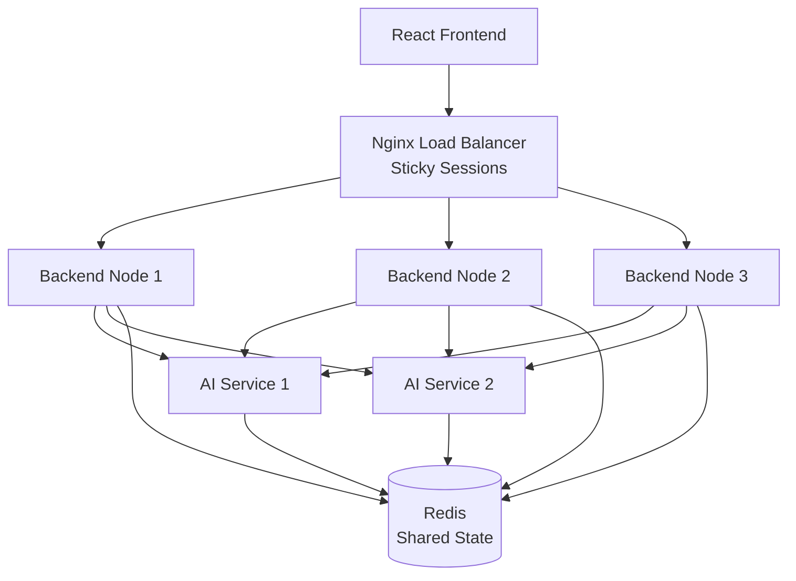

# 🚀 Multi-Node AI Chat Service with Sticky Sessions

[]()
[]()
[]()

## 📚 Overview

A scalable, distributed real-time AI chat service featuring:

- ✅ **Multi-Node Deployment** - Horizontal scaling with 3+ backend & AI nodes
- ✅ **Sticky Sessions** - WebSocket persistence via Nginx `ip_hash`
- ✅ **Shared State** - Redis-based distributed session management
- ✅ **Real-Time Streaming** - Word-by-word AI response streaming
- ✅ **Load Balancing** - Round-robin AI service distribution with retry
- ✅ **Backend Gateway** - Centralized API access pattern
- ✅ **Cancellation Support** - Stop streaming mid-generation
- ✅ **Auto Recovery** - Message recovery on reconnection

## 📖 Documentation

### **→ [📘 Complete POC Documentation](./POC_DOCUMENTATION.md)** ←

**This comprehensive document includes:**
- Executive Summary & Business Case
- Detailed Architecture with Mermaid Diagrams
- Complete Request Flows
- Technical Implementation Details
- Deployment Guide & Scaling Strategy
- Performance Metrics & Benchmarks
- Production Readiness Assessment

## 🏗️ Architecture Quick View



## 🚀 Quick Start

### Prerequisites
- Docker & Docker Compose installed
- 8GB RAM minimum
- 20GB disk space

### Start System

```bash
# Clone and checkout branch
git checkout dev_sticky_session

# Start all services
docker compose -f docker-compose.sticky-session.yml up -d

# Wait for services to be healthy (~30-60 seconds)
docker compose ps

# Check logs
docker compose logs -f java-websocket-1 python-ai-1
```

### Access Application

| Service | URL |
|---------|-----|
| **Frontend** | http://localhost:3000 |
| **Backend API** | http://localhost:8080/api |
| **WebSocket** | ws://localhost:8080/ws/chat |
| **Health Check** | http://localhost:8080/health |

### Stop System

```bash
# Stop all services
docker compose -f docker-compose.sticky-session.yml down

# Clean slate (remove volumes)
docker compose -f docker-compose.sticky-session.yml down -v
```

## 🎯 Key Features

### 1. Sticky Sessions
- Client IP-based session affinity
- Persistent WebSocket connections
- Automatic failover on node failure

### 2. Shared State
- Redis-based distributed session registry
- Stream chunk caching with TTL
- Message history persistence

### 3. Load Balancing
- Nginx for client→backend (ip_hash)
- Backend for AI service requests (round-robin)
- Automatic retry on failure

### 4. Real-Time Streaming
- Word-by-word AI response streaming
- Redis PubSub for message distribution
- WebSocket delivery to clients

### 5. Backend Gateway Pattern
```
Frontend → Nginx → Backend Gateway → AI Services
```
- Single entry point for all AI requests
- Centralized authentication & logging
- Flexible AI service management

## 📊 Architecture Highlights

### Multi-Node Deployment
```
3x Java WebSocket Backends  (768MB each)
3x Python AI Services       (256MB each)
1x Redis                    (512MB)
1x Kafka (optional)         (512MB)
1x Nginx Load Balancer      (128MB)
1x React Frontend           (128MB)
━━━━━━━━━━━━━━━━━━━━━━━━━━━━━━━━━━━━━
Total: ~4.5GB RAM
```

### Technology Stack

**Frontend:** React 18 + Vite + WebSocket API  
**Backend:** Spring Boot 3 + Spring WebSocket + Redisson  
**AI Service:** FastAPI + Redis-py + Uvicorn  
**Infrastructure:** Redis 7 + Apache Kafka + Nginx  
**Deployment:** Docker + Docker Compose

## 📈 Performance

| Metric | Value |
|--------|-------|
| WebSocket Connect | ~10ms |
| Send Message | ~20ms |
| Stream Chunk | ~5ms |
| History Load | ~50ms |
| Throughput | 10,000 chunks/s |

*Tested with 100 concurrent users on laptop (8 cores, 16GB RAM)*

## 🔧 Configuration

### Backend Nodes
```yaml
AI_SERVICE_URLS: "http://python-ai-1:8000,http://python-ai-2:8000,http://python-ai-3:8000"
SPRING_DATA_REDIS_HOST: "redis"
NODE_ID: "ws-node-1"
```

### Nginx Load Balancer
```nginx
upstream websocket_backend {
    ip_hash;  # Sticky sessions
    server java-websocket-1:8080;
    server java-websocket-2:8080;
    server java-websocket-3:8080;
}
```

## 🧪 Testing

### Manual Testing
1. Open http://localhost:3000
2. Send a chat message
3. Observe real-time streaming response
4. Click Cancel during streaming
5. Refresh page → history preserved

### Load Testing
```bash
# Test with multiple clients
for i in {1..10}; do
  open http://localhost:3000 &
done

# Monitor distribution
docker compose logs nginx-lb | grep upstream:
```

## 📁 Project Structure

```
├── docker-compose.sticky-session.yml  # Multi-node orchestration
├── nginx-sticky-session.conf          # Load balancer config
├── POC_DOCUMENTATION.md               # Complete documentation
├── README.md                          # This file
│
├── frontend/                          # React application
│   ├── src/
│   │   ├── App.jsx
│   │   ├── hooks/
│   │   │   ├── useChat.js
│   │   │   └── useWebSocket.js
│   │   └── components/
│   └── Dockerfile
│
├── java-websocket-server/            # Backend service
│   ├── src/main/java/com/demo/websocket/
│   │   ├── handler/
│   │   │   └── ChatWebSocketHandler.java
│   │   ├── infrastructure/
│   │   │   ├── SessionManager.java
│   │   │   ├── RedisStreamCache.java
│   │   │   └── ChatOrchestrator.java
│   │   ├── service/
│   │   │   └── AiServiceLoadBalancer.java
│   │   └── controller/
│   │       └── ChatController.java
│   └── Dockerfile
│
└── python-ai-service/                # AI service
    ├── app.py
    ├── ai_service.py
    ├── redis_client.py
    └── Dockerfile
```

## 🐛 Troubleshooting

### Services Not Starting
```bash
# Check service status
docker compose ps

# View logs
docker compose logs [service-name]

# Restart specific service
docker compose restart [service-name]
```

### WebSocket Connection Fails
```bash
# Check nginx logs
docker compose logs nginx-lb

# Verify backend health
curl http://localhost:8080/actuator/health
```

### Redis Connection Issues
```bash
# Test Redis connectivity
docker exec -it sticky-redis redis-cli ping

# Check Redis keys
docker exec -it sticky-redis redis-cli KEYS '*'
```

## 📚 Additional Resources

- [Complete POC Documentation](./POC_DOCUMENTATION.md) - Full architecture & implementation details
- [Docker Compose File](./docker-compose.sticky-session.yml) - Service configuration
- [Nginx Config](./nginx-sticky-session.conf) - Load balancer setup

## 🤝 Contributing

This is a Proof of Concept project. For production deployment:
1. Review [POC_DOCUMENTATION.md](./POC_DOCUMENTATION.md) Section "Production Readiness"
2. Implement security enhancements (HTTPS, JWT, rate limiting)
3. Set up monitoring (Prometheus, Grafana)
4. Migrate to Kubernetes for production-grade orchestration

## 📄 License

[Your License Here]

## 🏆 Status

**Current:** Proof of Concept (POC)  
**Production Ready Score:** 7.6/10  
**Recommended:** Ready for pilot with security & monitoring enhancements

---

**For complete documentation with diagrams and implementation details:**  
**→ [📘 Read POC_DOCUMENTATION.md](./POC_DOCUMENTATION.md)**
